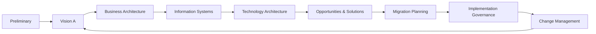
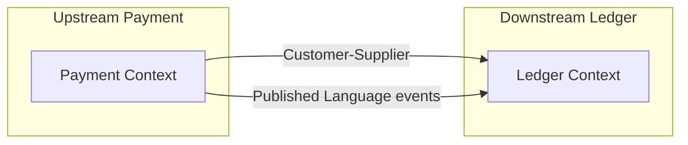

# Enterprise Architecture Frameworks — TOGAF, Zachman & Strategic DDD

> **You are here**: Principal / Architect — Enterprise Strategy
> **Roadmap**: [Developer Master Roadmap](../../ROADMAP.md#principal-architect) | **Prerequisites**: [Organization Design](Organization_Design_Conway_Team_Topologies.md), [§20 Technical Leadership](../../01_TechGuide/20_Technical_Leadership_Architecture.md) | **Next**: [Multi-Year Vision & Build-vs-Buy](Multi_Year_Vision_Build_vs_Buy.md)

Principal interviews at **banks, GCCs, and large product orgs in India** (Flipkart platform, Razorpay infra, PhonePe core, Amazon horizontal teams) sometimes probe whether you can speak **enterprise architecture language** — not to recite certification trivia, but to align **business capabilities**, **technology standards**, and **team boundaries** across years.

This guide is the **canonical home** for TOGAF, Zachman, and strategic Domain-Driven Design in this repo. Tactical DDD (aggregates, entities) lives in [§03 Design Patterns](../../01_TechGuide/03_Design_Patterns_SOLID_CleanArch.md); org alignment in [Organization Design](Organization_Design_Conway_Team_Topologies.md).

---

## When each framework matters (interview lens)

| Framework | Best for | Principal signal | Skip when |
|-----------|----------|------------------|-----------|
| **TOGAF ADM** | Large orgs, transformation programs, standards boards | Phased roadmap with governance gates | Early-stage startup (<50 eng) |
| **Zachman** | Stakeholder alignment, "who needs what view" | Matrix of concerns across roles | Single-product team design |
| **Strategic DDD** | Microservices boundaries, platform splits | Bounded contexts + context map | CRUD service with one team |
| **This repo's ADRs** | Day-to-day engineering decisions | [§20 ADRs](../../01_TechGuide/20_Technical_Leadership_Architecture.md) | Replacing all EA frameworks |

**Rule**: In product-company loops, lead with **strategic DDD + capability map**; mention TOGAF/Zachman when interviewer uses enterprise vocabulary (bank, insurance, GCC architecture review).

---

## TOGAF — Architecture Development Method (ADM)

TOGAF is a **process** for developing and governing enterprise architecture in phases. You do not need to memorize all 10 phases — know the **loop** and where technology decisions land.

### ADM phases (simplified)



| Phase | Question answered | Repo anchor |
|-------|-------------------|-------------|
| **A — Architecture Vision** | Why change? Scope? Stakeholders? | [Multi-Year Vision](Multi_Year_Vision_Build_vs_Buy.md) |
| **B — Business Architecture** | Capabilities, value streams | [Org Design](Organization_Design_Conway_Team_Topologies.md) |
| **C — Information Systems** | Application + data architecture | [§06 Microservices](../../01_TechGuide/06_Microservices_Distributed_Systems.md), [§07 SD](../../01_TechGuide/07_System_Design.md) |
| **D — Technology Architecture** | Standards: Java 21, EKS, Kafka | [§24 IDP](../../01_TechGuide/24_Platform_Engineering_IDP.md), [§30 K8s](../../01_TechGuide/30_Kubernetes_Deep_Dive.md) |
| **E — Opportunities & Solutions** | Work packages, dependencies | [Multi-Team ARF](../Levels/Multi_Team_Architecture_Review.md) |
| **F — Migration Planning** | Transition states, risk | [Enterprise Integration](Enterprise_Integration_ESB_iPaaS_Event_Mesh.md) strangler |
| **G — Implementation Governance** | Compliance with target architecture | [§38 Compliance](../../01_TechGuide/38_Compliance_and_Regulated_Systems.md) |
| **H — Change Management** | Continuous evolution | [§23 SRE](../../01_TechGuide/23_SRE_Reliability_Engineering.md) |

### Interview one-liner

> "I'd run an ADM-style cycle: vision and capability map first, then application boundaries (DDD contexts), then technology standards on our golden path, then phased migration with governance checkpoints — same content as our RFC process, framed for exec stakeholders."

### Architecture Governance (what principals own)

| Artifact | Purpose | Frequency |
|----------|---------|-----------|
| **Architecture Principles** | Non-negotiables (e.g. "events over sync for cross-domain") | Annual refresh |
| **Standards Catalog** | Approved stacks (Spring Boot 3, PostgreSQL, Kafka) | Quarterly |
| **Compliance reviews** | New services vs target architecture | Per RFC / ARF |
| **Exception process** | Time-boxed waivers with exit criteria | As needed |

Link: [Vendor Evaluation Rubrics](Vendor_Evaluation_Rubrics.md) for standards vs buy decisions.

---

## Zachman Framework — the 6×6 matrix

John Zachman (1987): different stakeholders need different **views** of the same enterprise. The matrix rows are **questions** (What, How, Where, Who, When, Why); columns are **perspectives** (Planner, Owner, Designer, Builder, Subcontractor, Functioning).

### Simplified matrix (e-commerce example)

| | **What (data)** | **How (function)** | **Where (network)** | **Who (people)** | **When (time)** | **Why (motivation)** |
|--|-----------------|--------------------|-----------------------|------------------|-------------------|----------------------|
| **Scope (Planner)** | Product catalog | Sell online | India market | Customers | Peak season | Revenue |
| **Business Model (Owner)** | Order, Payment entities | Checkout flow | — | Checkout team | SLA 99.9% | Conversion |
| **System Model (Designer)** | PostgreSQL schemas | Spring services | AWS ap-south-1 | Stream-aligned squads | Event ordering | PCI scope reduction |
| **Technology Model (Builder)** | Kafka topics, Redis | REST + events | VPC, LB | Platform team | Deploy weekly | Golden path |

### How to use in interviews

1. **Clarify perspective**: "Are we at business-owner level or system-designer level?" — prevents mixing exec slides with class diagrams.
2. **Fill one row**: For checkout, align What (Order aggregate) with How (Payment service) with Who (Order team owns).
3. **Hand off to DDD**: Designer column → bounded contexts; Builder column → [§24 IDP](../../01_TechGuide/24_Platform_Engineering_IDP.md).

**Anti-pattern**: Filling the entire 36-cell matrix in an interview — mention the framework, then focus on **one business capability row**.

---

## Strategic Domain-Driven Design

Eric Evans' DDD has **tactical** patterns (Entity, Aggregate, Repository) and **strategic** patterns for large systems. Principals need strategic DDD for **service boundaries**.

### Core strategic concepts

| Concept | Definition | Example (payments org) |
|---------|------------|------------------------|
| **Bounded context** | Model + language boundary; one ubiquitous language per context | `Payment`, `Ledger`, `Settlement` are separate contexts |
| **Context map** | Relationships between contexts | Payment **upstream** to Ledger (published language) |
| **Ubiquitous language** | Terms mean one thing inside a context | "Order" in Checkout ≠ "Order" in Fulfillment without translation |
| **Anti-corruption layer (ACL)** | Protect your model from external models | Adapter from legacy ESB XML to domain events |

### Context relationship types



| Relationship | Meaning | When to use |
|--------------|---------|-------------|
| **Partnership** | Two teams co-evolve | Early product discovery |
| **Customer-Supplier** | Upstream serves downstream | Platform API with SLA |
| **Conformist** | Downstream adopts upstream model | Integrating SaaS (Stripe webhooks) |
| **Anti-corruption layer** | Downstream translates | Legacy mainframe integration |
| **Open host service** | Published protocol for many consumers | Event schema registry |
| **Shared kernel** | Shared small model (dangerous) | Rare; version carefully |

### Subdomain types (prioritization)

| Type | Invest? | Example |
|------|---------|---------|
| **Core** | Build best team here | Payment orchestration for fintech |
| **Supporting** | Good enough, don't over-engineer | Admin reporting |
| **Generic** | Buy | Email, auth, APM |

Maps directly to [Build-vs-Buy matrix](Multi_Year_Vision_Build_vs_Buy.md).

### Capability → context → team (worked example)

```
Business capability: "Accept payment"
  → Bounded context: Payment (Spring service, owns Payment aggregate)
  → Team: Stream-aligned Payment squad (4–6 engineers)
  → Integration: Publishes PaymentCaptured v1 to Kafka (open host)
  → Downstream: Ledger context consumes via ACL if legacy COBOL exists
```

Cross-link: [Conway's Law](Organization_Design_Conway_Team_Topologies.md) — if one team owns Payment + Ledger + Notification, expect a monolith or tangled modules.

---

## Combining frameworks in one Principal narrative

**60-minute enterprise architecture answer structure:**

| Minutes | Framework | Deliverable |
|---------|-----------|-------------|
| 0–10 | Zachman (Scope row) | Business outcomes, stakeholders |
| 10–25 | Strategic DDD | Capability map + bounded contexts + context map |
| 25–40 | TOGAF (Technology + Migration) | Target stack, phased strangler from monolith |
| 40–50 | Governance | Standards, ARF checklist, compliance ([§38](../../01_TechGuide/38_Compliance_and_Regulated_Systems.md)) |
| 50–60 | Risks | Org misalignment, vendor lock-in, DR ([Multi-Region DR](Multi_Region_Active_Active_DR.md)) |

---

## India-specific notes

| Context | Framework emphasis |
|---------|-------------------|
| **Product startup → scale-up** | Strategic DDD + team topologies; light TOGAF |
| **GCC / captive center** | TOGAF governance + Zachman views for global HQ |
| **Bank / insurance** | TOGAF + compliance; ACL from core banking |
| **Remote-for-India global team** | Published language (events/APIs) across time zones |

---

## Comparison cheat sheet

| | TOGAF | Zachman | Strategic DDD |
|--|-------|---------|---------------|
| **Type** | Process | Classification | Modeling |
| **Output** | Roadmap, standards | Stakeholder views | Context boundaries |
| **Best question** | "How do we get there in phases?" | "Who needs which view?" | "Where do services split?" |
| **Certification** | TOGAF EA (optional) | None mainstream | None (DDD community) |

---

## Interview traps

| Trap | Better response |
|------|-----------------|
| Recite all ADM phases from memory | Name 3–4 phases relevant to the question |
| Draw Zachman 36 cells | One row for the capability under discussion |
| DDD = microservices everywhere | Context map first; split only when team/change rate justifies |
| EA frameworks replace ADRs | ADRs for local decisions; EA for org-wide standards |

---

## Related repo files

| Topic | File |
|-------|------|
| Org ↔ architecture | [Organization_Design_Conway_Team_Topologies.md](Organization_Design_Conway_Team_Topologies.md) |
| 3-year bets | [Multi_Year_Vision_Build_vs_Buy.md](Multi_Year_Vision_Build_vs_Buy.md) |
| Integration legacy | [Enterprise_Integration_ESB_iPaaS_Event_Mesh.md](Enterprise_Integration_ESB_iPaaS_Event_Mesh.md) |
| Cross-team review | [Multi_Team_Architecture_Review.md](../Levels/Multi_Team_Architecture_Review.md) |
| Principal loop | [Interview_Loop_Guide.md](Interview_Loop_Guide.md) |
| Failure modes | [Principal_Failure_Modes.md](../Levels/Principal_Failure_Modes.md) |

---

## LeetCode / coding note

Enterprise architecture rounds are **not coding** — but Staff+ loops may still ask [LFU Cache](../../02_DSA/05_Linked_Lists/LFUCache/LFUCache.md) or [Distributed Cache HLD](../../04_SystemDesign/02_HighLevelDesign/DistributedCache/DistributedCache.md). Keep framework talk for domain/executive rounds only.
