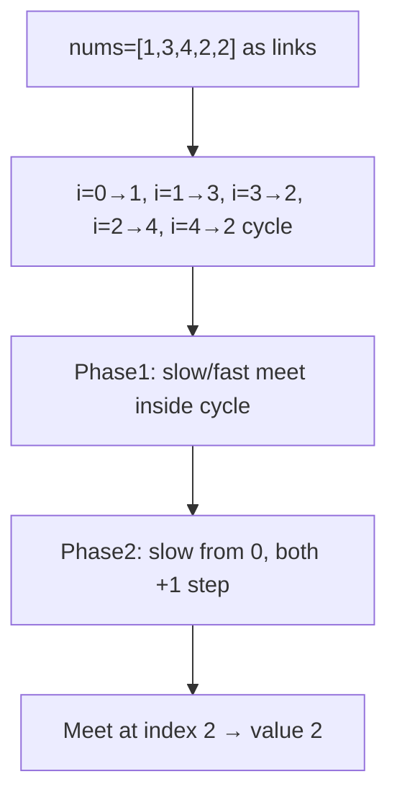
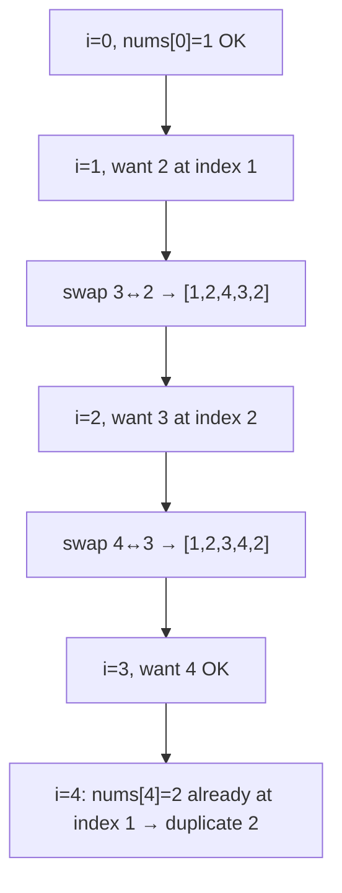

# Find the Duplicate Number — LeetCode 287

> **You are here**: SDE2 — DSA (arrays / cyclic sort)
> **Roadmap**: [Developer Master Roadmap](../../../ROADMAP.md#sde2) | **Prerequisites**: [Binary Search](../../03_Sorting_Searching/BinarySearch/BinarySearch.md), [Algorithmic Patterns §5 Cyclic Sort](../../../03_CodingPatterns/02_AlgorithmicPatterns.md#pattern-5-cyclic-sort) | **Next**: [Search in Rotated Sorted Array](../SearchInRotatedSortedArray/SearchInRotatedSortedArray.md)
> **Pattern**: [Cyclic Sort](../../../03_CodingPatterns/02_AlgorithmicPatterns.md#pattern-5-cyclic-sort) | **Catalog**: [Algorithmic Patterns](../../../03_CodingPatterns/02_AlgorithmicPatterns.md)

## Problem Statement

Given an array `nums` containing `n + 1` integers where each integer is in the range `[1, n]` inclusive, there is exactly **one duplicate** number. Return the duplicate.

**Constraints** (typical interview framing):

- Must not modify the array (rules out in-place sort).
- Must use only constant extra space (rules out `HashSet`).
- Expected time O(n) or O(n log n).

**Example 1:**
```
Input: nums = [1,3,4,2,2]
Output: 2
```

**Example 2:**
```
Input: nums = [3,1,3,4,2]
Output: 3
```

---

## Approach 1: Floyd's Cycle Detection (Optimal — O(1) space, no mutation)

**Insight**: Treat each index `i` as a node pointing to `nums[i]` (a **linked list** in value space). Because values are in `[1, n]` but there are `n + 1` slots, **pigeonhole principle** guarantees a duplicate → two indices point to the same value → a cycle.

This is identical to [Linked List Cycle](../../05_Linked_Lists/LinkedListCycle/LinkedListCycle.md):

| Phase | Action |
|-------|--------|
| 1 | `slow = nums[0]`, `fast = nums[0]` |
| 2 | Advance `slow` one step, `fast` two steps until they meet |
| 3 | Reset `slow` to `nums[0]`; move both one step until equal — meeting point = duplicate |

### Key Logic

#### Example Flow

**Step flow (mermaid):**



**Walkthrough (same example):**

```
nums = [1, 3, 4, 2, 2]  (index → nums[index])

0→1→3→2→4→2→4→...  (cycle at value 2)

Phase 1 — find cycle:
  slow: 1→3→2→4→2...
  fast: 1→4→2→4→2...  meet at index 2

Phase 2 — find entry:
  slow = nums[0] = 1, fast reset to 1
  step both: 3→2, meet at index 2

Duplicate = nums[2] = 2
```

```java
int slow = nums[0], fast = nums[0];
do {
    slow = nums[slow];
    fast = nums[nums[fast]];
} while (slow != fast);

slow = nums[0];
while (slow != fast) {
    slow = nums[slow];
    fast = nums[fast];
}
return slow;
```

### Complexity

- **Time**: O(n)
- **Space**: O(1), no array mutation

---

## Approach 2: Cyclic Sort (Optimal when mutation allowed)

Place value `v` at index `v - 1`. While `nums[i] != i + 1`:

- If `nums[i]` already equals `nums[correctIndex]`, duplicate found.
- Else swap `nums[i]` with `nums[correctIndex]`.

See [Pattern 5: Cyclic Sort](../../../03_CodingPatterns/02_AlgorithmicPatterns.md#pattern-5-cyclic-sort).

### Key Logic

#### Example Flow

**Step flow (mermaid):**



**Walkthrough (same example):**

```
nums = [1, 3, 4, 2, 2]

i=0: nums[0]=1 already correct
i=1: need 2 at index 1, swap with index 2 → [1,2,4,3,2]
i=2: need 3 at index 2, swap with index 3 → [1,2,3,4,2]
i=3: nums[3]=4 correct
i=4: correct index for 2 is 1, but nums[1] already 2
     → duplicate found: 2
```

```java
while (i < nums.length) {
    int correct = nums[i] - 1;
    if (nums[i] != nums[correct]) swap(nums, i, correct);
    else i++;
}
```

### Complexity

- **Time**: O(n) — each swap places at least one element correctly
- **Space**: O(1), **mutates** array

---

## Complexity Comparison

| Approach | Time | Space | Mutates? |
|----------|------|-------|----------|
| Floyd cycle | O(n) | O(1) | No |
| Cyclic sort | O(n) | O(1) | Yes |
| Binary search on value | O(n log n) | O(1) | No |
| HashSet | O(n) | O(n) | No |

---

## Pattern Recognition

| Signal | Pattern |
|--------|---------|
| Duplicate in `[1, n]` with `n + 1` elements | Pigeonhole → cycle or cyclic sort |
| Cannot modify array + O(1) space | Floyd's tortoise and hare |
| Mutation allowed | Cyclic sort is simplest to code |

**Related problems**: Missing Number (complement), First Missing Positive, Linked List Cycle II.

---

## Edge Cases

- All same value: `[2, 2, 2, 2, 2]` with `n = 4`
- Minimum size: `n = 1` → `[1, 1]`
- Duplicate at index 0 path: `[3, 1, 3, 4, 2]`
- Floyd requires **at least one advance** before cycle check — use `do-while`

---

## Interview Tips

1. Name **fast/slow pointers** or **cyclic sort** in the first two minutes — shows pattern fluency.
2. If interviewer allows mutation → cyclic sort is the fastest to implement cleanly.
3. Connect to Linked List Cycle: "Index `i` points to `nums[i]`; duplicate creates a cycle entry."
4. Binary search on value `[1, n]` is a valid O(n log n) fallback — count elements `≤ mid`; if count > mid, duplicate is in lower half.

**Implementation**: [FindDuplicateNumber.java](FindDuplicateNumber.java)
