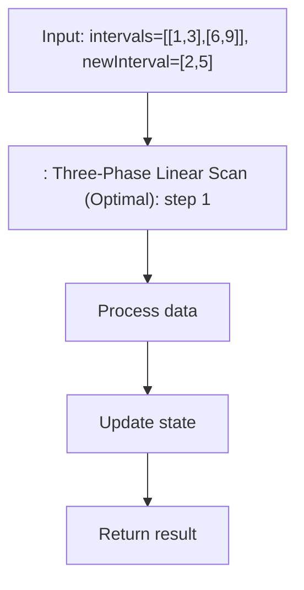

# Insert Interval (LeetCode 57)

> **You are here**: DSA — see [ROADMAP](../../../ROADMAP.md) for level assignment
> **Roadmap**: [Developer Master Roadmap](../../../ROADMAP.md) | **Study path**: [StudyGuide](../../StudyGuide.md)
> **Pattern**: [Merge Intervals](../../../03_CodingPatterns/02_AlgorithmicPatterns.md#pattern-4-merge-intervals) | **Catalog**: [Algorithmic Patterns](../../../03_CodingPatterns/02_AlgorithmicPatterns.md)

## Problem Statement

You are given an array of non-overlapping intervals `intervals` where `intervals[i] = [start_i, end_i]` represent the start and the end of the `i`th interval and `intervals` is sorted in ascending order by `start_i`. You are also given an interval `newInterval = [start, end]` that represents the start and end of another interval.

Insert `newInterval` into `intervals` such that `intervals` is still sorted in ascending order by `start_i` and `intervals` still does not have any overlapping intervals (merge overlapping intervals if necessary).

Return `intervals` after the insertion.

**Example 1:**
```
Input: intervals = [[1,3],[6,9]], newInterval = [2,5]
Output: [[1,5],[6,9]]
Explanation: [2,5] overlaps with [1,3], so they merge to [1,5].
```

**Example 2:**
```
Input: intervals = [[1,2],[3,5],[6,7],[8,10],[12,16]], newInterval = [4,8]
Output: [[1,2],[3,10],[12,16]]
Explanation: [4,8] overlaps with [3,5],[6,7],[8,10], merging into [3,10].
```

**Example 3:**
```
Input: intervals = [], newInterval = [5,7]
Output: [[5,7]]
```

**Constraints:**
- `0 <= intervals.length <= 10^4`
- `intervals[i].length == 2`
- `0 <= start_i <= end_i <= 10^5`
- `intervals` is sorted by `start_i` in ascending order.
- `newInterval.length == 2`
- `0 <= start <= end <= 10^5`

---

## Key Insight: Three-Phase Linear Scan

The sorted property of the input allows us to process intervals in a single pass using three phases:

1. **Before Phase**: All intervals that end before the new interval starts (no overlap).
2. **Overlap Phase**: All intervals that overlap with the new interval (merge them).
3. **After Phase**: All intervals that start after the new interval ends (no overlap).

### Overlap Detection

Two intervals `[a, b]` and `[c, d]` overlap if and only if `a <= d` AND `c <= b`. Equivalently, they do NOT overlap if `b < c` (first ends before second starts) OR `d < a` (second ends before first starts).

---

## Approach: Three-Phase Linear Scan (Optimal)

**Time:** O(n), **Space:** O(n) for the result

### Complete Implementation


#### Example Flow

**Step flow (mermaid):**



**Walkthrough (same example):**

```
Example: intervals=[[1,3],[6,9]], newInterval=[2,5] → [[1,5],[6,9]]
Approach: : Three-Phase Linear Scan (Optimal)

Apply : Three-Phase Linear Scan (Optimal) on the example input step by step
Final answer from example: see above
```
```java
import java.util.*;

public class InsertInterval {
    
    public int[][] insert(int[][] intervals, int[] newInterval) {
        List<int[]> result = new ArrayList<>();
        int i = 0;
        int n = intervals.length;
        
        // Phase 1: Add all intervals that end BEFORE the new interval starts
        // (No overlap: intervals[i][1] < newInterval[0])
        while (i < n && intervals[i][1] < newInterval[0]) {
            result.add(intervals[i]);
            i++;
        }
        
        // Phase 2: Merge all intervals that OVERLAP with the new interval
        // (Overlap condition: intervals[i][0] <= newInterval[1])
        while (i < n && intervals[i][0] <= newInterval[1]) {
            newInterval[0] = Math.min(newInterval[0], intervals[i][0]);
            newInterval[1] = Math.max(newInterval[1], intervals[i][1]);
            i++;
        }
        result.add(newInterval); // Add the merged interval
        
        // Phase 3: Add all remaining intervals (they start AFTER the new interval ends)
        while (i < n) {
            result.add(intervals[i]);
            i++;
        }
        
        return result.toArray(new int[result.size()][]);
    }
}
```

### Dry Run Example 1

```
Input: intervals = [[1,3],[6,9]], newInterval = [2,5]

Phase 1 (add non-overlapping before):
  i=0: intervals[0]=[1,3], end=3 >= newStart=2 → STOP (overlap detected)
  result = []

Phase 2 (merge overlapping):
  i=0: intervals[0]=[1,3], start=1 <= newEnd=5 → MERGE
    newInterval = [min(2,1), max(5,3)] = [1,5]
    i=1
  i=1: intervals[1]=[6,9], start=6 > newEnd=5 → STOP
  Add merged [1,5]
  result = [[1,5]]

Phase 3 (add remaining):
  i=1: add [6,9]
  result = [[1,5],[6,9]]

Output: [[1,5],[6,9]] ✓
```

### Dry Run Example 2

```
Input: intervals = [[1,2],[3,5],[6,7],[8,10],[12,16]], newInterval = [4,8]

Phase 1 (add non-overlapping before):
  i=0: [1,2], end=2 < newStart=4 → ADD [1,2], i=1
  i=1: [3,5], end=5 >= newStart=4 → STOP
  result = [[1,2]]

Phase 2 (merge overlapping):
  i=1: [3,5], start=3 <= newEnd=8 → MERGE
    newInterval = [min(4,3), max(8,5)] = [3,8], i=2
  i=2: [6,7], start=6 <= newEnd=8 → MERGE
    newInterval = [min(3,6), max(8,7)] = [3,8], i=3
  i=3: [8,10], start=8 <= newEnd=8 → MERGE
    newInterval = [min(3,8), max(8,10)] = [3,10], i=4
  i=4: [12,16], start=12 > newEnd=10 → STOP
  Add merged [3,10]
  result = [[1,2],[3,10]]

Phase 3 (add remaining):
  i=4: add [12,16]
  result = [[1,2],[3,10],[12,16]]

Output: [[1,2],[3,10],[12,16]] ✓
```

---

## Alternative: Binary Search for Insert Position

**Time:** O(n) overall (still O(n) for insertion), **Space:** O(n)

You can use binary search to find where the new interval should be inserted, then merge. However, since we need to shift elements anyway, the overall time is still O(n). The binary search helps only when the number of overlapping intervals is small.

```java
public int[][] insert(int[][] intervals, int[] newInterval) {
    // Binary search for the first interval that could overlap
    int left = 0, right = intervals.length - 1;
    int insertPos = intervals.length;
    
    while (left <= right) {
        int mid = left + (right - left) / 2;
        if (intervals[mid][0] > newInterval[1]) {
            insertPos = mid;
            right = mid - 1;
        } else {
            left = mid + 1;
        }
    }
    
    // ... merge from the insertion point backward/forward
    // (More complex but can skip non-overlapping intervals faster)
}
```

---

## Related Pattern: Merge Intervals (LeetCode 56)

Insert Interval is closely related to Merge Intervals. The key difference is that in Merge Intervals, the input is unsorted and we need to sort it first. In Insert Interval, the input is already sorted.

```java
// Merge Intervals (LeetCode 56)
public int[][] merge(int[][] intervals) {
    Arrays.sort(intervals, (a, b) -> a[0] - b[0]);
    
    List<int[]> result = new ArrayList<>();
    result.add(intervals[0]);
    
    for (int i = 1; i < intervals.length; i++) {
        int[] last = result.get(result.size() - 1);
        
        if (intervals[i][0] <= last[1]) {
            // Overlapping — extend the last interval
            last[1] = Math.max(last[1], intervals[i][1]);
        } else {
            // Non-overlapping — add new interval
            result.add(intervals[i]);
        }
    }
    
    return result.toArray(new int[result.size()][]);
}
```

---

## Interval Problems Master Reference

| Problem | Approach | Time | Key Idea |
|---------|----------|------|----------|
| Merge Intervals (56) | Sort + merge | O(n log n) | Extend end if overlapping |
| Insert Interval (57) | Three-phase scan | O(n) | Before, overlap, after |
| Meeting Rooms (252) | Sort + check | O(n log n) | Any overlap = cannot attend all |
| Meeting Rooms II (253) | Min heap / sweep line | O(n log n) | Track concurrent meetings |
| Non-overlapping Intervals (435) | Sort + greedy | O(n log n) | Remove interval with later end |
| Interval List Intersections (986) | Two pointers | O(n + m) | Track intersection of two lists |

---

## Edge Cases

| Case | Input | Expected |
|------|-------|----------|
| Empty intervals | `[], [5,7]` | `[[5,7]]` |
| Insert at beginning | `[[3,5],[6,9]], [1,2]` | `[[1,2],[3,5],[6,9]]` |
| Insert at end | `[[1,3],[6,9]], [10,12]` | `[[1,3],[6,9],[10,12]]` |
| Absorb all intervals | `[[1,3],[4,6],[7,9]], [0,10]` | `[[0,10]]` |
| No overlap | `[[1,2],[5,6]], [3,4]` | `[[1,2],[3,4],[5,6]]` |
| Touch boundary | `[[1,3],[6,9]], [3,6]` | `[[1,9]]` |
| Same interval | `[[1,5]], [1,5]` | `[[1,5]]` |

---

## Common Mistakes

1. **Wrong overlap condition**: Using `<` instead of `<=`. The condition `intervals[i][0] <= newInterval[1]` uses `<=` because touching intervals (e.g., `[1,3]` and `[3,5]`) should merge.
2. **Forgetting to add the merged interval**: After Phase 2, you must add `newInterval` to the result.
3. **Not updating both start and end during merge**: You need to take `min` of starts AND `max` of ends.
4. **Converting result incorrectly**: `result.toArray(new int[result.size()][])` is the correct way to convert `List<int[]>` to `int[][]`.

---

## LeetCode Similar Problems

- [56. Merge Intervals](https://leetcode.com/problems/merge-intervals/)
- [252. Meeting Rooms](https://leetcode.com/problems/meeting-rooms/)
- [253. Meeting Rooms II](https://leetcode.com/problems/meeting-rooms-ii/)
- [435. Non-overlapping Intervals](https://leetcode.com/problems/non-overlapping-intervals/)
- [495. Teemo Attacking](https://leetcode.com/problems/teemo-attacking/)
- [986. Interval List Intersections](https://leetcode.com/problems/interval-list-intersections/)
- [1288. Remove Covered Intervals](https://leetcode.com/problems/remove-covered-intervals/)

---

## Interview Tips

1. **Visualize with a timeline**: Draw a number line and mark the intervals. This helps you see the three phases clearly.
2. **State the three phases upfront**: "I'll process in three phases: non-overlapping before, overlapping (merge), and non-overlapping after."
3. **Clarify the overlap condition**: "Two intervals overlap when the first ends at or after the second starts, AND the second ends at or after the first starts."
4. **Connect to Merge Intervals**: "This is similar to Merge Intervals but simpler because the input is already sorted."
5. **Discuss the boundary case**: "I use `<=` for overlap detection because intervals that touch at a single point (like [1,3] and [3,5]) should merge."
6. **For Lead-level**: Discuss how this pattern applies in real systems — calendar scheduling, resource allocation, time-series data merging, network packet coalescing.
