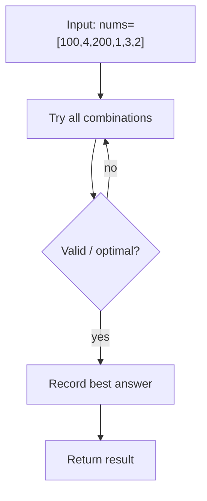
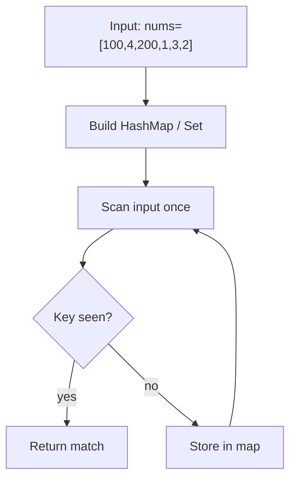
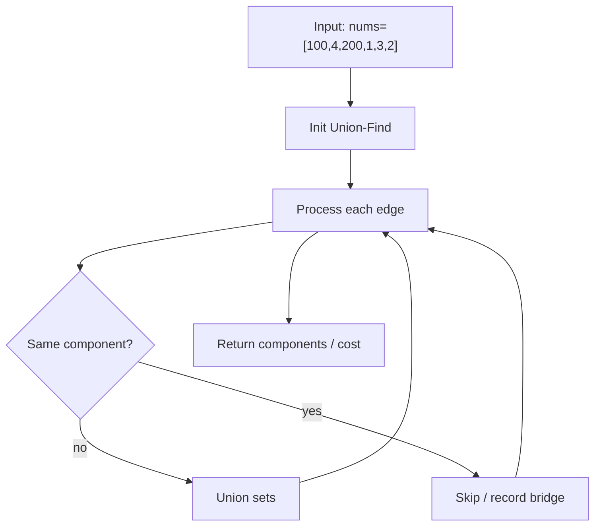

# Longest Consecutive Sequence

> **You are here**: DSA — see [ROADMAP](../../../ROADMAP.md) for level assignment
> **Roadmap**: [Developer Master Roadmap](../../../ROADMAP.md) | **Study path**: [StudyGuide](../../StudyGuide.md)
> **Pattern**: [Hash Map / Set](../../../03_CodingPatterns/02_AlgorithmicPatterns.md#pattern-1-two-pointers) | **Catalog**: [Algorithmic Patterns](../../../03_CodingPatterns/02_AlgorithmicPatterns.md)

## Problem Statement

Given an unsorted array of integers `nums`, return the length of the longest consecutive elements sequence. You must write an algorithm that runs in **O(n)** time.

**LeetCode**: [128. Longest Consecutive Sequence](https://leetcode.com/problems/longest-consecutive-sequence/)

### Examples

```
Input:  nums = [100, 4, 200, 1, 3, 2]
Output: 4
Explanation: The longest consecutive sequence is [1, 2, 3, 4]. Length = 4.

Input:  nums = [0, 3, 7, 2, 5, 8, 4, 6, 0, 1]
Output: 9
Explanation: The longest consecutive sequence is [0, 1, 2, 3, 4, 5, 6, 7, 8]. Length = 9.

Input:  nums = []
Output: 0
```

### Constraints
- `0 <= nums.length <= 10^5`
- `-10^9 <= nums[i] <= 10^9`

---

## Why This Problem Is Important

This is a **top 25 interview problem** because:
1. It tests whether you can think beyond sorting (O(n log n)) to achieve O(n).
2. It demonstrates HashSet mastery — a fundamental data structure.
3. It combines a clever insight (only start counting from sequence beginnings) with simple implementation.
4. It is frequently asked at Google, Amazon, Meta, and Microsoft.

---

## Approach 1: Sorting (Baseline)

**Time**: O(n log n), **Space**: O(1) or O(n) depending on sort

Sort the array, then scan for consecutive runs.


#### Example Flow

**Step flow (mermaid):**



**Walkthrough (same example):**

```
Example: nums=[100,4,200,1,3,2] → length 4 (1,2,3,4)
Approach: Sorting (Baseline)

Enumerate all candidates from example input
Check validity/optimal condition
Keep best answer found
```
```java
class Solution {
    public int longestConsecutive(int[] nums) {
        if (nums.length == 0) return 0;

        Arrays.sort(nums);

        int longest = 1;
        int currentStreak = 1;

        for (int i = 1; i < nums.length; i++) {
            if (nums[i] == nums[i - 1]) {
                continue; // Skip duplicates
            }
            if (nums[i] == nums[i - 1] + 1) {
                currentStreak++;
            } else {
                longest = Math.max(longest, currentStreak);
                currentStreak = 1;
            }
        }

        return Math.max(longest, currentStreak);
    }
}
```

> **Interview Note**: This approach does NOT satisfy the O(n) time requirement. Mention it as a baseline, then optimize.

---

## Approach 2: HashSet — Only Start From Sequence Beginnings (Optimal)

**Time**: O(n), **Space**: O(n)

### The Key Insight

If we put all numbers in a HashSet, we can check in O(1) whether `num - 1` exists. If `num - 1` does NOT exist, then `num` is the **start of a new consecutive sequence**. We only count forward from these starting points.

This ensures each element is visited at most twice (once when adding to set, once when counting in a sequence), giving us O(n) total time.

### Why This Is O(n) And Not O(n²)

At first glance, the nested while loop looks like O(n²). But consider:
- The outer for loop runs n times.
- The inner while loop ONLY executes for elements that are sequence starts (no `num - 1` in set).
- Each element in the array is counted by the inner while loop exactly once across all iterations.
- Total inner loop iterations across all outer iterations = n.
- Therefore total work = O(n) + O(n) = O(n).

### Visual Walkthrough

```
Input: [100, 4, 200, 1, 3, 2]
HashSet: {100, 4, 200, 1, 3, 2}

Iterate through each number:

num = 100: Is 99 in set? NO → 100 is a sequence start
  Count: 100 → 101 in set? NO → streak = 1
  longest = max(0, 1) = 1

num = 4: Is 3 in set? YES → 4 is NOT a start → SKIP

num = 200: Is 199 in set? NO → 200 is a sequence start
  Count: 200 → 201 in set? NO → streak = 1
  longest = max(1, 1) = 1

num = 1: Is 0 in set? NO → 1 is a sequence start
  Count: 1 → 2 in set? YES → streak = 2
  Count: 2 → 3 in set? YES → streak = 3
  Count: 3 → 4 in set? YES → streak = 4
  Count: 4 → 5 in set? NO → streak = 4
  longest = max(1, 4) = 4

num = 3: Is 2 in set? YES → 3 is NOT a start → SKIP

num = 2: Is 1 in set? YES → 2 is NOT a start → SKIP

Result: 4 ✓
```

### Java Implementation


#### Example Flow

**Step flow (mermaid):**



**Walkthrough (same example):**

```
Example: nums=[100,4,200,1,3,2] → length 4 (1,2,3,4)
Approach: HashSet — Only Start From Sequence Beginnings (Optimal)

Scan input left-to-right
Store seen keys/values in hash map
O(1) lookup finds complement or group
```
```java
class Solution {
    public int longestConsecutive(int[] nums) {
        if (nums.length == 0) return 0;

        // Step 1: Add all numbers to a HashSet for O(1) lookup
        Set<Integer> numSet = new HashSet<>();
        for (int num : nums) {
            numSet.add(num);
        }

        int longest = 0;

        // Step 2: For each number, check if it's the START of a sequence
        for (int num : numSet) {
            // Only start counting if num-1 is NOT in the set
            // This means num is the beginning of a consecutive sequence
            if (!numSet.contains(num - 1)) {
                int currentNum = num;
                int currentStreak = 1;

                // Count consecutive numbers forward
                while (numSet.contains(currentNum + 1)) {
                    currentNum++;
                    currentStreak++;
                }

                longest = Math.max(longest, currentStreak);
            }
        }

        return longest;
    }
}
```

---

## Approach 3: Union-Find (Alternative O(n))

**Time**: O(n × α(n)) ≈ O(n), **Space**: O(n)

For each number, union it with `num + 1` if present. The largest connected component size is the answer.


#### Example Flow

**Step flow (mermaid):**



**Walkthrough (same example):**

```
Example: nums=[100,4,200,1,3,2] → length 4 (1,2,3,4)
Approach: Union-Find (Alternative O(n))

Build adjacency from input
Union edges or relax distances
Return components / shortest cost
```
```java
class Solution {
    private int[] parent, size;

    public int longestConsecutive(int[] nums) {
        if (nums.length == 0) return 0;

        Map<Integer, Integer> numToIndex = new HashMap<>();
        parent = new int[nums.length];
        size = new int[nums.length];

        // Initialize Union-Find
        for (int i = 0; i < nums.length; i++) {
            parent[i] = i;
            size[i] = 1;
            numToIndex.put(nums[i], i); // Handles duplicates by overwriting
        }

        // Union consecutive numbers
        for (int num : nums) {
            if (numToIndex.containsKey(num + 1)) {
                union(numToIndex.get(num), numToIndex.get(num + 1));
            }
        }

        // Find the largest component
        int longest = 1;
        for (int s : size) {
            longest = Math.max(longest, s);
        }
        return longest;
    }

    private int find(int x) {
        if (parent[x] != x) {
            parent[x] = find(parent[x]); // Path compression
        }
        return parent[x];
    }

    private void union(int x, int y) {
        int rootX = find(x), rootY = find(y);
        if (rootX == rootY) return;
        if (size[rootX] < size[rootY]) { int temp = rootX; rootX = rootY; rootY = temp; }
        parent[rootY] = rootX;
        size[rootX] += size[rootY];
    }
}
```

> **Interview Note**: The HashSet approach is simpler and more commonly expected. Only mention Union-Find if asked for an alternative or if the problem is presented in a graph/connectivity context.

---

## Complexity Analysis

| Approach | Time | Space | Meets O(n) Requirement? |
|----------|------|-------|------------------------|
| Sorting | O(n log n) | O(1) | No |
| HashSet | O(n) | O(n) | Yes — optimal |
| Union-Find | O(n × α(n)) ≈ O(n) | O(n) | Yes (practically) |

---

## Edge Cases

| Case | Input | Output | Why It Matters |
|------|-------|--------|---------------|
| Empty array | `[]` | `0` | No elements, no sequence |
| Single element | `[7]` | `1` | Every number is a sequence of length 1 |
| All same | `[5, 5, 5]` | `1` | Duplicates should not extend the sequence |
| Negative numbers | `[-3, -2, -1, 0, 1]` | `5` | Consecutive works with negatives |
| Already sorted | `[1, 2, 3, 4, 5]` | `5` | Algorithm works regardless of input order |
| Reverse sorted | `[5, 4, 3, 2, 1]` | `5` | Order does not matter with HashSet |
| Disjoint sequences | `[1,2,3,10,11,12,13]` | `4` | Must find the longest among multiple sequences |
| Large gaps | `[1, 1000000]` | `1` | No consecutive sequence despite two elements |

---

## Interview Tips

1. **Always start by mentioning sorting**: "I can sort and scan — O(n log n). But the problem asks for O(n), so I need a better approach."
2. **Explain the HashSet insight clearly**: "I only start counting from numbers that are the beginning of a sequence — meaning `num - 1` is not in the set."
3. **Prove the O(n) claim**: Interviewers often challenge this. Explain that each number is counted by the inner while loop exactly once across all iterations.
4. **Handle duplicates**: Using a HashSet naturally deduplicates. No special handling needed.
5. **Common mistake**: Iterating over `nums` instead of `numSet` — iterating over `nums` with duplicates can cause redundant work (still correct but not clean).

---

## Related Problems

| Problem | Connection | LeetCode |
|---------|-----------|----------|
| Union Find | Alternative approach using connected components | [02_DSA/11_Graphs/UnionFind](../../11_Graphs/UnionFind/UnionFind.md) |
| Longest Increasing Subsequence | Also finds longest sequence, but not consecutive | [300](https://leetcode.com/problems/longest-increasing-subsequence/) |
| Missing Number | Uses HashSet for O(1) lookups on number ranges | [268](https://leetcode.com/problems/missing-number/) |
| First Missing Positive | Related — find smallest missing positive integer | [41](https://leetcode.com/problems/first-missing-positive/) |

---

**Difficulty**: Medium
**Must-Know**: Yes — Top 25 interview problem, demonstrates O(n) thinking beyond sorting

