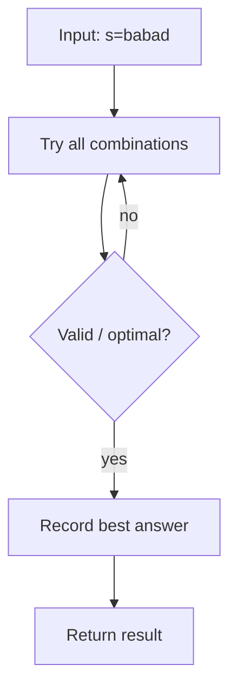
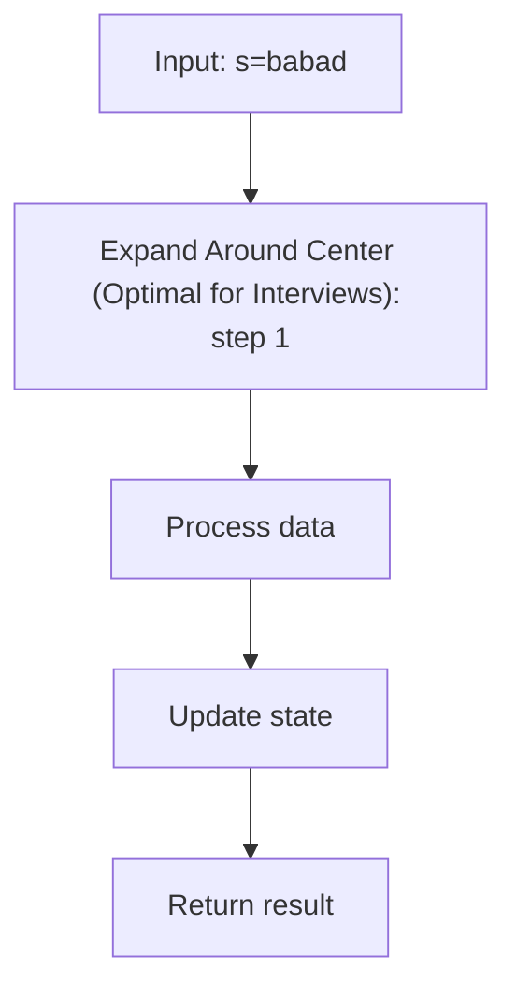
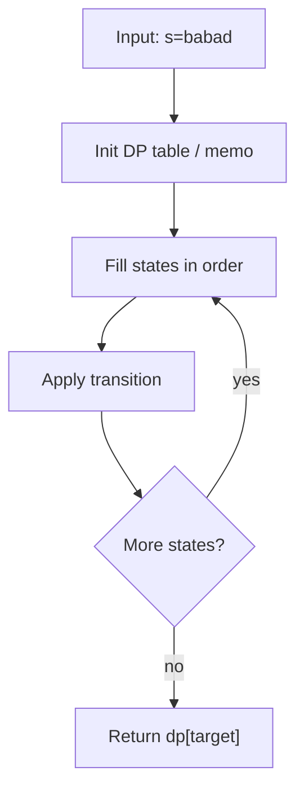
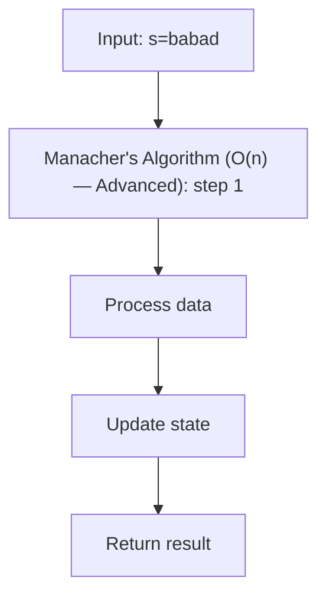
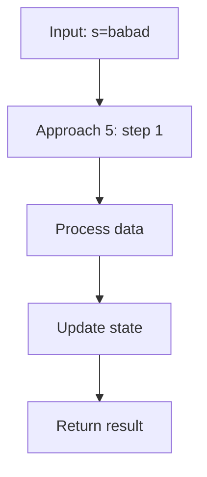

# Longest Palindromic Substring (LeetCode 5)

> **You are here**: DSA — see [ROADMAP](../../../ROADMAP.md) for level assignment
> **Roadmap**: [Developer Master Roadmap](../../../ROADMAP.md) | **Study path**: [StudyGuide](../../StudyGuide.md)
> **Pattern**: [Two Pointers](../../../03_CodingPatterns/02_AlgorithmicPatterns.md#pattern-1-two-pointers) · [Dynamic Programming](../../../03_CodingPatterns/02_AlgorithmicPatterns.md#pattern-16-dynamic-programming-patterns) | **Catalog**: [Algorithmic Patterns](../../../03_CodingPatterns/02_AlgorithmicPatterns.md)

## Problem Statement

Given a string `s`, return the longest palindromic substring in `s`.

**Example 1:**
```
Input: s = "babad"
Output: "bab"
Explanation: "aba" is also a valid answer.
```

**Example 2:**
```
Input: s = "cbbd"
Output: "bb"
```

**Constraints:**
- `1 <= s.length <= 1000`
- `s` consists of only digits and English letters.

---

## Why This Problem Is Important

This is one of the most frequently asked string problems at FAANG companies. It tests understanding of:
- Two-pointer / expand-around-center technique
- Dynamic programming on substrings
- String manipulation and index arithmetic

---

## Approach 1: Brute Force

**Time:** O(n³), **Space:** O(1)

Check every possible substring and verify if it is a palindrome.


#### Example Flow

**Step flow (mermaid):**



**Walkthrough (same example):**

```
Example: s="babad" → "bab" or "aba"
Approach: Brute Force

Enumerate all candidates from example input
Check validity/optimal condition
Keep best answer found
```
```java
public String longestPalindrome(String s) {
    String result = "";
    for (int i = 0; i < s.length(); i++) {
        for (int j = i; j < s.length(); j++) {
            if (isPalindrome(s, i, j) && j - i + 1 > result.length()) {
                result = s.substring(i, j + 1);
            }
        }
    }
    return result;
}

private boolean isPalindrome(String s, int left, int right) {
    while (left < right) {
        if (s.charAt(left) != s.charAt(right)) return false;
        left++;
        right--;
    }
    return true;
}
```

This is O(n²) substrings × O(n) palindrome check = O(n³). Not acceptable in interviews.

---

## Approach 2: Expand Around Center (Optimal for Interviews)

**Time:** O(n²), **Space:** O(1)

### Core Insight

A palindrome mirrors around its center. The center can be:
- A single character (odd-length palindromes: "aba" has center at 'b')
- A gap between two characters (even-length palindromes: "abba" has center between the two 'b's)

For a string of length `n`, there are `2n - 1` possible centers (n characters + n-1 gaps). For each center, we expand outward while the characters on both sides match.

### Complete Implementation


#### Example Flow

**Step flow (mermaid):**



**Walkthrough (same example):**

```
Example: s="babad" → "bab" or "aba"
Approach: Expand Around Center (Optimal for Interviews)

Apply Expand Around Center (Optimal for Interviews) on the example input step by step
Final answer from example: see above
```
```java
public class LongestPalindromicSubstring {
    
    private int start = 0;
    private int maxLen = 0;
    
    public String longestPalindrome(String s) {
        if (s == null || s.length() < 2) return s;
        
        for (int i = 0; i < s.length(); i++) {
            // Try odd-length palindromes (center at character i)
            expandAroundCenter(s, i, i);
            
            // Try even-length palindromes (center between i and i+1)
            expandAroundCenter(s, i, i + 1);
        }
        
        return s.substring(start, start + maxLen);
    }
    
    private void expandAroundCenter(String s, int left, int right) {
        while (left >= 0 && right < s.length() && s.charAt(left) == s.charAt(right)) {
            left--;
            right++;
        }
        
        // After the while loop, left and right point to positions OUTSIDE the palindrome
        // The palindrome is from (left + 1) to (right - 1), length = right - left - 1
        int len = right - left - 1;
        if (len > maxLen) {
            start = left + 1;
            maxLen = len;
        }
    }
}
```

### Alternative Implementation (Without Instance Variables)

```java
public String longestPalindrome(String s) {
    if (s == null || s.length() < 2) return s;
    
    int start = 0, maxLen = 1;
    
    for (int i = 0; i < s.length(); i++) {
        // Odd-length palindrome centered at i
        int len1 = expand(s, i, i);
        // Even-length palindrome centered between i and i+1
        int len2 = expand(s, i, i + 1);
        
        int len = Math.max(len1, len2);
        if (len > maxLen) {
            maxLen = len;
            // Calculate start index from center and length
            start = i - (len - 1) / 2;
        }
    }
    
    return s.substring(start, start + maxLen);
}

private int expand(String s, int left, int right) {
    while (left >= 0 && right < s.length() && s.charAt(left) == s.charAt(right)) {
        left--;
        right++;
    }
    return right - left - 1;
}
```

### Dry Run Example

```
Input: s = "babad"

i=0, center='b':
  Odd: expand(s, 0, 0) → left=-1,right=1 → len=1 ("b")
  Even: expand(s, 0, 1) → 'b'≠'a' → len=0

i=1, center='a':
  Odd: expand(s, 1, 1) → 'b'=='b'? No, s[0]='b',s[2]='b' → YES!
    expand: left=0,right=2 → s[-1]? → stop → len=3 ("bab")
  Even: expand(s, 1, 2) → 'a'≠'b' → len=0
  maxLen=3, start=0

i=2, center='b':
  Odd: expand(s, 2, 2) → s[1]='a',s[3]='a' → YES!
    expand: left=1,right=3 → s[0]='b',s[4]='d' → NO → len=3 ("aba")
  Even: expand(s, 2, 3) → 'b'≠'a' → len=0
  maxLen=3 (no update, same length)

i=3, center='a':
  Odd: expand(s, 3, 3) → s[2]='b',s[4]='d' → NO → len=1
  Even: expand(s, 3, 4) → 'a'≠'d' → len=0

i=4, center='d':
  Odd: expand(s, 4, 4) → len=1
  Even: i+1=5 out of bounds → len=0

Result: s.substring(0, 3) = "bab"
```

### Why the Start Index Formula Works

When we find a palindrome of length `len` centered at index `i`:
- For odd-length: the palindrome extends `(len-1)/2` characters on each side of `i`.
  - Start = `i - (len-1)/2`
- For even-length: the left center is at `i`, so the palindrome extends `(len-1)/2` to the left.
  - Start = `i - (len-1)/2` (same formula works for both cases)

---

## Approach 3: Dynamic Programming

**Time:** O(n²), **Space:** O(n²)

### Core Insight

Define `dp[i][j] = true` if the substring `s[i..j]` is a palindrome.

**Recurrence:**
- Base case: `dp[i][i] = true` (single characters)
- Base case: `dp[i][i+1] = (s[i] == s[i+1])` (two characters)
- Transition: `dp[i][j] = dp[i+1][j-1] && (s[i] == s[j])` (if inner substring is palindrome and outer characters match)

### Complete Implementation


#### Example Flow

**Step flow (mermaid):**



**Walkthrough (same example):**

```
Example: s="babad" → "bab" or "aba"
Approach: Dynamic Programming

Define subproblem table
Fill base cases
Apply recurrence to reach target state
```
```java
public String longestPalindrome(String s) {
    int n = s.length();
    if (n < 2) return s;
    
    boolean[][] dp = new boolean[n][n];
    int start = 0, maxLen = 1;
    
    // Base case: single characters
    for (int i = 0; i < n; i++) {
        dp[i][i] = true;
    }
    
    // Base case: pairs of characters
    for (int i = 0; i < n - 1; i++) {
        if (s.charAt(i) == s.charAt(i + 1)) {
            dp[i][i + 1] = true;
            start = i;
            maxLen = 2;
        }
    }
    
    // Fill for lengths 3 to n
    for (int len = 3; len <= n; len++) {
        for (int i = 0; i <= n - len; i++) {
            int j = i + len - 1;
            
            if (s.charAt(i) == s.charAt(j) && dp[i + 1][j - 1]) {
                dp[i][j] = true;
                if (len > maxLen) {
                    start = i;
                    maxLen = len;
                }
            }
        }
    }
    
    return s.substring(start, start + maxLen);
}
```

### When to Prefer DP Over Expand Around Center

The DP approach is useful when you need to answer multiple queries about palindromic substrings. Once the DP table is built, you can check if any substring is a palindrome in O(1). The expand-around-center approach would require O(n) per query.

---

## Approach 4: Manacher's Algorithm (O(n) — Advanced)

**Time:** O(n), **Space:** O(n)

### Core Idea

Manacher's algorithm exploits the symmetry of palindromes. If we have already found a long palindrome, we can use that information to avoid re-checking characters inside it.

### How It Works

1. **Transform the string**: Insert a special character (like `#`) between every character and at both ends. This converts even-length palindromes into odd-length ones.
   - `"abba"` becomes `"#a#b#b#a#"`
2. **Maintain a "radius" array**: `p[i]` = the radius (half-length) of the longest palindrome centered at `i` in the transformed string.
3. **Use a "center" and "right boundary"**: As we scan left to right, we maintain the rightmost palindrome boundary seen so far and use mirror properties to initialize `p[i]` before expanding.

### Complete Implementation


#### Example Flow

**Step flow (mermaid):**



**Walkthrough (same example):**

```
Example: s="babad" → "bab" or "aba"
Approach: Manacher's Algorithm (O(n) — Advanced)

Apply Manacher's Algorithm (O(n) — Advanced) on the example input step by step
Final answer from example: see above
```
```java
public String longestPalindrome(String s) {
    if (s == null || s.length() < 2) return s;
    
    // Transform: "abc" → "^#a#b#c#$"
    StringBuilder t = new StringBuilder("^");
    for (char c : s.toCharArray()) {
        t.append('#').append(c);
    }
    t.append("#$");
    String T = t.toString();
    
    int n = T.length();
    int[] p = new int[n]; // p[i] = radius of palindrome centered at i
    int center = 0, right = 0;
    
    for (int i = 1; i < n - 1; i++) {
        int mirror = 2 * center - i; // Mirror of i around center
        
        if (i < right) {
            p[i] = Math.min(right - i, p[mirror]);
        }
        
        // Expand around center i
        while (T.charAt(i + p[i] + 1) == T.charAt(i - p[i] - 1)) {
            p[i]++;
        }
        
        // Update center and right if palindrome centered at i extends past right
        if (i + p[i] > right) {
            center = i;
            right = i + p[i];
        }
    }
    
    // Find the maximum in p[]
    int maxLen = 0, centerIndex = 0;
    for (int i = 1; i < n - 1; i++) {
        if (p[i] > maxLen) {
            maxLen = p[i];
            centerIndex = i;
        }
    }
    
    // Map back to original string
    int start = (centerIndex - maxLen - 1) / 2;
    return s.substring(start, start + maxLen);
}
```

### When to Mention Manacher's

Only mention this algorithm if:
1. The interviewer explicitly asks for O(n).
2. You have already solved it with expand-around-center and the interviewer wants optimization.
3. You are very comfortable coding it (it is easy to make off-by-one errors).

---

## Approach Comparison

| Approach | Time | Space | Code Complexity | Interview Recommendation |
|----------|------|-------|----------------|-------------------------|
| Brute Force | O(n³) | O(1) | Simple | Only to establish baseline |
| Expand Around Center | O(n²) | O(1) | Medium | Best for interviews |
| Dynamic Programming | O(n²) | O(n²) | Medium | When follow-up needs DP table |
| Manacher's | O(n) | O(n) | High | Only if asked for O(n) |

---

## Edge Cases

| Case | Input | Expected |
|------|-------|----------|
| Single character | "a" | "a" |
| Two same chars | "aa" | "aa" |
| Two different chars | "ab" | "a" (or "b") |
| All same chars | "aaaa" | "aaaa" |
| No palindrome > 1 | "abcd" | "a" (any single char) |
| Entire string is palindrome | "racecar" | "racecar" |

---

## Common Mistakes

1. **Off-by-one in start index**: The formula `start = i - (len - 1) / 2` is tricky. Test it with both odd and even palindromes.
2. **Forgetting even-length palindromes**: Only expanding around single characters misses palindromes like "abba".
3. **Returning length instead of substring**: The problem asks for the substring, not its length.
4. **Not handling empty or single-character strings**: These are valid inputs.
5. **In DP approach**: Filling the table in the wrong order. Must fill by increasing length, not by increasing `i`.

---

## Follow-Up: Count Palindromic Substrings (LeetCode 647)

Same approach but count all palindromes instead of tracking the longest:


#### Example Flow

**Step flow (mermaid):**



**Walkthrough (same example):**

```
Example: s="babad" → "bab" or "aba"
Approach: Approach 5

Apply Approach 5 on the example input step by step
Final answer from example: see above
```
```java
public int countSubstrings(String s) {
    int count = 0;
    for (int i = 0; i < s.length(); i++) {
        count += countPalindromes(s, i, i);     // Odd
        count += countPalindromes(s, i, i + 1); // Even
    }
    return count;
}

private int countPalindromes(String s, int left, int right) {
    int count = 0;
    while (left >= 0 && right < s.length() && s.charAt(left) == s.charAt(right)) {
        count++;
        left--;
        right++;
    }
    return count;
}
```

---

## LeetCode Similar Problems

- [647. Palindromic Substrings](https://leetcode.com/problems/palindromic-substrings/) — Count all palindromic substrings
- [131. Palindrome Partitioning](https://leetcode.com/problems/palindrome-partitioning/) — Backtracking + palindrome check
- [516. Longest Palindromic Subsequence](https://leetcode.com/problems/longest-palindromic-subsequence/) — DP on subsequence (different!)
- [125. Valid Palindrome](https://leetcode.com/problems/valid-palindrome/) — Two-pointer palindrome check
- [214. Shortest Palindrome](https://leetcode.com/problems/shortest-palindrome/) — KMP-based approach
- [1312. Minimum Insertion Steps to Make a String Palindrome](https://leetcode.com/problems/minimum-insertion-steps-to-make-a-string-palindrome/)

---

## Interview Tips

1. **Start with expand-around-center**: It is the cleanest O(n²) solution with O(1) space.
2. **Explicitly handle both odd and even**: "Each character is a center for odd-length palindromes. Each gap between characters is a center for even-length palindromes."
3. **Practice the index math**: The start index formula `i - (len - 1) / 2` trips many candidates. Work through examples.
4. **Mention Manacher's but don't code it unless asked**: "There is an O(n) algorithm called Manacher's that exploits palindrome symmetry, but the O(n²) expand approach is typically sufficient."
5. **Distinguish substring vs subsequence**: "Longest Palindromic Substring is O(n²) with expand. Longest Palindromic Subsequence is O(n²) DP — they are different problems."
