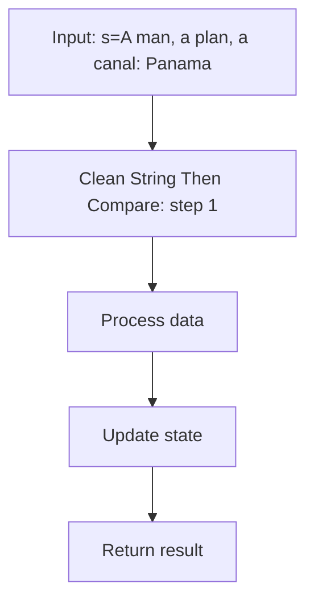
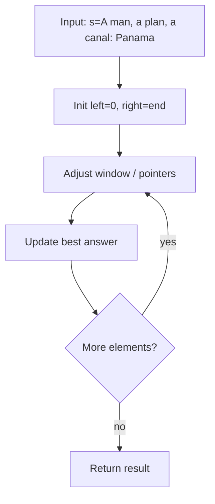
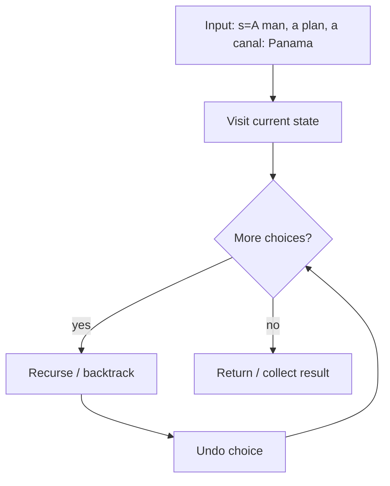
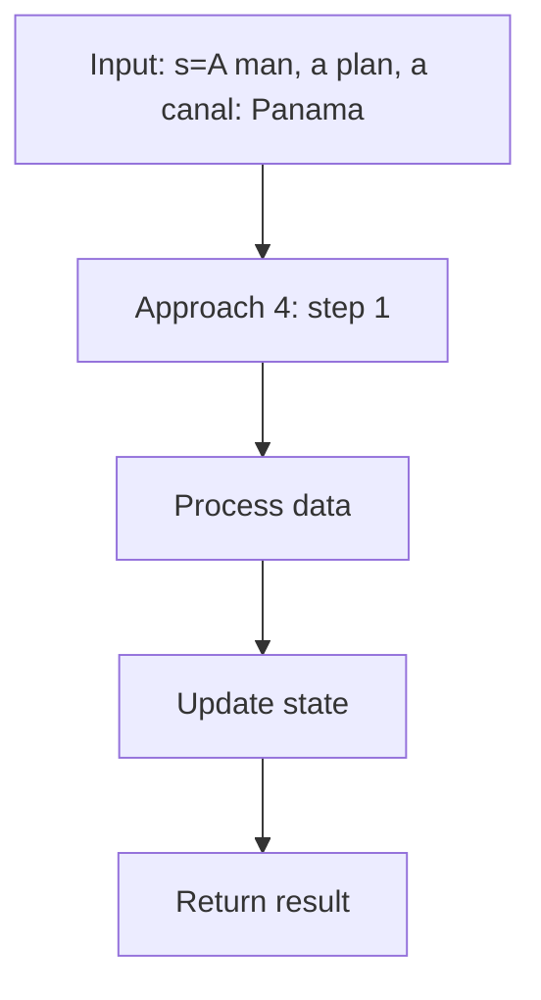

# Valid Palindrome (LeetCode 125)

> **You are here**: DSA — see [ROADMAP](../../../ROADMAP.md) for level assignment
> **Roadmap**: [Developer Master Roadmap](../../../ROADMAP.md) | **Study path**: [StudyGuide](../../StudyGuide.md)
> **Pattern**: [Two Pointers](../../../03_CodingPatterns/02_AlgorithmicPatterns.md#pattern-1-two-pointers) | **Catalog**: [Algorithmic Patterns](../../../03_CodingPatterns/02_AlgorithmicPatterns.md)

## Problem Statement

A phrase is a palindrome if, after converting all uppercase letters into lowercase letters and removing all non-alphanumeric characters, it reads the same forward and backward. Alphanumeric characters include letters and numbers.

Given a string `s`, return `true` if it is a palindrome, or `false` otherwise.

**Example 1:**
```
Input: s = "A man, a plan, a canal: Panama"
Output: true
Explanation: "amanaplanacanalpanama" is a palindrome.
```

**Example 2:**
```
Input: s = "race a car"
Output: false
Explanation: "raceacar" is not a palindrome.
```

**Example 3:**
```
Input: s = " "
Output: true
Explanation: s is an empty string "" after removing non-alphanumeric characters. 
Since an empty string reads the same forward and backward, it is a palindrome.
```

**Constraints:**
- `1 <= s.length <= 2 * 10^5`
- `s` consists only of printable ASCII characters.

---

## Approach 1: Clean String Then Compare

**Time:** O(n), **Space:** O(n)

### How It Works

1. Build a new string containing only lowercase alphanumeric characters.
2. Compare the cleaned string with its reverse.


#### Example Flow

**Step flow (mermaid):**



**Walkthrough (same example):**

```
Example: s="A man, a plan, a canal: Panama" → true
Approach: Clean String Then Compare

Apply Clean String Then Compare on the example input step by step
Final answer from example: see above
```
```java
public boolean isPalindrome(String s) {
    StringBuilder cleaned = new StringBuilder();
    
    for (char c : s.toCharArray()) {
        if (Character.isLetterOrDigit(c)) {
            cleaned.append(Character.toLowerCase(c));
        }
    }
    
    String forward = cleaned.toString();
    String backward = cleaned.reverse().toString();
    
    return forward.equals(backward);
}
```

### Why This Works But Is Not Optimal

This approach is correct and easy to understand, but it uses O(n) extra space to store the cleaned string. In an interview, mention this approach first, then optimize to O(1) space.

---

## Approach 2: Two Pointers — In-Place (Optimal)

**Time:** O(n), **Space:** O(1)

### How It Works

Use two pointers starting from the beginning and end of the string. Skip non-alphanumeric characters and compare the remaining characters case-insensitively. This avoids creating any new string.

### Complete Implementation


#### Example Flow

**Step flow (mermaid):**



**Walkthrough (same example):**

```
Example: s="A man, a plan, a canal: Panama" → true
Approach: Two Pointers — In-Place (Optimal)

Initialize two pointers at boundaries
Move pointer that improves constraint
Update best answer each step
```
```java
public class ValidPalindrome {
    
    public boolean isPalindrome(String s) {
        int left = 0;
        int right = s.length() - 1;
        
        while (left < right) {
            // Move left pointer past non-alphanumeric characters
            while (left < right && !Character.isLetterOrDigit(s.charAt(left))) {
                left++;
            }
            
            // Move right pointer past non-alphanumeric characters
            while (left < right && !Character.isLetterOrDigit(s.charAt(right))) {
                right--;
            }
            
            // Compare characters (case-insensitive)
            if (Character.toLowerCase(s.charAt(left)) != Character.toLowerCase(s.charAt(right))) {
                return false;
            }
            
            left++;
            right--;
        }
        
        return true;
    }
}
```

### Dry Run Example

```
Input: "A man, a plan, a canal: Panama"

Step 1: left=0 ('A'), right=29 ('a')
  Skip nothing. Compare: 'a' == 'a' ✓. Move: left=1, right=28

Step 2: left=1 (' '), right=28 ('m')
  Skip space at left → left=2 ('m')
  Compare: 'm' == 'm' ✓. Move: left=3, right=27

Step 3: left=3 ('a'), right=27 ('a')
  Compare: 'a' == 'a' ✓. Move: left=4, right=26

Step 4: left=4 ('n'), right=26 ('n')
  Compare: 'n' == 'n' ✓. Move: left=5, right=25

... continues matching all characters ...

All characters matched → return true
```

### Why This Is the Preferred Interview Approach

1. **O(1) space** — no extra string creation.
2. **Single pass** — efficient O(n) time.
3. **Clean code** — shows mastery of two-pointer technique.
4. **Uses Java API effectively** — `Character.isLetterOrDigit()` and `Character.toLowerCase()`.

---

## Approach 3: Recursive (Less Common)

**Time:** O(n), **Space:** O(n) due to call stack


#### Example Flow

**Step flow (mermaid):**



**Walkthrough (same example):**

```
Example: s="A man, a plan, a canal: Panama" → true
Approach: Recursive (Less Common)

Visit current node/state
Recurse on valid next choices
Backtrack and try alternatives
```
```java
public boolean isPalindrome(String s) {
    String cleaned = s.replaceAll("[^a-zA-Z0-9]", "").toLowerCase();
    return isPalindromeHelper(cleaned, 0, cleaned.length() - 1);
}

private boolean isPalindromeHelper(String s, int left, int right) {
    if (left >= right) return true;
    if (s.charAt(left) != s.charAt(right)) return false;
    return isPalindromeHelper(s, left + 1, right - 1);
}
```

This approach is not recommended due to O(n) stack space and is slower due to regex processing, but it demonstrates recursion understanding.

---

## Important Java API Methods

| Method | Purpose | Example |
|--------|---------|---------|
| `Character.isLetterOrDigit(c)` | Check if char is alphanumeric | `'a'` → true, `','` → false |
| `Character.isLetter(c)` | Check if char is a letter only | `'a'` → true, `'1'` → false |
| `Character.isDigit(c)` | Check if char is a digit only | `'1'` → true, `'a'` → false |
| `Character.toLowerCase(c)` | Convert to lowercase | `'A'` → `'a'` |
| `Character.toUpperCase(c)` | Convert to uppercase | `'a'` → `'A'` |

---

## Approach Comparison

| Approach | Time | Space | Pros | Cons |
|----------|------|-------|------|------|
| Clean + Compare | O(n) | O(n) | Simple, readable | Extra space |
| Two Pointers | O(n) | O(1) | Optimal space | Slightly more complex |
| Recursive | O(n) | O(n) stack | Shows recursion | Stack overflow risk, slower |

---

## Edge Cases

| Case | Input | Expected | Explanation |
|------|-------|----------|-------------|
| Empty after cleaning | `" "` | `true` | Empty string is a palindrome |
| Single character | `"a"` | `true` | Single char is always a palindrome |
| Only non-alphanumeric | `",.!?"` | `true` | Cleaned string is empty |
| Numbers in string | `"0P"` | `false` | '0' and 'p' are different |
| All same characters | `"aaaa"` | `true` | Obviously a palindrome |
| Mixed case palindrome | `"Aa"` | `true` | Case-insensitive comparison |

---

## Follow-Up: Valid Palindrome II (LeetCode 680)

Given a string, return `true` if the string can be a palindrome after deleting at most one character. This is a common follow-up question.


#### Example Flow

**Step flow (mermaid):**



**Walkthrough (same example):**

```
Example: s="A man, a plan, a canal: Panama" → true
Approach: Approach 4

Apply Approach 4 on the example input step by step
Final answer from example: see above
```
```java
public boolean validPalindrome(String s) {
    int left = 0, right = s.length() - 1;
    
    while (left < right) {
        if (s.charAt(left) != s.charAt(right)) {
            // Try removing either character
            return isPalindromeRange(s, left + 1, right) || 
                   isPalindromeRange(s, left, right - 1);
        }
        left++;
        right--;
    }
    return true;
}

private boolean isPalindromeRange(String s, int left, int right) {
    while (left < right) {
        if (s.charAt(left) != s.charAt(right)) return false;
        left++;
        right--;
    }
    return true;
}
```

**Time:** O(n), **Space:** O(1)

---

## LeetCode Similar Problems

- [680. Valid Palindrome II](https://leetcode.com/problems/valid-palindrome-ii/) — Delete at most one character
- [5. Longest Palindromic Substring](https://leetcode.com/problems/longest-palindromic-substring/) — Expand around center
- [234. Palindrome Linked List](https://leetcode.com/problems/palindrome-linked-list/) — Two pointers on linked list
- [9. Palindrome Number](https://leetcode.com/problems/palindrome-number/) — Without converting to string
- [647. Palindromic Substrings](https://leetcode.com/problems/palindromic-substrings/) — Count all palindromic substrings
- [131. Palindrome Partitioning](https://leetcode.com/problems/palindrome-partitioning/) — Backtracking + palindrome check

---

## Interview Tips

1. **State the two-pointer approach immediately**: "I'll use two pointers from both ends, skipping non-alphanumeric characters and comparing case-insensitively."
2. **Mention the space optimization**: "I could clean the string first, but that uses O(n) space. The two-pointer approach is O(1) space."
3. **Know the Character API**: Using `Character.isLetterOrDigit()` instead of manual ASCII checks shows Java proficiency.
4. **Be ready for the follow-up**: The "delete at most one character" variant (LeetCode 680) is a very common follow-up.
5. **Discuss Unicode considerations**: In a real system, you might need to handle Unicode normalization (combining characters, accents). Mention this to show production awareness.
