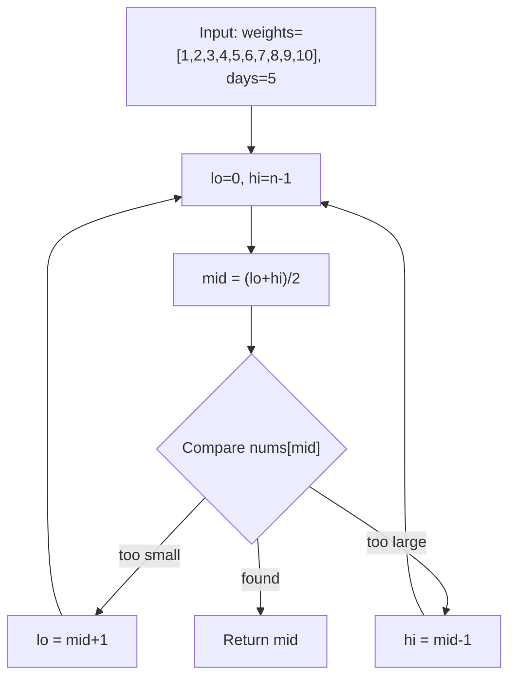
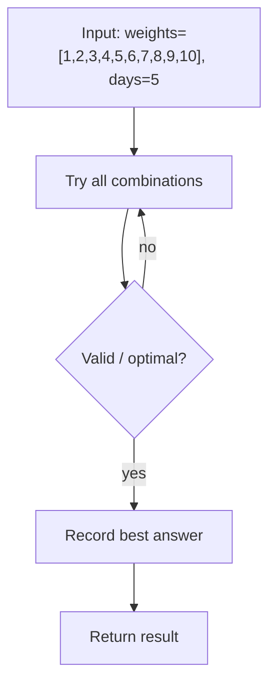

# Capacity To Ship Packages Within D Days — LeetCode 1011

> **You are here**: Senior SDE — DSA (binary search on answer)
> **Roadmap**: [Developer Master Roadmap](../../../ROADMAP.md#senior-sde) | **Prerequisites**: [Koko Eating Bananas](../KokoEatingBananas/KokoEatingBananas.md) | **Next**: [Split Array Largest Sum](../SplitArrayLargestSum/SplitArrayLargestSum.md)
> **Pattern**: [Modified Binary Search](../../../03_CodingPatterns/02_AlgorithmicPatterns.md#pattern-11-modified-binary-search) | **Catalog**: [Algorithmic Patterns](../../../03_CodingPatterns/02_AlgorithmicPatterns.md)

## Problem Statement

A conveyor belt has packages that must be shipped from one port to another within `days` days.

The `i`-th package has weight `weights[i]`. Each day, we load the ship with packages on the belt (in order). We may not load more weight than the ship's capacity.

Return the **least weight capacity** of the ship that will result in all packages being shipped within `days` days.

**Example 1:**
```
Input: weights = [1,2,3,4,5,6,7,8,9,10], days = 5
Output: 15
Explanation: ship with capacity 15 can split as [1,2,3,4,5], [6,7], [8], [9], [10]
```

**Example 2:**
```
Input: weights = [3,2,2,4,1,4], days = 3
Output: 6
```

---

## Approach 1: Binary Search on Answer (Optimal)

The answer lives in `[max(weights), sum(weights)]`:

| Bound | Why |
|-------|-----|
| `lo = max(weights)` | Must fit the heaviest single package |
| `hi = sum(weights)` | One day, one trip — always feasible |

Define `feasible(cap)`: greedily pack consecutive packages each day without exceeding `cap`; count days needed. If `daysNeeded ≤ days`, capacity is sufficient.

Monotonicity: if capacity `c` works, any `c' > c` also works → binary search for minimum feasible capacity.

### Key Logic


#### Example Flow

**Step flow (mermaid):**



**Walkthrough (same example):**

```
Example: weights=[1,2,3,4,5,6,7,8,9,10], days=5 → capacity 15
Approach: Binary Search on Answer (Optimal)

Set lo/hi bounds on answer or index
Compare mid element with target
Halve search space until found
```
```java
int lo = max(weights), hi = sum(weights);
while (lo < hi) {
    int mid = lo + (hi - lo) / 2;
    if (canShip(weights, days, mid)) hi = mid;
    else lo = mid + 1;
}
return lo;

private boolean canShip(int[] weights, int days, int cap) {
    int daysUsed = 1, load = 0;
    for (int w : weights) {
        if (load + w > cap) {   // start a new day
            daysUsed++;
            load = 0;
        }
        load += w;
    }
    return daysUsed <= days;
}
```

### Complexity

- **Time**: O(n log S) where S = sum of weights
- **Space**: O(1)

---

## Approach 2: Linear Search on Capacity (Baseline)

Iterate capacity from `max(weights)` upward until `feasible(cap)` returns true. Same greedy check, but no binary search — acceptable for small sums or as a stepping stone before optimizing.


#### Example Flow

**Step flow (mermaid):**



**Walkthrough (same example):**

```
Example: weights=[1,2,3,4,5,6,7,8,9,10], days=5 → capacity 15
Approach: Linear Search on Capacity (Baseline)

Enumerate all candidates from example input
Check validity/optimal condition
Keep best answer found
```
```java
int cap = max(weights);
while (!canShip(weights, days, cap)) cap++;
return cap;
```

### Complexity

- **Time**: O(n · S) in the worst case
- **Space**: O(1)

---

## Pattern Recognition

| Signal | Pattern |
|--------|---------|
| "Minimum capacity/speed/value that satisfies constraint" | Binary search on answer |
| Greedy day-by-day packing with fixed limit | Feasibility function inside binary search |
| Monotonic `feasible(x)` | If `f(x)` true, `f(x+1)` true |

**Related problems**: [Koko Eating Bananas](../KokoEatingBananas/KokoEatingBananas.md), [Split Array Largest Sum](../SplitArrayLargestSum/SplitArrayLargestSum.md), Minimum Speed to Arrive on Time.

---

## Interview Tips

1. State the answer space `[max, sum]` before writing code — interviewers want to see you bound the search.
2. The greedy feasibility check is identical in spirit to Split Array Largest Sum (days ↔ parts).
3. Watch the greedy detail: when `load + w > cap`, reset `load = 0` **then** add `w` (not skip `w`).
4. Use `int` for capacity bounds; `long` only if sums overflow 32-bit (rare in interviews).

**Code**: [CapacityToShipPackages.java](CapacityToShipPackages.java)
