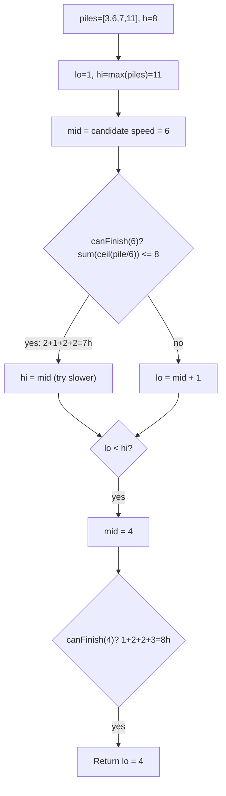

# Koko Eating Bananas — LeetCode 875

> **You are here**: DSA — see [ROADMAP](../../../ROADMAP.md) for level assignment
> **Roadmap**: [Developer Master Roadmap](../../../ROADMAP.md) | **Study path**: [StudyGuide](../../StudyGuide.md)
> **Pattern**: [Modified Binary Search](../../../03_CodingPatterns/02_AlgorithmicPatterns.md#pattern-11-modified-binary-search) | **Catalog**: [Algorithmic Patterns](../../../03_CodingPatterns/02_AlgorithmicPatterns.md)

## Problem Statement

Koko loves bananas. There are `n` piles of bananas; pile `i` has `piles[i]` bananas. The guards return in `h` hours.

Koko can decide her eating speed `k` (bananas per hour). Each hour she picks a pile and eats `k` bananas from it (or the whole pile if fewer than `k` remain). She cannot split eating across piles in the same hour.

Return the **minimum integer `k`** such that she can eat all bananas within `h` hours.

**Example:**
```
Input: piles = [3,6,7,11], h = 8
Output: 4
```

---

## Approach: Binary Search on Answer

The answer space is `[1, max(piles)]`. For a candidate speed `k`, check if Koko can finish in `h` hours:

```
hours(k) = sum(ceil(pile / k)) for each pile
```

If `hours(k) <= h`, try smaller `k`; else increase `k`.

### Key Logic


#### Example Flow

**Step flow (mermaid):**



**Walkthrough (same example):**

```
Answer space: speed k in [1, 11] (1 to max pile)

k=6: hours = ceil(3/6)+ceil(6/6)+ceil(7/6)+ceil(11/6) = 1+1+2+2 = 7 ≤ 8 → feasible, try slower
k=3: hours = 1+2+3+4 = 10 > 8 → too slow, need faster
k=4: hours = 1+2+2+3 = 8 ≤ 8 → feasible
k=5: also feasible but 4 is minimum → answer = 4
```
```java
public int minEatingSpeed(int[] piles, int h) {
    int left = 1, right = max(piles);
    while (left < right) {
        int mid = left + (right - left) / 2;
        if (canFinish(piles, mid, h)) right = mid;
        else left = mid + 1;
    }
    return left;
}

private boolean canFinish(int[] piles, int speed, int h) {
    long hours = 0;
    for (int pile : piles) {
        hours += (pile + speed - 1) / speed; // ceil division
    }
    return hours <= h;
}
```

### Complexity

- **Time**: O(n log M) where M = max pile size
- **Space**: O(1)

---

## Pattern Recognition

| Signal | Pattern |
|--------|---------|
| "Minimum maximum" or "minimum value that satisfies constraint" | Binary search on answer |
| Monotonic feasibility function | If `f(k)` is true, `f(k+1)` is also true |

**Related problems**: Capacity to Ship Packages, Split Array Largest Sum, Minimum Speed to Arrive on Time.

---

## Interview Tips

1. State that you're binary searching on the answer space, not the array indices.
2. Use `long` for hour accumulation to avoid overflow on large piles.
3. Use `ceil(pile/speed)` as `(pile + speed - 1) / speed` to avoid floating point.
