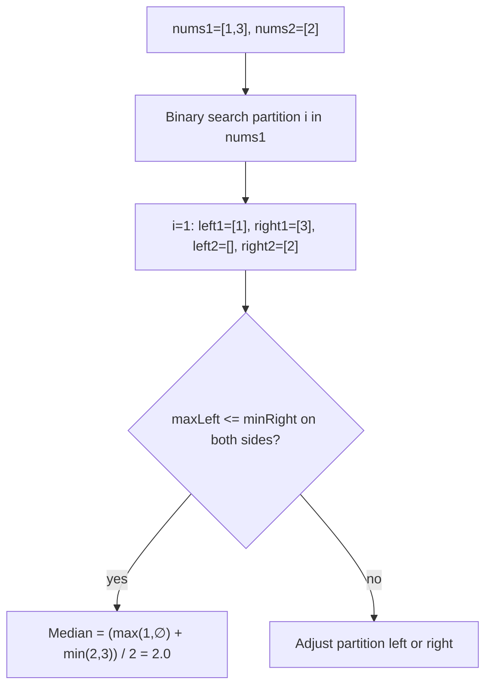
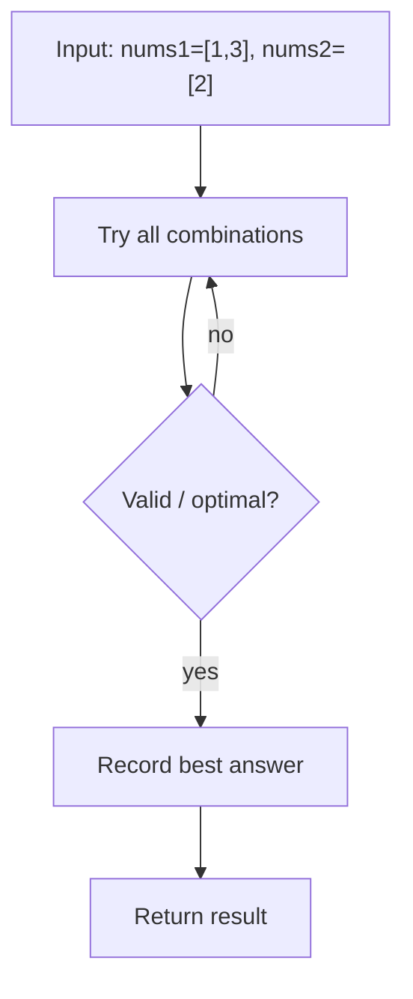

# Median of Two Sorted Arrays — LeetCode 4

> **You are here**: Staff Engineer — DSA (hard binary search)
> **Roadmap**: [Developer Master Roadmap](../../../ROADMAP.md#staff-engineer) | **Prerequisites**: [Binary Search](../BinarySearch/BinarySearch.md) | **Next**: [Burst Balloons](../../13_Dynamic_Programming/BurstBalloons/BurstBalloons.md)
> **Pattern**: [Modified Binary Search](../../../03_CodingPatterns/02_AlgorithmicPatterns.md#pattern-11-modified-binary-search) | **Catalog**: [Algorithmic Patterns](../../../03_CodingPatterns/02_AlgorithmicPatterns.md)

## Problem Statement

Given two sorted arrays `nums1` and `nums2` of size `m` and `n` respectively, return the **median** of the two sorted arrays combined.

The overall run time complexity should be **O(log (m + n))**.

**Example 1:**
```
Input: nums1 = [1,3], nums2 = [2]
Output: 2.00000
Explanation: merged = [1,2,3], median = 2
```

**Example 2:**
```
Input: nums1 = [1,2], nums2 = [3,4]
Output: 2.50000
Explanation: merged = [1,2,3,4], median = (2 + 3) / 2 = 2.5
```

---

## Approach 1: Binary Search on Partition (Optimal)

Instead of merging, imagine a **cut** that splits both arrays into left and right halves. The median is valid when every element on the left is ≤ every element on the right.

Binary search the cut position `i` in the **shorter** array `nums1` (length `m`). The cut in `nums2` is forced:

```
j = (m + n + 1) / 2 - i    // left half has (m+n+1)/2 elements (handles odd length)
```

A partition is **valid** when:

```
maxLeft1 ≤ minRight2   AND   maxLeft2 ≤ minRight1
```

where `maxLeft1` / `minRight1` are neighbors around cut `i` in `nums1` (use ±∞ at boundaries).

If `maxLeft1 > minRight2`, move cut left (`hi = i - 1`); else move right (`lo = i + 1`).

### Key Logic


#### Example Flow

**Step flow (mermaid):**



**Walkthrough (same example):**

```
Example: nums1=[1,3], nums2=[2] → 2.0
Approach: Binary Search on Partition (Optimal)

Set lo/hi bounds on answer or index
Compare mid element with target
Halve search space until found
```
```java
// Always binary search on the shorter array
if (nums1.length > nums2.length) return findMedianSortedArrays(nums2, nums1);

int lo = 0, hi = m;
while (lo <= hi) {
    int i = (lo + hi) / 2;
    int j = (m + n + 1) / 2 - i;

    int maxLeft1  = (i == 0) ? Integer.MIN_VALUE : nums1[i - 1];
    int minRight1 = (i == m) ? Integer.MAX_VALUE : nums1[i];
    int maxLeft2  = (j == 0) ? Integer.MIN_VALUE : nums2[j - 1];
    int minRight2 = (j == n) ? Integer.MAX_VALUE : nums2[j];

    if (maxLeft1 <= minRight2 && maxLeft2 <= minRight1) {
        if ((m + n) % 2 == 1) return Math.max(maxLeft1, maxLeft2);
        return (Math.max(maxLeft1, maxLeft2) + Math.min(minRight1, minRight2)) / 2.0;
    } else if (maxLeft1 > minRight2) {
        hi = i - 1;
    } else {
        lo = i + 1;
    }
}
```

### Complexity

- **Time**: O(log min(m, n)) — binary search on shorter array only
- **Space**: O(1)

---

## Approach 2: Merge and Pick Middle (Baseline)

Merge both arrays (or use two pointers) into one sorted view, then return the middle element(s). Correct and easy to explain, but does **not** meet the O(log(m+n)) requirement.


#### Example Flow

**Step flow (mermaid):**



**Walkthrough (same example):**

```
Example: nums1=[1,3], nums2=[2] → 2.0
Approach: Merge and Pick Middle (Baseline)

Enumerate all candidates from example input
Check validity/optimal condition
Keep best answer found
```
```java
// Two-pointer merge until we've seen (m+n)/2 + 1 elements
int i = 0, j = 0, prev = 0, cur = 0;
for (int count = 0; count <= (m + n) / 2; count++) {
    prev = cur;
    if (i < m && (j >= n || nums1[i] <= nums2[j])) cur = nums1[i++];
    else cur = nums2[j++];
}
return (m + n) % 2 == 1 ? cur : (prev + cur) / 2.0;
```

### Complexity

- **Time**: O(m + n)
- **Space**: O(1) with two pointers (O(m + n) if you materialize the merge)

---

## Pattern Recognition

| Signal | Pattern |
|--------|---------|
| Median of two sorted sequences in sub-linear time | Binary search on partition, not on values |
| "Find a split where left ≤ right" | Invariant-based binary search |
| Edge indices `i == 0`, `i == m` | Sentinel ±∞ for empty left/right halves |

**Related problems**: Kth Smallest in Two Sorted Arrays, Median of a Data Stream.

---

## Interview Tips

1. **Start with the merge idea** to show you understand the problem, then pivot: "We can binary search where the cut goes."
2. **Always search the shorter array** — keeps `j` in bounds and gives O(log min(m,n)).
3. Use `(m + n + 1) / 2` for left-half size so odd total length picks the single middle from the left partition.
4. Walk through `nums1 = [1,3]`, `nums2 = [2]` on the whiteboard — cuts at `i=1, j=0` is the answer.
5. Staff-tier signal: calm handling of boundary sentinels without off-by-one bugs.

---

## Why Staff-tier

Tests invariant reasoning, edge indices (`i == 0`, `i == m`), and calm coding under pressure — one of the hardest binary-search problems in interview catalogs.

**Code**: [MedianOfTwoSortedArrays.java](MedianOfTwoSortedArrays.java)
