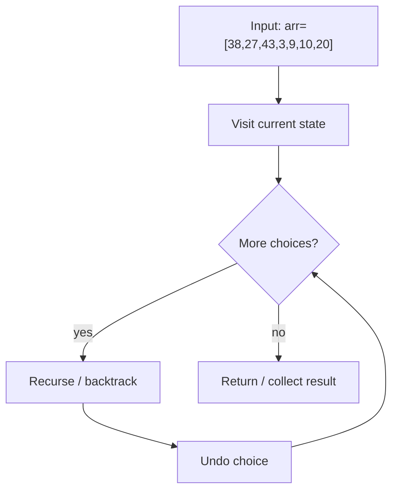
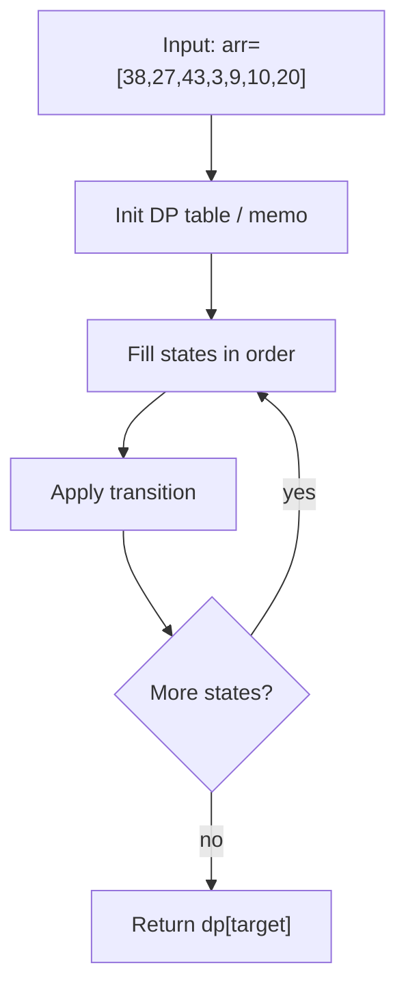
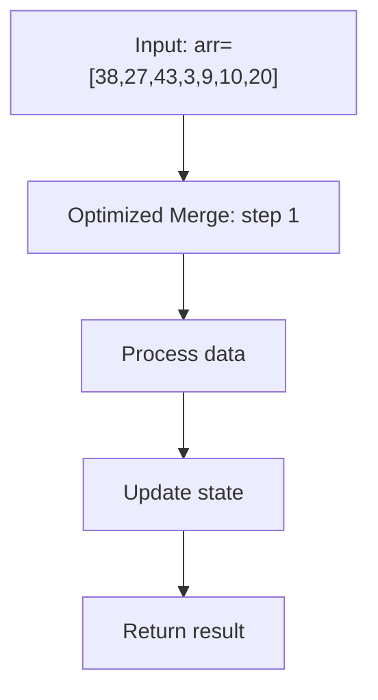

# Merge Sort Algorithm

> **You are here**: DSA — see [ROADMAP](../../../ROADMAP.md) for level assignment
> **Roadmap**: [Developer Master Roadmap](../../../ROADMAP.md) | **Study path**: [StudyGuide](../../StudyGuide.md)
> **Pattern**: [Sorting](../../../03_CodingPatterns/02_AlgorithmicPatterns.md#pattern-recognition-decision-tree) | **Catalog**: [Algorithmic Patterns](../../../03_CodingPatterns/02_AlgorithmicPatterns.md)

## Problem Statement
Implement the Merge Sort algorithm to sort an array of integers in ascending order.

Merge Sort is a **divide-and-conquer** algorithm that divides the input array into two halves, recursively sorts both halves, and then merges the two sorted halves.

## Algorithm Overview

### Basic Principle:
1. **Divide**: Split the array into two halves
2. **Conquer**: Recursively sort both halves
3. **Combine**: Merge the two sorted halves into a single sorted array

### Example:
```
Original: [64, 34, 25, 12, 22, 11, 90]

Divide:
[64, 34, 25] | [12, 22, 11, 90]

Continue dividing...
[64] [34, 25] | [12] [22, 11, 90]
[64] [34] [25] | [12] [22] [11, 90]

Merge back up:
[34, 64] [25] | [12] [11, 22] [90]
[25, 34, 64] | [11, 12, 22, 90]
[11, 12, 22, 25, 34, 64, 90]
```

## Time & Space Complexity

### Time Complexity:
- **Best Case**: O(n log n)
- **Average Case**: O(n log n)
- **Worst Case**: O(n log n)

**Explanation**: Always divides array in half (log n levels) and merges in linear time (n) at each level.

### Space Complexity:
- **O(n)**: Requires auxiliary array for merging
- **O(log n)**: Recursion stack space

## Implementation Variations

### 1. Classic Top-Down Approach

#### Example Flow

**Step flow (mermaid):**



**Walkthrough (same example):**

```
Example: arr=[38,27,43,3,9,10,20] → [3,9,10,20,27,38,43]
Approach: Top-Down Recursive

Visit current node/state
Recurse on valid next choices
Backtrack and try alternatives
```
```java
public void mergeSortClassic(int[] arr) {
    if (arr.length <= 1) return;
    
    int mid = arr.length / 2;
    int[] left = Arrays.copyOfRange(arr, 0, mid);
    int[] right = Arrays.copyOfRange(arr, mid, arr.length);
    
    mergeSortClassic(left);
    mergeSortClassic(right);
    merge(arr, left, right);
}
```

### 2. Bottom-Up Iterative Approach

#### Example Flow

**Step flow (mermaid):**



**Walkthrough (same example):**

```
Example: arr=[38,27,43,3,9,10,20] → [3,9,10,20,27,38,43]
Approach: Bottom-Up Iterative

Define subproblem table
Fill base cases
Apply recurrence to reach target state
```
```java
public void mergeSortBottomUp(int[] arr) {
    for (int size = 1; size < arr.length; size *= 2) {
        for (int left = 0; left < arr.length - size; left += 2 * size) {
            int mid = left + size - 1;
            int right = Math.min(left + 2 * size - 1, arr.length - 1);
            merge(arr, left, mid, right);
        }
    }
}
```

### 3. Optimized Version
**Optimizations**:
- Use insertion sort for small subarrays (< 7 elements)
- Skip merge if already sorted (arr[mid] ≤ arr[mid+1])
- Eliminate copying back to original array
- Use sentinel values to avoid boundary checks

## Merge Process

The core of merge sort is the **merge operation**:


#### Example Flow

**Step flow (mermaid):**



**Walkthrough (same example):**

```
Example: arr=[38,27,43,3,9,10,20] → [3,9,10,20,27,38,43]
Approach: Optimized Merge

Apply Optimized Merge on the example input step by step
Final answer from example: see above
```
```java
private void merge(int[] arr, int[] temp, int left, int mid, int right) {
    // Copy to temporary array
    for (int i = left; i <= right; i++) {
        temp[i] = arr[i];
    }
    
    int i = left, j = mid + 1, k = left;
    
    // Merge back to original array
    while (i <= mid && j <= right) {
        if (temp[i] <= temp[j]) {
            arr[k++] = temp[i++];
        } else {
            arr[k++] = temp[j++];
        }
    }
    
    // Copy remaining elements
    while (i <= mid) arr[k++] = temp[i++];
    while (j <= right) arr[k++] = temp[j++];
}
```

## Advantages

1. **Predictable Performance**: Always O(n log n)
2. **Stable**: Maintains relative order of equal elements
3. **External Sorting**: Works well for large datasets that don't fit in memory
4. **Parallelizable**: Can be easily parallelized
5. **Good for Linked Lists**: No random access required

## Disadvantages

1. **Space Complexity**: Requires O(n) extra space
2. **Not In-Place**: Cannot sort in-place efficiently
3. **Overhead**: More overhead than quicksort for small arrays
4. **Cache Performance**: Poor cache locality compared to quicksort

## Comparison with Other Algorithms

| Algorithm | Best | Average | Worst | Space | Stable | In-place |
|-----------|------|---------|-------|-------|--------|----------|
| Merge Sort | O(n log n) | O(n log n) | O(n log n) | O(n) | Yes | No |
| Quick Sort | O(n log n) | O(n log n) | O(n²) | O(log n) | No | Yes |
| Heap Sort | O(n log n) | O(n log n) | O(n log n) | O(1) | No | Yes |
| Insertion Sort | O(n) | O(n²) | O(n²) | O(1) | Yes | Yes |

## Applications

1. **External Sorting**: Sorting large files that don't fit in memory
2. **Stable Sorting**: When maintaining order of equal elements is important
3. **Linked Lists**: Efficient for sorting linked lists
4. **Parallel Processing**: Easy to parallelize for multi-core systems
5. **Database Systems**: Used in database sort operations

## Common Mistakes

1. **Incorrect Merge Logic**: Not handling array bounds properly
2. **Memory Allocation**: Creating new arrays in every recursive call
3. **Base Case**: Not handling single element or empty arrays
4. **Integer Overflow**: Using (left + right) / 2 instead of left + (right - left) / 2
5. **Stability**: Not preserving order of equal elements

## Advanced Topics

### 1. In-Place Merge Sort
- Time complexity becomes O(n log² n)
- More complex implementation
- Rarely used in practice
#### Example Flow

**Step flow (mermaid):**


**Walkthrough (same example):**

```
Example: arr=[38,27,43,3,9,10,20] → [3,9,10,20,27,38,43]
Approach: Optimized Merge

Apply Optimized Merge on the example input step by step
Final answer from example: see above
```


### 2. Natural Merge Sort
- Takes advantage of existing runs in data
- Better performance on partially sorted data
#### Example Flow

**Step flow (mermaid):**


**Walkthrough (same example):**

```
Example: arr=[38,27,43,3,9,10,20] → [3,9,10,20,27,38,43]
Approach: Optimized Merge

Apply Optimized Merge on the example input step by step
Final answer from example: see above
```


### 3. Parallel Merge Sort
- Uses multiple threads/cores
- Divide work among processors
- Significant speedup on multi-core systems

## When to Use Merge Sort

**Use Merge Sort when**:
- Stability is required
- Predictable performance is needed
- Sorting linked lists
- External sorting is required
- Working with large datasets

**Don't use Merge Sort when**:
- Memory is severely constrained
- Working with small arrays (use insertion sort)
- In-place sorting is required (use heap sort or quick sort)

## LeetCode Similar Problems:
- [23. Merge k Sorted Lists](https://leetcode.com/problems/merge-k-sorted-lists/)
- [88. Merge Sorted Array](https://leetcode.com/problems/merge-sorted-array/)
- [148. Sort List](https://leetcode.com/problems/sort-list/)
- [315. Count of Smaller Numbers After Self](https://leetcode.com/problems/count-of-smaller-numbers-after-self/)
- [493. Reverse Pairs](https://leetcode.com/problems/reverse-pairs/)

## Related Problems
- Merge K Sorted Lists
- Count Inversions in Array
- Sort Linked List
- External Sorting Algorithms
#### Example Flow

**Step flow (mermaid):**


**Walkthrough (same example):**

```
Example: arr=[38,27,43,3,9,10,20] → [3,9,10,20,27,38,43]
Approach: Optimized Merge

Apply Optimized Merge on the example input step by step
Final answer from example: see above
```
 