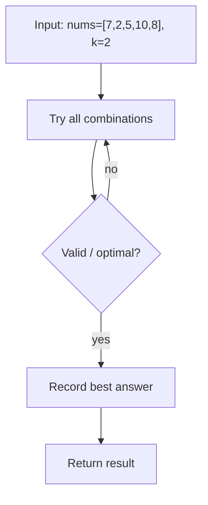

# Split Array Largest Sum — LeetCode 410

> **You are here**: Staff Engineer — DSA (binary search on answer)
> **Roadmap**: [Developer Master Roadmap](../../../ROADMAP.md#staff-engineer) | **Prerequisites**: [Capacity To Ship Packages](../CapacityToShipPackages/CapacityToShipPackages.md) | **Next**: [Median of Two Sorted Arrays](../MedianOfTwoSortedArrays/MedianOfTwoSortedArrays.md)
> **Pattern**: [Modified Binary Search](../../../03_CodingPatterns/02_AlgorithmicPatterns.md#pattern-11-modified-binary-search) | **Catalog**: [Algorithmic Patterns](../../../03_CodingPatterns/02_AlgorithmicPatterns.md)

## Problem Statement

Given an integer array `nums` and an integer `k`, split `nums` into `k` **non-empty contiguous subarrays** such that the largest sum among these subarrays is **minimized**.

Return the minimized largest sum.

**Example 1:**
```
Input: nums = [7,2,5,10,8], k = 2
Output: 18
Explanation: split into [7,2,5] and [10,8]; largest sum = 18
```

**Example 2:**
```
Input: nums = [1,2,3,4,5], k = 2
Output: 9
Explanation: split into [1,2,3,4] and [5]; or [1,2,3] and [4,5] → min max-sum = 9
```

---

## Approach 1: Binary Search on Answer (Optimal)

Binary search the **maximum allowed subarray sum** in `[max(nums), sum(nums)]`.

`feasible(maxSum)`: greedily form subarrays left-to-right; start a new subarray whenever adding the next element would exceed `maxSum`. If the number of subarrays needed is ≤ `k`, the limit is achievable.

Monotonicity: if `maxSum` works, any larger limit also works → search for the minimum feasible limit.

### Key Logic


#### Example Flow

**Step flow (mermaid):**

```mermaid
flowchart TD
    START["nums=[7,2,5,10,8], k=2"]
    START --> BOUNDS["lo=max(nums)=10, hi=sum(nums)=32"]
    BOUNDS --> MID["mid = max allowed subarray sum = 18"]
    MID --> FEAS{"feasible(18)? split into ≤2 subarrays"}
    FEAS -->|yes: [7,2,5] and [10,8]| HI["hi = mid (try smaller limit)"]
    FEAS -->|no| LO["lo = mid + 1"]
    HI --> DONE["Return minimum feasible max-sum = 18"]
```

**Walkthrough (same example):**

```
Example: nums=[7,2,5,10,8], k=2 → 18
Approach: Binary Search on Answer (Optimal)

Set lo/hi bounds on answer or index
Compare mid element with target
Halve search space until found
```
```java
int lo = max(nums), hi = sum(nums);
while (lo < hi) {
    int mid = lo + (hi - lo) / 2;
    if (canSplit(nums, k, mid)) hi = mid;
    else lo = mid + 1;
}
return lo;

private boolean canSplit(int[] nums, int k, int maxSum) {
    int parts = 1, cur = 0;
    for (int x : nums) {
        if (cur + x > maxSum) {
            parts++;
            cur = 0;
        }
        cur += x;
    }
    return parts <= k;
}
```

### Complexity

- **Time**: O(n log S) where S = sum of nums
- **Space**: O(1)

---

## Approach 2: Linear Search on maxSum (Baseline)

Try increasing `maxSum` from `max(nums)` until `canSplit` succeeds. Identical greedy check, no binary search.


#### Example Flow

**Step flow (mermaid):**



**Walkthrough (same example):**

```
Example: nums=[7,2,5,10,8], k=2 → 18
Approach: Linear Search on maxSum (Baseline)

Enumerate all candidates from example input
Check validity/optimal condition
Keep best answer found
```
```java
int limit = max(nums);
while (!canSplit(nums, k, limit)) limit++;
return limit;
```

### Complexity

- **Time**: O(n · S)
- **Space**: O(1)

---

## Pattern Recognition

| Signal | Pattern |
|--------|---------|
| "Minimize the maximum" across k contiguous groups | Binary search on answer |
| Greedy split when running sum exceeds limit | Same feasibility shape as Capacity to Ship |
| `k` groups ↔ `days` in shipping problem | Template swap only |

**Related problems**: [Capacity To Ship Packages](../CapacityToShipPackages/CapacityToShipPackages.md) (identical feasibility), [Koko Eating Bananas](../KokoEatingBananas/KokoEatingBananas.md).

---

## Interview Tips

1. Recognize this as **Capacity to Ship** with `days = k` and weights = nums — say that aloud to save time.
2. Clarify: subarrays must be **contiguous** and **non-empty** — DP is possible but overkill when binary search applies.
3. The greedy `canSplit` always uses the minimum number of parts for a given limit — that's what makes monotonicity hold.
4. Edge case: `k == 1` → answer is `sum(nums)`; `k == nums.length` → answer is `max(nums)`.

**Code**: [SplitArrayLargestSum.java](SplitArrayLargestSum.java)
