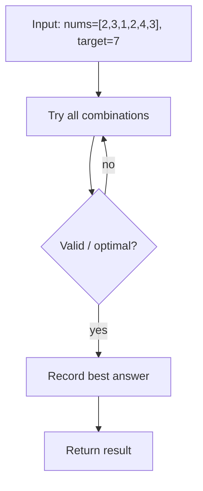
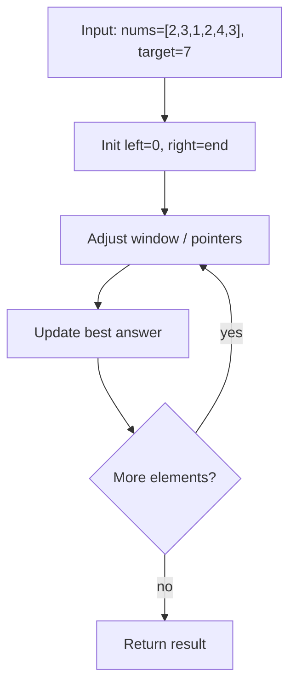
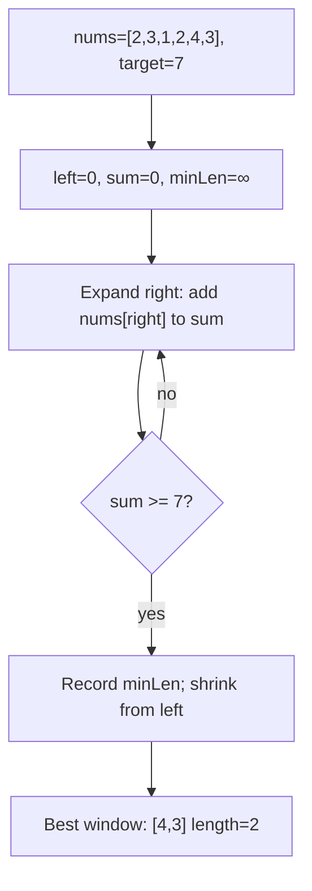

# Minimum Size Subarray Sum

> **You are here**: DSA — see [ROADMAP](../../../ROADMAP.md) for level assignment
> **Roadmap**: [Developer Master Roadmap](../../../ROADMAP.md) | **Study path**: [StudyGuide](../../StudyGuide.md)
> **Pattern**: [Sliding Window](../../../03_CodingPatterns/02_AlgorithmicPatterns.md#pattern-2-sliding-window) | **Catalog**: [Algorithmic Patterns](../../../03_CodingPatterns/02_AlgorithmicPatterns.md)

## Problem Statement

Given an array of positive integers `nums` and a positive integer `target`, return the **minimal length** of a contiguous subarray whose sum is greater than or equal to `target`. If there is no such subarray, return 0.

**Constraints:**
- 1 ≤ target ≤ 10^9
- 1 ≤ nums.length ≤ 10^5
- 1 ≤ nums[i] ≤ 10^4

## Example
```
Input: target = 7, nums = [2,3,1,2,4,3]
Output: 2
Explanation: The subarray [4,3] has the minimal length under the constraint.

Input: target = 4, nums = [1,4,4]
Output: 1

Input: target = 11, nums = [1,1,1,1,1,1,1,1]
Output: 0
```

## Approach 1: Brute Force

Check every possible subarray.


#### Example Flow

**Step flow (mermaid):**



**Walkthrough (same example):**

```
Example: nums=[2,3,1,2,4,3], target=7 → min length 2 ([4,3])
Approach: Brute Force

Enumerate all candidates from example input
Check validity/optimal condition
Keep best answer found
```
```java
public int minSubArrayLenBrute(int target, int[] nums) {
    int minLength = Integer.MAX_VALUE;
    
    for (int i = 0; i < nums.length; i++) {
        int sum = 0;
        for (int j = i; j < nums.length; j++) {
            sum += nums[j];
            if (sum >= target) {
                minLength = Math.min(minLength, j - i + 1);
                break;  // Found shortest starting at i, no need to continue
            }
        }
    }
    
    return minLength == Integer.MAX_VALUE ? 0 : minLength;
}
```

**Time**: O(n²)
**Space**: O(1)

## Approach 2: Sliding Window (Optimal)

### Key Insight
Since all numbers are positive, expanding the window (moving `right`) increases the sum and contracting the window (moving `left`) decreases it. We expand until the sum meets the target, then contract to find the minimum window that still meets the target.

**This is the classic "variable-size sliding window for minimum length" pattern.**


#### Example Flow

**Step flow (mermaid):**



**Walkthrough (same example):**

```
Example: nums=[2,3,1,2,4,3], target=7 → min length 2 ([4,3])
Approach: Sliding Window (Optimal)

Initialize two pointers at boundaries
Move pointer that improves constraint
Update best answer each step
```
```java
public int minSubArrayLen(int target, int[] nums) {
    int left = 0;
    int windowSum = 0;
    int minLength = Integer.MAX_VALUE;
    
    for (int right = 0; right < nums.length; right++) {
        // Expand: add right element to window
        windowSum += nums[right];
        
        // Contract: shrink window while constraint is satisfied
        while (windowSum >= target) {
            minLength = Math.min(minLength, right - left + 1);
            windowSum -= nums[left];
            left++;
        }
    }
    
    return minLength == Integer.MAX_VALUE ? 0 : minLength;
}
```

### Walkthrough
```
target = 7, nums = [2, 3, 1, 2, 4, 3]

right=0: sum=2, 2<7
right=1: sum=5, 5<7
right=2: sum=6, 6<7
right=3: sum=8, 8≥7 → minLen=4, subtract nums[0]=2, sum=6, 6<7
right=4: sum=10, 10≥7 → minLen=4, subtract nums[1]=3, sum=7, 7≥7 → minLen=3
                         subtract nums[2]=1, sum=6, 6<7
right=5: sum=9, 9≥7 → minLen=3, subtract nums[3]=2, sum=7, 7≥7 → minLen=2
                        subtract nums[4]=4, sum=3, 3<7

Result: 2 (subarray [4,3])
```

**Time**: O(n) — Each element is added and removed at most once.
**Space**: O(1) — Only a few variables.

## Approach 3: Binary Search on Prefix Sums

Build a prefix sum array and use binary search to find the smallest window for each starting index.


#### Example Flow

**Step flow (mermaid):**



**Walkthrough (same example):**

```
Example: nums=[2,3,1,2,4,3], target=7 → min length 2 ([4,3])
Approach: Binary Search on Prefix Sums

Set lo/hi bounds on answer or index
Compare mid element with target
Halve search space until found
```
```java
public int minSubArrayLenBinarySearch(int target, int[] nums) {
    int n = nums.length;
    int[] prefixSum = new int[n + 1];
    
    // Build prefix sums
    for (int i = 0; i < n; i++) {
        prefixSum[i + 1] = prefixSum[i] + nums[i];
    }
    
    int minLength = Integer.MAX_VALUE;
    
    for (int i = 0; i < n; i++) {
        // We need prefixSum[j] - prefixSum[i] >= target
        // i.e., prefixSum[j] >= prefixSum[i] + target
        int needed = prefixSum[i] + target;
        
        // Binary search for the first j where prefixSum[j] >= needed
        int j = lowerBound(prefixSum, needed);
        
        if (j <= n) {
            minLength = Math.min(minLength, j - i);
        }
    }
    
    return minLength == Integer.MAX_VALUE ? 0 : minLength;
}

private int lowerBound(int[] arr, int target) {
    int lo = 0, hi = arr.length;
    while (lo < hi) {
        int mid = lo + (hi - lo) / 2;
        if (arr[mid] < target) lo = mid + 1;
        else hi = mid;
    }
    return lo;
}
```

**Time**: O(n log n) — n iterations × O(log n) binary search each.
**Space**: O(n) — Prefix sum array.

## Comparison

| Approach | Time | Space | Notes |
|----------|------|-------|-------|
| Brute Force | O(n²) | O(1) | Simple but slow |
| **Sliding Window** | **O(n)** | **O(1)** | **Optimal** — use this |
| Binary Search | O(n log n) | O(n) | Works for non-positive numbers too (if prefix sums are monotonic) |

## Edge Cases

1. **No valid subarray**: All elements sum to less than target → return 0.
2. **Single element ≥ target**: Return 1.
3. **Entire array needed**: Sum of all elements just barely ≥ target → return n.
4. **All elements equal to target**: Every single element is a valid window → return 1.

## Interview Tips

1. **Identify this is a "shortest subarray" problem** — "Shortest" with a "sum ≥ target" constraint on positive integers = sliding window.
2. **Explain why sliding window works**: "Because all numbers are positive, expanding always increases the sum and contracting always decreases it, so we don't miss any optimal window."
3. **Follow-up**: "What if numbers can be negative?" → Sliding window doesn't work (expanding could decrease sum). Use prefix sum + deque or binary search.
4. **Follow-up**: "What about shortest subarray with sum ≥ K (with negatives)?" → This is LeetCode 862, which requires a monotonic deque on prefix sums.

## Related Problems
- Shortest Subarray with Sum at Least K (with negatives — deque)
- Maximum Sum Subarray of Size K (fixed window)
- Longest Subarray with Sum ≤ K
- Subarray Sum Equals K (prefix sum + hash map)

