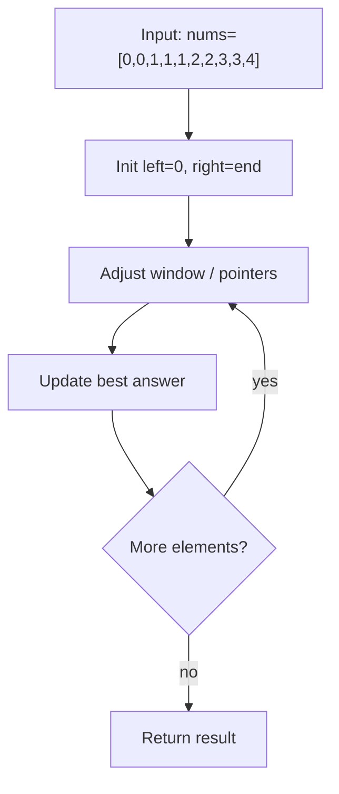
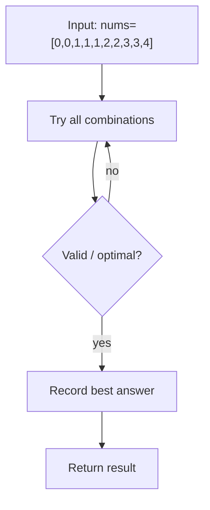

# Remove Duplicates from Sorted Array

> **You are here**: DSA — see [ROADMAP](../../../ROADMAP.md) for level assignment
> **Roadmap**: [Developer Master Roadmap](../../../ROADMAP.md) | **Study path**: [StudyGuide](../../StudyGuide.md)
> **Pattern**: [Two Pointers](../../../03_CodingPatterns/02_AlgorithmicPatterns.md#pattern-1-two-pointers) | **Catalog**: [Algorithmic Patterns](../../../03_CodingPatterns/02_AlgorithmicPatterns.md)

## Problem Statement
Given an integer array `nums` sorted in **non-decreasing order**, remove the duplicates **in-place** such that each unique element appears only once. The **relative order** of the elements should be kept the same.

Return `k` after placing the final result in the first `k` slots of `nums`.

**Example 1:**
```
Input: nums = [1,1,2]
Output: 2, nums = [1,2,_]
Explanation: Your function should return k = 2, with the first two elements of nums being 1 and 2 respectively.
```

**Example 2:**
```
Input: nums = [0,0,1,1,1,2,2,3,3,4]
Output: 5, nums = [0,1,2,3,4,_,_,_,_,_]
```

## Solution Approach

### Algorithm: Two Pointers Technique
The key insight is to use two pointers:
- **Slow pointer**: Points to the last position of unique elements
- **Fast pointer**: Scans through the array to find next unique element

### Step-by-Step Process:
1. Initialize slow pointer at index 0 (first element is always unique)
2. Use fast pointer starting from index 1 to scan the array
3. When fast pointer finds a different element, move it to slow+1 position
4. Increment slow pointer and continue


#### Example Flow

**Step flow (mermaid):**



**Walkthrough (same example):**

```
Example: nums=[0,0,1,1,1,2,2,3,3,4] → length 5
Approach: Two Pointers In-Place

Initialize two pointers at boundaries
Move pointer that improves constraint
Update best answer each step
```

### Time & Space Complexity:
- **Time Complexity**: O(n) - Single pass through the array
- **Space Complexity**: O(1) - Only using two pointers

## Variations

### 1. Basic Version (Each element appears once)

#### Example Flow

**Step flow (mermaid):**



**Walkthrough (same example):**

```
Example: nums=[0,0,1,1,1,2,2,3,3,4] → length 5
Approach: Extra Array Copy

Enumerate all candidates from example input
Check validity/optimal condition
Keep best answer found
```
```java
public int removeDuplicates(int[] nums) {
    int slow = 0;
    for (int fast = 1; fast < nums.length; fast++) {
        if (nums[fast] != nums[slow]) {
            slow++;
            nums[slow] = nums[fast];
        }
    }
    return slow + 1;
}
```

### 2. Remove Duplicates II (Allow at most 2 duplicates)

#### Example Flow

**Step flow (mermaid):**


**Walkthrough (same example):**

```
Example: nums=[0,0,1,1,1,2,2,3,3,4] → length 5
Approach: Extra Array Copy

Enumerate all candidates from example input
Check validity/optimal condition
Keep best answer found
```
```java
public int removeDuplicatesII(int[] nums) {
    int slow = 2;
    for (int fast = 2; fast < nums.length; fast++) {
        if (nums[fast] != nums[slow - 2]) {
            nums[slow] = nums[fast];
            slow++;
        }
    }
    return slow;
}
```

### 3. Generic Version (Allow at most k duplicates)
The pattern can be generalized for allowing at most k duplicates by comparing with the element at position `slow - k`.

## Key Insights:
- **Two Pointers Pattern**: Classic technique for in-place array manipulation
- **Sorted Array Property**: Duplicates are consecutive, making detection easy
- **In-place Modification**: Avoid extra space by modifying the original array
- **Relative Order**: Maintained naturally due to left-to-right scanning

## Edge Cases:
- Empty array or single element
- All elements are the same
- No duplicates present
- Array with only two elements

## Common Mistakes:
- Forgetting to return the correct length (slow + 1)
- Not handling empty arrays
- Incorrectly updating pointers
- Modifying elements unnecessarily

## Applications:
- Data preprocessing and cleaning
- Memory optimization
- Database operations
- Stream processing

## Related Problems:
- Remove Element
- Move Zeroes
- Remove Duplicates from Sorted List
- Remove Duplicates from Sorted Array II
#### Example Flow

**Step flow (mermaid):**


**Walkthrough (same example):**

```
Example: nums=[0,0,1,1,1,2,2,3,3,4] → length 5
Approach: Extra Array Copy

Enumerate all candidates from example input
Check validity/optimal condition
Keep best answer found
```
 