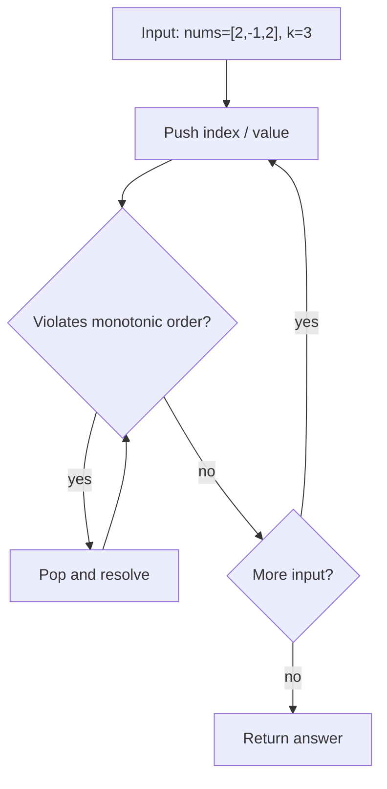
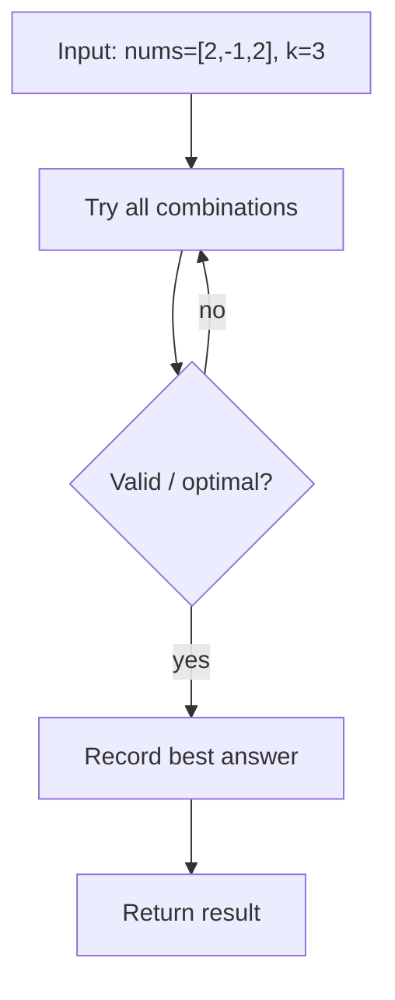

# Shortest Subarray with Sum at Least K — LeetCode 862

> **You are here**: Staff Engineer — DSA (deque + prefix sum)
> **Roadmap**: [Developer Master Roadmap](../../../ROADMAP.md#staff-engineer) | **Prerequisites**: [Sliding Window Maximum](../SlidingWindowMaximum/SlidingWindowMaximum.md) | **Next**: [Constrained Subsequence Sum](../../13_Dynamic_Programming/ConstrainedSubsequenceSum/ConstrainedSubsequenceSum.md)
> **Pattern**: [Sliding Window](../../../03_CodingPatterns/02_AlgorithmicPatterns.md#pattern-2-sliding-window) · [Monotonic Stack](../../../03_CodingPatterns/02_AlgorithmicPatterns.md#pattern-14-monotonic-stack) | **Catalog**: [Algorithmic Patterns](../../../03_CodingPatterns/02_AlgorithmicPatterns.md)

## Problem Statement

Given an integer array `nums` and an integer `k`, return the **length of the shortest non-empty subarray** whose sum is at least `k`. If no such subarray exists, return `-1`.

**Note**: `nums` may contain **negative** numbers.

**Example 1:**
```
Input: nums = [1], k = 1
Output: 1
```

**Example 2:**
```
Input: nums = [1,2], k = 4
Output: -1
```

**Example 3:**
```
Input: nums = [2,-1,2], k = 3
Output: 3
```

---

## Why Standard Sliding Window Fails

With only non-negative numbers, shrink the left pointer while `sum ≥ k`. **Negatives break the monotonicity**: removing elements from the left can *increase* the sum, so the "expand right / shrink left" invariant no longer holds.

Example: `nums = [2, -1, 2], k = 3` — a sliding window might miss that the full array length 3 is required.

---

## Approach 1: Prefix Sum + Monotonic Deque (Optimal)

Build prefix sums `P` where `P[0] = 0` and `P[i+1] = P[i] + nums[i]`.

A subarray `nums[l..r]` has sum `P[r+1] - P[l]`. We need:

```
P[j] - P[i] ≥ k   with minimal j - i   (j > i)
```

Scan `j` from `0` to `n`. Maintain a deque of **indices** with **increasing** prefix values:

1. **Front**: if `P[j] - P[front] ≥ k`, record `j - front` and pop front (smallest valid window for this `j`).
2. **Back**: pop indices whose prefix ≥ `P[j]` — they can never be a better (smaller) start for a future `j' > j` because a larger prefix at an earlier index only shrinks `P[j'] - P[i]`.

### Key Logic


#### Example Flow

**Step flow (mermaid):**



**Walkthrough (same example):**

```
Example: nums=[2,-1,2], k=3 → length 3
Approach: Prefix Sum + Monotonic Deque (Optimal)

Push indices/values on stack
Pop when current resolves pending
Stack top gives next greater / valid match
```
```java
long[] prefix = new long[n + 1];
for (int i = 0; i < n; i++) prefix[i + 1] = prefix[i] + nums[i];

Deque<Integer> dq = new ArrayDeque<>();
int ans = n + 1;

for (int j = 0; j <= n; j++) {
    while (!dq.isEmpty() && prefix[j] - prefix[dq.peekFirst()] >= k)
        ans = Math.min(ans, j - dq.pollFirst());
    while (!dq.isEmpty() && prefix[dq.peekLast()] >= prefix[j])
        dq.pollLast();
    dq.offerLast(j);
}
return ans <= n ? ans : -1;
```

### Complexity

- **Time**: O(n) — each index enters and leaves the deque once
- **Space**: O(n) for prefix array and deque

---

## Approach 2: Brute Force with Prefix Sums (Baseline)

For each start index `i`, scan forward accumulating sum until `≥ k`. With prefix sums, inner loop checks `P[j] - P[i] ≥ k`.


#### Example Flow

**Step flow (mermaid):**



**Walkthrough (same example):**

```
Example: nums=[2,-1,2], k=3 → length 3
Approach: Brute Force with Prefix Sums (Baseline)

Enumerate all candidates from example input
Check validity/optimal condition
Keep best answer found
```
```java
for (int i = 0; i < n; i++)
    for (int j = i + 1; j <= n; j++)
        if (prefix[j] - prefix[i] >= k) ans = min(ans, j - i);
```

### Complexity

- **Time**: O(n²)
- **Space**: O(n)

---

## Pattern Recognition

| Signal | Pattern |
|--------|---------|
| Shortest subarray sum with **negatives allowed** | Prefix sum + monotonic deque |
| "Find `j - i` minimizing length with `f(j) - f(i) ≥ k`" | Deque keeps candidate `i` with increasing `f(i)` |
| Non-negative array only | Standard sliding window suffices |

**Related problems**: [Sliding Window Maximum](../SlidingWindowMaximum/SlidingWindowMaximum.md), [Constrained Subsequence Sum](../../13_Dynamic_Programming/ConstrainedSubsequenceSum/ConstrainedSubsequenceSum.md), Minimum Window Substring.

---

## Interview Tips

1. Explicitly say why sliding window fails when negatives are present — shows pattern maturity.
2. Use `long` for prefix sums; cumulative sums can exceed `Integer.MAX_VALUE`.
3. The deque stores **indices**, not values — length is `j - index`.
4. Monotonic **increasing** prefix in the deque: we want the **smallest** start index that still gives sum ≥ k.
5. Initialize `ans = n + 1` as sentinel; return `-1` if no valid window found.

**Code**: [ShortestSubarraySumAtLeastK.java](ShortestSubarraySumAtLeastK.java)
