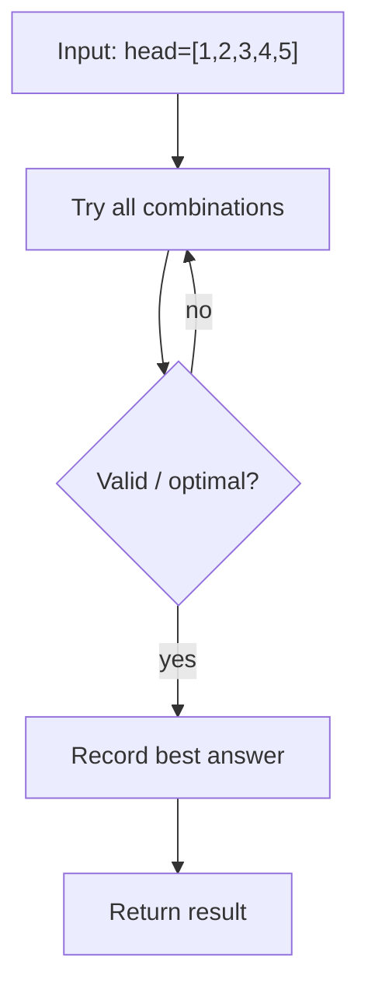
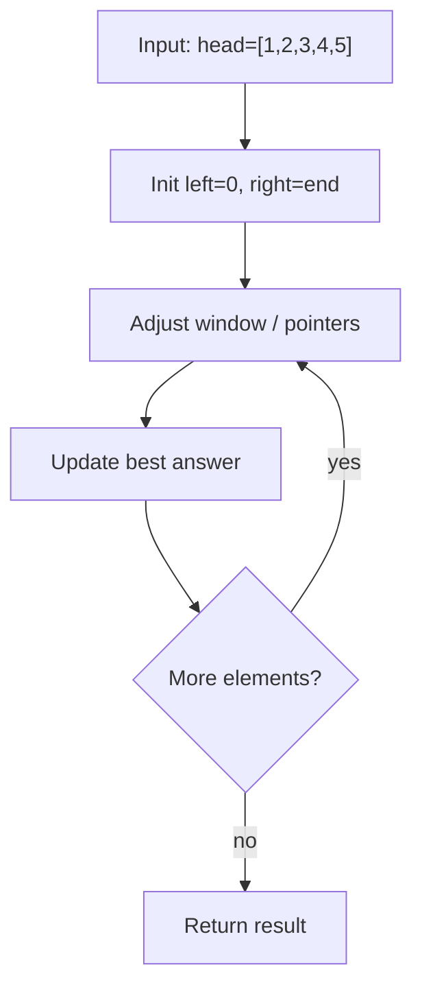

# Find Middle Node of Linked List

> **You are here**: DSA — see [ROADMAP](../../../ROADMAP.md) for level assignment
> **Roadmap**: [Developer Master Roadmap](../../../ROADMAP.md) | **Study path**: [StudyGuide](../../StudyGuide.md)
> **Pattern**: [Fast & Slow Pointers](../../../03_CodingPatterns/02_AlgorithmicPatterns.md#pattern-3-fast-slow-pointers) | **Catalog**: [Algorithmic Patterns](../../../03_CodingPatterns/02_AlgorithmicPatterns.md)

## Problem Statement
Given the head of a singly linked list, return the middle node. If there are two middle nodes, return the second middle node.

## Example
```
Input: [1,2,3,4,5]
Output: Node with value 3

Input: [1,2,3,4,5,6]
Output: Node with value 4 (second middle)
```

## Approach 1: Two-Pass Solution

### How it works:
1. **First pass:** Count total nodes
2. **Second pass:** Go to middle position (count/2)

### Key Logic:

#### Example Flow

**Step flow (mermaid):**



**Walkthrough (same example):**

```
Example: head=[1,2,3,4,5] → node 3
Approach: Two-Pass Solution

Enumerate all candidates from example input
Check validity/optimal condition
Keep best answer found
```
```java
// First pass: count nodes
int count = 0;
ListNode temp = head;
while (temp != null) {
    count++;
    temp = temp.next;
}

// Second pass: find middle
temp = head;
for (int i = 0; i < count / 2; i++) {
    temp = temp.next;
}
return temp;
```

### Time & Space Complexity:
- **Time:** O(n) - Two passes through list
- **Space:** O(1) - Only using a few variables

## Approach 2: Fast and Slow Pointers (Optimal!)

### How it works:
1. **Slow pointer** moves one step at a time
2. **Fast pointer** moves two steps at a time
3. **When fast reaches end**, slow is at middle

### Key Logic:

#### Example Flow

**Step flow (mermaid):**



**Walkthrough (same example):**

```
Example: head=[1,2,3,4,5] → node 3
Approach: Fast and Slow Pointers (Optimal!)

Initialize two pointers at boundaries
Move pointer that improves constraint
Update best answer each step
```
```java
ListNode slow = head;
ListNode fast = head;

while (fast != null && fast.next != null) {
    slow = slow.next;
    fast = fast.next.next;
}

return slow;
```

### Time & Space Complexity:
- **Time:** O(n) - Single pass through list
- **Space:** O(1) - Only using two pointers

## Why Fast/Slow Pointers Work:

### For odd length (n=5):
```
Step 0: slow=1, fast=1
Step 1: slow=2, fast=3
Step 2: slow=3, fast=5 (fast.next = null)
Result: slow at middle (3)
```

### For even length (n=6):
```
Step 0: slow=1, fast=1
Step 1: slow=2, fast=3
Step 2: slow=3, fast=5
Step 3: slow=4, fast=null
Result: slow at second middle (4)
```

## Variations:

### Return First Middle (for even length):
```java
while (fast.next != null && fast.next.next != null) {
    slow = slow.next;
    fast = fast.next.next;
}
```

### Find Previous of Middle:
```java
ListNode prev = null;
while (fast != null && fast.next != null) {
    prev = slow;
    slow = slow.next;
    fast = fast.next.next;
}
// prev points to node before middle
```

## LeetCode Similar Problems:
- [143. Reorder List](https://leetcode.com/problems/reorder-list/)
- [234. Palindrome Linked List](https://leetcode.com/problems/palindrome-linked-list/)
- [141. Linked List Cycle](https://leetcode.com/problems/linked-list-cycle/)
- [142. Linked List Cycle II](https://leetcode.com/problems/linked-list-cycle-ii/)
- [61. Rotate List](https://leetcode.com/problems/rotate-list/)

## Interview Tips:
- Fast/slow pointer technique is classic "tortoise and hare"
- This technique appears in many linked list problems
- Practice the termination condition carefully
- Consider edge cases: single node, two nodes
- Understand why fast pointer moves twice as fast 