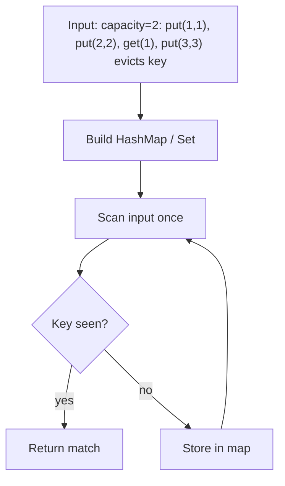

# LFU Cache — LeetCode 460

> **You are here**: Staff Engineer — DSA (design)
> **Roadmap**: [Developer Master Roadmap](../../../ROADMAP.md) | **Prerequisites**: [LRU Cache](../LRUCache/LRUCache.md) | **Next**: [Alien Dictionary](../../11_Graphs/AlienDictionary/AlienDictionary.md)
> **Pattern**: [Data Structure Design](../../../03_CodingPatterns/02_AlgorithmicPatterns.md#pattern-recognition-decision-tree) | **Catalog**: [Algorithmic Patterns](../../../03_CodingPatterns/02_AlgorithmicPatterns.md)

## Problem Statement

Design a data structure for a **Least Frequently Used (LFU)** cache with:

- `get(key)` and `put(key, value)` in **O(1)** average time
- When capacity is full, evict the **least frequently used** key
- On tie (same frequency), evict the **least recently used** among tied keys

**Extension of** [LRU Cache](../LRUCache/LRUCache.md) — asked in Staff loops and [Distributed Cache HLD](../../../04_SystemDesign/02_HighLevelDesign/DistributedCache/DistributedCache.md) eviction discussions.

## Example

```
LFUCache cache = new LFUCache(2);
cache.put(1, 1);
cache.put(2, 2);
cache.get(1);       // returns 1, freq(1)=2
cache.put(3, 3);    // evicts key 2 (freq 1, older than other freq-1 keys if any)
cache.get(2);       // returns -1
cache.put(4, 4);    // evicts key 1 (freq 2 but LRU among min freq if tie logic applies)
```

---

## Approach: HashMap + freq buckets + DLL

| Structure | Purpose |
|-----------|---------|
| `Map<key, Node>` | O(1) lookup |
| `Map<freq, DoublyLinkedList>` | Nodes at each frequency |
| `minFreq` | O(1) find eviction bucket |

Each **Node** stores: `key`, `value`, `freq`, `prev`, `next`.

### Operations

**get(key)**:
1. If missing → -1
2. Remove node from `freq` list; increment `freq`
3. Add to `freq+1` list (create list if needed)
4. Update `minFreq` if old bucket empty
5. Return value

**put(key, value)**:
1. If capacity 0 → return
2. If key exists → update value, call `get` logic to bump freq
3. Else if at capacity → remove LRU from `minFreq` list, delete from map
4. Insert new node at freq 1 list; `minFreq = 1`

### Complexity

- **Time**: O(1) get and put
- **Space**: O(capacity)

---

## LRU vs LFU — when to use

| Policy | Best for | Weakness |
|--------|----------|----------|
| **LRU** | Temporal locality (recent items repeat) | One-time scan pollutes cache |
| **LFU** | Hot keys stable over time (CDN, trending) | Stale high-freq keys block new hot items |
| **LRU-K / TTL** | Production hybrids | More complex |

**Interview**: "Redis uses configurable policies; LRU common; LFU for skewed access patterns."

---

## Java Implementation

See [LFUCache.java](LFUCache.java) — mirrors [LRUCache.java](../LRUCache/LRUCache.java) style.

---

## Edge Cases

1. **capacity = 0** — no-op puts
2. **Update existing key** — frequency increases, may change `minFreq`
3. **Tie on frequency** — LRU within min freq bucket (problem 460 rule)
4. **Thread safety** — interview follow-up: `ConcurrentHashMap` + per-bucket locks or single lock

---

## System design connection

- [Distributed Cache](../../../04_SystemDesign/02_HighLevelDesign/DistributedCache/DistributedCache.md) — eviction policy per shard
- [Rate Limiter](../../../04_SystemDesign/02_HighLevelDesign/RateLimiter/RateLimiter.md) — different problem but same "policy" discussion

---

## Interview Tips

1. Start from LRU solution — interviewer often asks "how would you change for frequency?"
2. Explain why `minFreq` pointer avoids scanning all keys
3. Mention **aging** (decay freq over time) for production LFU staleness

## Related

- [LRU Cache](../LRUCache/LRUCache.md)
- [Tier3 Differentiators](../../Tier3_Differentiators.md)
#### Example Flow

**Step flow (mermaid):**



**Walkthrough (same example):**

```
Example: capacity=2: put(1,1), put(2,2), get(1), put(3,3) evicts key 2 (LFU)
Approach: : HashMap + freq buckets + DLL

Scan input left-to-right
Store seen keys/values in hash map
O(1) lookup finds complement or group
```

