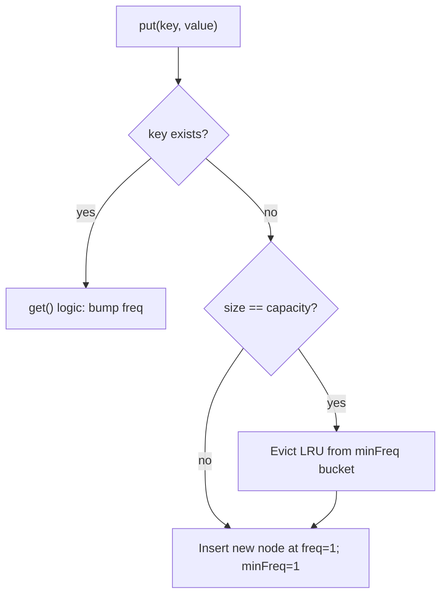

# LFU Cache — LeetCode 460

> **You are here**: Staff Engineer — DSA (design)
> **Depth**: Standard (full explanation with walkthroughs and implementation)
> **Roadmap**: [Developer Master Roadmap](../../../ROADMAP.md) | **Prerequisites**: [LRU Cache](../LRUCache/LRUCache.md) | **Next**: [Alien Dictionary](../../11_Graphs/AlienDictionary/AlienDictionary.md)
> **Pattern**: [Data Structure Design](../../../03_CodingPatterns/02_AlgorithmicPatterns.md) | **Catalog**: [Algorithmic Patterns](../../../03_CodingPatterns/02_AlgorithmicPatterns.md)

---

## Problem Statement

Design a **Least Frequently Used (LFU)** cache with:

- `get(key)` and `put(key, value)` in **O(1)** average time
- When at capacity, evict the **least frequently used** key
- On frequency tie, evict the **least recently used** among tied keys

**Extension of** [LRU Cache](../LRUCache/LRUCache.md) — asked in Staff loops and [Distributed Cache HLD](../../../04_SystemDesign/02_HighLevelDesign/DistributedCache/DistributedCache.md) eviction discussions.

---

## Example walkthrough

```
LFUCache cache = new LFUCache(2);

cache.put(1, 1);   // cache: {1=1} freq(1)=1
cache.put(2, 2);   // cache: {1=1, 2=2} freq(1)=1, freq(2)=1
cache.get(1);      // returns 1, freq(1)=2
cache.put(3, 3);   // evicts key 2 (freq 1, LRU among freq-1 keys)
cache.get(2);      // returns -1 (evicted)
cache.put(4, 4);   // evicts key 1 (freq 2 but was LRU among lowest after prior ops)
cache.get(1);      // returns -1
cache.get(3);      // returns 3
cache.get(4);      // returns 4
```

**Key insight**: After `get(1)`, key 1's frequency rises — key 2 becomes the only freq-1 key and gets evicted on next `put`.

---

## LRU vs LFU — when to use

| Policy | Evicts | Best for | Weakness |
|--------|--------|----------|----------|
| **LRU** | Least recently accessed | Temporal locality (recent items repeat) | One-time scan pollutes cache |
| **LFU** | Least often accessed | Stable hot keys (CDN, API gateway) | Old high-freq keys block new hot items |
| **LRU-K** | K-th access tracking | Hybrid | More complex |
| **TTL** | Time-based expiry | Session data | Not frequency-aware |

**Production**: Redis supports `volatile-lru`, `allkeys-lfu`, etc. — policy depends on access pattern.

---

## Data structures (the O(1) design)

We need four things simultaneously:

| Structure | Purpose | O(1) operation |
|-----------|---------|----------------|
| `Map<key, Node>` | Find node by key | get, put |
| `Map<freq, DoublyLinkedList>` | Nodes grouped by frequency | add/remove at freq bucket |
| `Node` | key, value, freq, prev, next | move between buckets |
| `minFreq` | Track lowest frequency in cache | find eviction candidate |

### Why not scan all keys for min frequency?

Scanning breaks O(1). The `minFreq` pointer updates only when:
- New key inserted → `minFreq = 1`
- Lowest freq bucket becomes empty after eviction or promotion → increment `minFreq`

---

## Visual structure

```
keyToNode: {1→NodeA, 2→NodeB, 3→NodeC}

freqBuckets:
  freq=1:  [NodeB] ↔ [dummy head/tail]
  freq=2:  [NodeA] ↔ [NodeC]

minFreq = 1  → eviction candidate from freq=1 bucket (LRU end = NodeB)
```

Each **DoublyLinkedList** maintains **LRU order within that frequency** — head = most recent, tail = least recent.

---

## Operations explained

### get(key)

```
1. If key not in map → return -1
2. Remove node from its current freq bucket
3. node.freq++
4. Add node to freq+1 bucket (create bucket if needed)
5. If old freq bucket (at minFreq) is now empty → minFreq++
6. Return node.value
```

### put(key, value)

```
1. If capacity == 0 → return
2. If key exists → update value, call get(key) to bump freq
3. Else (new key):
   a. If at capacity → evict LRU from minFreq bucket (tail.prev)
   b. Remove evicted key from map
   c. Create new node with freq=1
   d. Add to freq=1 bucket; minFreq = 1
   e. Put in map
```

---

## Step-by-step mermaid



---

## Java implementation (core logic)

```java
class LFUCache {
    private final int capacity;
    private int minFreq;
    private final Map<Integer, Node> keyMap = new HashMap<>();
    private final Map<Integer, DoublyLinkedList> freqMap = new HashMap<>();

    public int get(int key) {
        Node node = keyMap.get(key);
        if (node == null) return -1;
        increaseFreq(node);
        return node.value;
    }

    public void put(int key, int value) {
        if (capacity == 0) return;
        if (keyMap.containsKey(key)) {
            Node node = keyMap.get(key);
            node.value = value;
            increaseFreq(node);
            return;
        }
        if (keyMap.size() == capacity) {
            DoublyLinkedList minList = freqMap.get(minFreq);
            Node evicted = minList.removeTail();
            keyMap.remove(evicted.key);
        }
        Node newNode = new Node(key, value, 1);
        keyMap.put(key, newNode);
        freqMap.computeIfAbsent(1, k -> new DoublyLinkedList()).addToHead(newNode);
        minFreq = 1;
    }

    private void increaseFreq(Node node) {
        int freq = node.freq;
        freqMap.get(freq).remove(node);
        if (freq == minFreq && freqMap.get(freq).isEmpty()) minFreq++;
        node.freq++;
        freqMap.computeIfAbsent(node.freq, k -> new DoublyLinkedList()).addToHead(node);
    }
}
```

Full code: [LFUCache.java](LFUCache.java)

---

## Complexity

| Operation | Time | Space |
|-----------|------|-------|
| get | O(1) | — |
| put | O(1) | — |
| Overall | — | O(capacity) |

---

## Edge cases

| Case | Handling |
|------|----------|
| `capacity = 0` | All puts no-op |
| Update existing key | Value changes + freq increases (not new insert) |
| Tie on frequency | LRU within minFreq bucket (LeetCode 460 rule) |
| Single capacity | Every new put evicts previous |
| Thread safety (follow-up) | `ConcurrentHashMap` + synchronized freq bucket ops, or striped locks |

---

## Interview follow-ups (prepare answers)

1. **"What if frequencies grow unbounded?"** → Aging: decay all frequencies periodically, or cap max tracked freq
2. **"Distributed LFU across Redis nodes?"** → Not global LFU per node; use consistent hashing so hot keys land on same shard — [Distributed Cache HLD](../../../04_SystemDesign/02_HighLevelDesign/DistributedCache/DistributedCache.md)
3. **"LFU vs LRU for CDN?"** → LFU for stable viral content; LRU for mixed traffic
4. **"Prove O(1)"** → HashMap lookup + DLL insert/remove are O(1); minFreq pointer avoids scan

---

## Common mistakes

| Mistake | Fix |
|---------|-----|
| Forgetting to update `minFreq` on eviction | After removing last node at minFreq, check if bucket empty |
| Not moving node on `get` | `get` must increase frequency (not just read) |
| Using one global LRU list | Need **per-frequency** lists |
| Double-counting on update | `put` existing key → bump freq, don't count as new entry |

---

## Related

- [LRU Cache](../LRUCache/LRUCache.md) — start here before LFU
- [Tier3 Differentiators](../../Tier3_Differentiators.md)
- [Distributed Cache HLD](../../../04_SystemDesign/02_HighLevelDesign/DistributedCache/DistributedCache.md)
