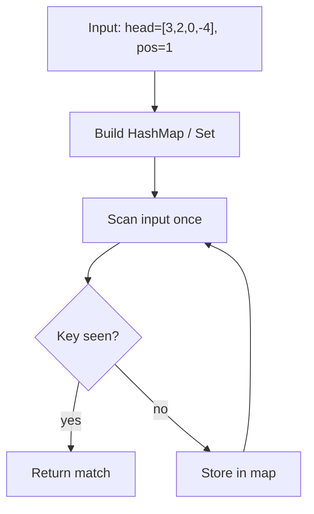
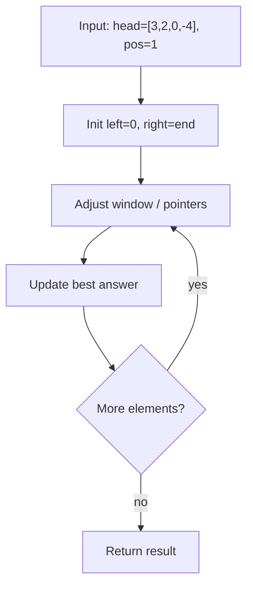

# Linked List Cycle Detection

> **You are here**: DSA — see [ROADMAP](../../../ROADMAP.md) for level assignment
> **Roadmap**: [Developer Master Roadmap](../../../ROADMAP.md) | **Study path**: [StudyGuide](../../StudyGuide.md)
> **Pattern**: [Fast & Slow Pointers](../../../03_CodingPatterns/02_AlgorithmicPatterns.md#pattern-3-fast-slow-pointers) | **Catalog**: [Algorithmic Patterns](../../../03_CodingPatterns/02_AlgorithmicPatterns.md)

## Problem Statement
Given the head of a linked list, determine if there is a cycle. A cycle exists if a node can be reached again by continuously following the next pointer.

## Example
```
Input: head = [3,2,0,-4], pos = 1 (cycle connects to index 1)
Output: true

Input: head = [1,2], pos = -1 (no cycle)
Output: false
```

## Approach 1: HashSet (Simple)

### How it works:
1. **Track visited nodes** in HashSet
2. **If we see a node again**, cycle exists
3. **If we reach null**, no cycle

### Key Logic:

#### Example Flow

**Step flow (mermaid):**



**Walkthrough (same example):**

```
Example: head=[3,2,0,-4], pos=1 → true (cycle at index 1)
Approach: HashSet (Simple)

Scan input left-to-right
Store seen keys/values in hash map
O(1) lookup finds complement or group
```
```java
Set<ListNode> visited = new HashSet<>();
ListNode current = head;

while (current != null) {
    if (visited.contains(current)) {
        return true; // Cycle detected
    }
    visited.add(current);
    current = current.next;
}
return false; // No cycle
```

### Time & Space Complexity:
- **Time:** O(n) - Visit each node once
- **Space:** O(n) - Store nodes in HashSet

## Approach 2: Floyd's Cycle Detection (Optimal!)

### How it works:
1. **Two pointers:** slow (1 step) and fast (2 steps)
2. **If there's a cycle**, fast will eventually meet slow
3. **If no cycle**, fast will reach null

### Key Logic:

#### Example Flow

**Step flow (mermaid):**



**Walkthrough (same example):**

```
Example: head=[3,2,0,-4], pos=1 → true (cycle at index 1)
Approach: Floyd's Cycle Detection (Optimal!)

Initialize two pointers at boundaries
Move pointer that improves constraint
Update best answer each step
```
```java
if (head == null || head.next == null) return false;

ListNode slow = head;
ListNode fast = head;

while (fast != null && fast.next != null) {
    slow = slow.next;
    fast = fast.next.next;
    
    if (slow == fast) {
        return true; // Cycle detected
    }
}
return false; // No cycle
```

### Time & Space Complexity:
- **Time:** O(n) - At most n steps for fast pointer
- **Space:** O(1) - Only using two pointers

## Why Floyd's Algorithm Works:

### Mathematical Proof:
1. **In a cycle**, fast pointer gains 1 position on slow pointer each step
2. **Eventually**, fast will catch up to slow (like running on a track)
3. **Distance between them decreases by 1** each iteration

### Visual Example:
```
Cycle: 1 -> 2 -> 3 -> 4
             ↑         ↓
             ←---------

Step 1: slow=2, fast=4
Step 2: slow=3, fast=2 (fast wrapped around)
Step 3: slow=4, fast=4 (meeting point!)
```

## Follow-up: Find Cycle Start (Floyd's Phase 2)

### How it works:
1. **After detecting cycle**, reset one pointer to head
2. **Move both pointers one step** at a time
3. **Meeting point is cycle start**

### Key Logic:
```java
// After cycle detection
slow = head;
while (slow != fast) {
    slow = slow.next;
    fast = fast.next;
}
return slow; // Start of cycle
```

## Edge Cases:
1. **Empty list** → No cycle
2. **Single node pointing to itself** → Cycle
3. **Two nodes forming cycle** → Cycle
4. **Very long list with small cycle** → Handle efficiently

## LeetCode Similar Problems:
- [142. Linked List Cycle II](https://leetcode.com/problems/linked-list-cycle-ii/)
- [287. Find the Duplicate Number](https://leetcode.com/problems/find-the-duplicate-number/)
- [202. Happy Number](https://leetcode.com/problems/happy-number/)
- [876. Middle of the Linked List](https://leetcode.com/problems/middle-of-the-linked-list/)

## Interview Tips:
- Start with HashSet approach to show understanding
- Optimize to Floyd's algorithm for space efficiency
- Understand the mathematical reasoning behind Floyd's
- Practice drawing cycle examples
- Remember two-phase approach for finding cycle start 