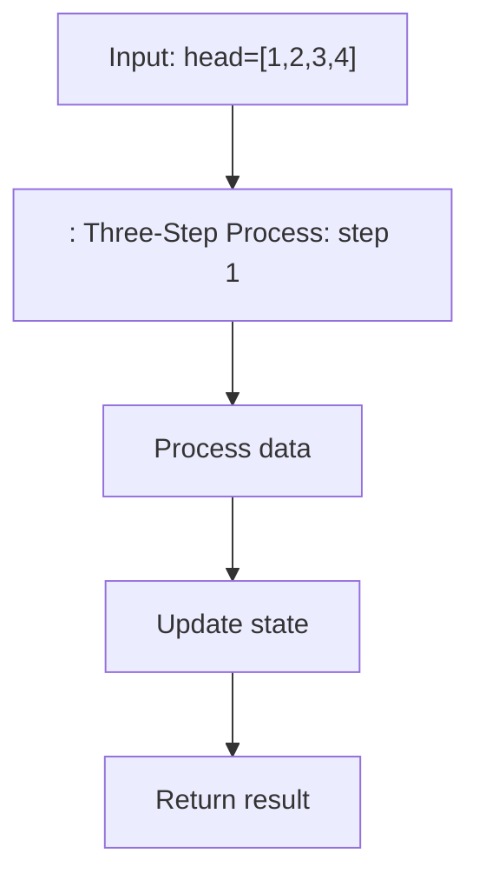

# Reorder List — LeetCode 143

> **You are here**: SDE2 — DSA (linked lists)
> **Roadmap**: [Developer Master Roadmap](../../../ROADMAP.md) | **Prerequisites**: [Reverse Linked List](../ReverseLinkedList/ReverseLinkedList.md), [Find Middle Node](../FindMiddleNode/FindMiddleNode.md) | **Next**: [LRU Cache](../LRUCache/LRUCache.md)
> **Pattern**: [In-Place Linked List Reversal](../../../03_CodingPatterns/02_AlgorithmicPatterns.md#pattern-6-in-place-linked-list-reversal) | **Catalog**: [Algorithmic Patterns](../../../03_CodingPatterns/02_AlgorithmicPatterns.md)

## Problem Statement
Given a singly linked list, reorder it to: L0 → L1 → … → Ln-1 → Ln becomes L0 → Ln → L1 → Ln-1 → L2 → Ln-2 → …

## Example
```
Input: head = [1,2,3,4]
Output: [1,4,2,3]

Input: head = [1,2,3,4,5]
Output: [1,5,2,4,3]
```

## Approach: Three-Step Process

### Step 1: Find Middle of List

#### Example Flow

**Step flow (mermaid):**



**Walkthrough (same example):**

```
Example: head=[1,2,3,4] → [1,4,2,3]
Approach: : Three-Step Process

Apply : Three-Step Process on the example input step by step
Final answer from example: see above
```
```java
// Use fast/slow pointers
ListNode slow = head;
ListNode fast = head;
while (fast.next != null && fast.next.next != null) {
    slow = slow.next;
    fast = fast.next.next;
}
```

### Step 2: Reverse Second Half
```java
ListNode secondHalf = reverseList(slow.next);
slow.next = null; // Break connection
```

### Step 3: Merge Two Halves Alternately
```java
ListNode first = head;
ListNode second = secondHalf;

while (second != null) {
    ListNode firstNext = first.next;
    ListNode secondNext = second.next;
    
    first.next = second;
    second.next = firstNext;
    
    first = firstNext;
    second = secondNext;
}
```

## Complete Solution:
```java
public void reorderList(ListNode head) {
    if (head == null || head.next == null) return;
    
    // Step 1: Find middle
    ListNode slow = head;
    ListNode fast = head;
    while (fast.next != null && fast.next.next != null) {
        slow = slow.next;
        fast = fast.next.next;
    }
    
    // Step 2: Reverse second half
    ListNode secondHalf = reverseList(slow.next);
    slow.next = null;
    
    // Step 3: Merge alternately
    ListNode first = head;
    ListNode second = secondHalf;
    
    while (second != null) {
        ListNode firstNext = first.next;
        ListNode secondNext = second.next;
        
        first.next = second;
        second.next = firstNext;
        
        first = firstNext;
        second = secondNext;
    }
}

private ListNode reverseList(ListNode head) {
    ListNode prev = null;
    ListNode current = head;
    
    while (current != null) {
        ListNode next = current.next;
        current.next = prev;
        prev = current;
        current = next;
    }
    
    return prev;
}
```

### Time & Space Complexity:
- **Time:** O(n) - Three O(n) operations
- **Space:** O(1) - Only using pointers

## Visualization:
```
Original: 1 -> 2 -> 3 -> 4 -> 5

Step 1: Find middle
First half:  1 -> 2 -> 3
Second half:      4 -> 5

Step 2: Reverse second half
First half:  1 -> 2 -> 3
Second half:      5 -> 4

Step 3: Merge alternately
Result: 1 -> 5 -> 2 -> 4 -> 3
```

## Edge Cases:
1. **Empty list or single node**
2. **Two nodes:** [1,2] → [1,2]
3. **Even vs odd length lists**

## Alternative: Stack/Deque Approach

### How it works:
1. **Store all nodes** in a deque
2. **Alternately pop** from front and back
3. **Reconstruct list**

### Time & Space Complexity:
- **Time:** O(n)
- **Space:** O(n) - Deque storage

## Interview Follow-Ups (Staff / Amazon India)

### Follow-up 1: "Do it in one pass without reversing?"

**Answer**: The standard optimal solution **requires** reversing the second half — O(1) space. A deque-based approach uses O(n) extra space. Interviewers accept the 3-step pattern if you explain why each step is O(n) and total O(n).

### Follow-up 2: "How is this related to palindrome check?"

[Palindrome Linked List](https://leetcode.com/problems/palindrome-linked-list/) uses **same steps 1–2** (find middle, reverse second half) then compares halves. Master Reorder List → Palindrome is a 5-minute extension.

### Follow-up 3: "Find middle — which node for even length?"

For `1→2→3→4`, slow stops at `2` or `3` depending on loop condition. This problem uses:

```java
while (fast.next != null && fast.next.next != null)
```

First half ends at `2`; second half starts at `3`. **Be consistent** in interview — state your choice.

### Follow-up 4: Thread safety / production analogy

Not a concurrency problem — but **playlist reorder** in music apps uses similar merge logic. For system design link: reordering streams → [News Feed fan-out](../../../04_SystemDesign/02_HighLevelDesign/NewsFeed/NewsFeed.md).

### Follow-up 5: k-group reverse (harder)

[Reverse Nodes in k-Group](https://leetcode.com/problems/reverse-nodes-in-k-group/) — generalization requiring segment reversal. Reorder List is the **k=2 interleave** special case.

---

## Pattern Composition Map

| Sub-problem | Repo file | Technique |
|-------------|-----------|-----------|
| Find middle | [FindMiddleNode](../FindMiddleNode/FindMiddleNode.md) | Fast/slow pointers |
| Reverse half | [ReverseLinkedList](../ReverseLinkedList/ReverseLinkedList.md) | In-place reversal |
| Merge alternately | [Merge Two Sorted Lists](../MergeTwoSortedLists/MergeTwoSortedLists.md) | Pointer weaving |

**Study order (Path 2)**: Reverse → Find Middle → Reorder → [LRU Cache](../LRUCache/LRUCache.md) (design).

---

## Common Mistakes (SDE2 failure mode)

| Mistake | Symptom | Fix |
|---------|---------|-----|
| Forget `slow.next = null` | Infinite loop on merge | Break list after reverse |
| Wrong middle on even list | Wrong interleave order | State loop invariant aloud |
| Lose head reference | Return wrong list | Keep `head` fixed; merge from `head` |
| Recursive reverse | Stack overflow on long list | Use iterative reverse for O(1) space |

---

## LeetCode Similar Problems:
- [206. Reverse Linked List](https://leetcode.com/problems/reverse-linked-list/)
- [876. Middle of the Linked List](https://leetcode.com/problems/middle-of-the-linked-list/)
- [234. Palindrome Linked List](https://leetcode.com/problems/palindrome-linked-list/)
- [25. Reverse Nodes in k-Group](https://leetcode.com/problems/reverse-nodes-in-k-group/)

## Interview Tips:
- Break problem into smaller subproblems
- This combines three common linked list techniques
- Practice each step separately first
- Handle edge cases for odd/even length lists
- Remember to break the connection in the middle 