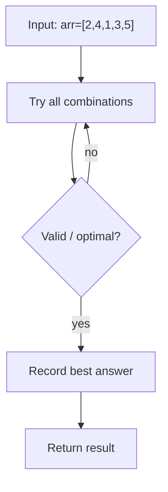
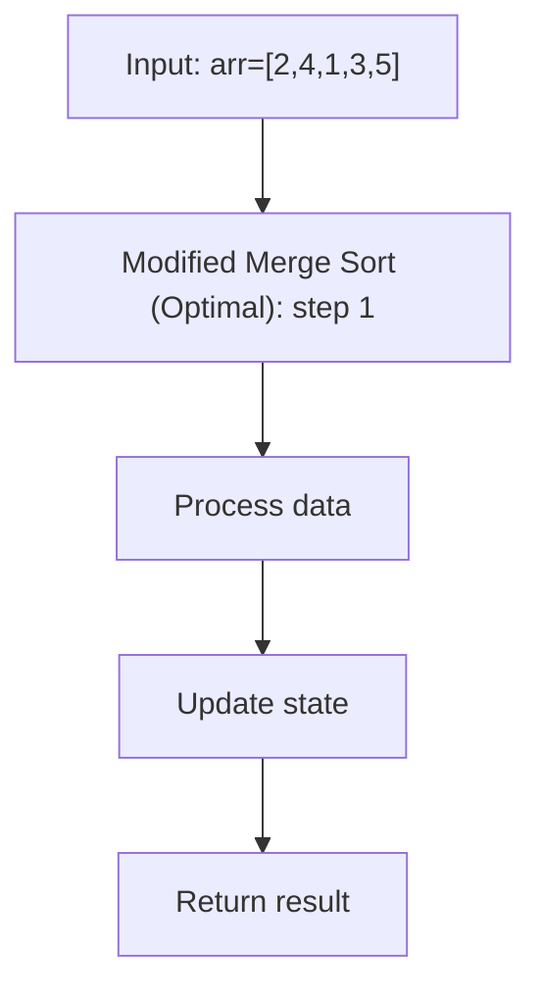

# Inversion Count — Merge Sort Application

> **You are here**: DSA — see [ROADMAP](../../../ROADMAP.md) for level assignment
> **Roadmap**: [Developer Master Roadmap](../../../ROADMAP.md) | **Study path**: [StudyGuide](../../StudyGuide.md)
> **Pattern**: [Sorting](../../../03_CodingPatterns/02_AlgorithmicPatterns.md#pattern-recognition-decision-tree) · [Dynamic Programming](../../../03_CodingPatterns/02_AlgorithmicPatterns.md#pattern-16-dynamic-programming-patterns) | **Catalog**: [Algorithmic Patterns](../../../03_CodingPatterns/02_AlgorithmicPatterns.md)

## Problem Statement

Given an array, count the number of **inversions**. An inversion is a pair `(i, j)` where `i < j` but `nums[i] > nums[j]`. The inversion count measures how far an array is from being sorted.

**Constraints:**
- 1 ≤ nums.length ≤ 10^5
- -10^9 ≤ nums[i] ≤ 10^9

## Example
```
Input: nums = [2, 4, 1, 3, 5]
Output: 3
Explanation: Inversions are (2,1), (4,1), (4,3)

Input: nums = [5, 4, 3, 2, 1]
Output: 10
Explanation: Every pair is an inversion (reverse sorted = maximum inversions = n*(n-1)/2)

Input: nums = [1, 2, 3, 4, 5]
Output: 0
Explanation: Already sorted, no inversions.
```

## Approach 1: Brute Force

Check every pair (i, j) where i < j.


#### Example Flow

**Step flow (mermaid):**



**Walkthrough (same example):**

```
Example: arr=[2,4,1,3,5] → 3 inversions
Approach: Brute Force

Enumerate all candidates from example input
Check validity/optimal condition
Keep best answer found
```
```java
public int countInversionsBrute(int[] nums) {
    int count = 0;
    for (int i = 0; i < nums.length; i++) {
        for (int j = i + 1; j < nums.length; j++) {
            if (nums[i] > nums[j]) {
                count++;
            }
        }
    }
    return count;
}
```

**Time**: O(n²)
**Space**: O(1)

## Approach 2: Modified Merge Sort (Optimal)

### Key Insight
During the merge step of merge sort, when we pick an element from the right half before all elements of the left half have been placed, it means that element is smaller than all remaining elements in the left half. Each such pick counts as inversions equal to the number of remaining elements in the left half.

### Why Merge Sort?
- Merge sort naturally compares elements from two sorted halves.
- When merging, if `left[i] > right[j]`, then all elements from `left[i]` to `left[end]` are also greater than `right[j]` (because the left half is sorted).
- So we add `(mid - i + 1)` inversions in one step.


#### Example Flow

**Step flow (mermaid):**



**Walkthrough (same example):**

```
Example: arr=[2,4,1,3,5] → 3 inversions
Approach: Modified Merge Sort (Optimal)

Apply Modified Merge Sort (Optimal) on the example input step by step
Final answer from example: see above
```
```java
public int countInversions(int[] nums) {
    int[] temp = new int[nums.length];
    return mergeSortCount(nums, temp, 0, nums.length - 1);
}

private int mergeSortCount(int[] nums, int[] temp, int left, int right) {
    int count = 0;
    
    if (left < right) {
        int mid = left + (right - left) / 2;
        
        // Count inversions in left half
        count += mergeSortCount(nums, temp, left, mid);
        
        // Count inversions in right half
        count += mergeSortCount(nums, temp, mid + 1, right);
        
        // Count split inversions during merge
        count += mergeCount(nums, temp, left, mid, right);
    }
    
    return count;
}

private int mergeCount(int[] nums, int[] temp, int left, int mid, int right) {
    int i = left;        // Pointer for left half
    int j = mid + 1;     // Pointer for right half
    int k = left;        // Pointer for temp array
    int count = 0;
    
    while (i <= mid && j <= right) {
        if (nums[i] <= nums[j]) {
            temp[k++] = nums[i++];
        } else {
            // nums[i] > nums[j]: all remaining in left half are > nums[j]
            count += (mid - i + 1);
            temp[k++] = nums[j++];
        }
    }
    
    // Copy remaining elements
    while (i <= mid) temp[k++] = nums[i++];
    while (j <= right) temp[k++] = nums[j++];
    
    // Copy back to original array
    for (int idx = left; idx <= right; idx++) {
        nums[idx] = temp[idx];
    }
    
    return count;
}
```

### Walkthrough
```
nums = [2, 4, 1, 3, 5]

Split: [2, 4] and [1, 3, 5]

Left [2, 4]:
  Split: [2] and [4]
  Merge: 2 ≤ 4, no inversions → count = 0
  Sorted: [2, 4]

Right [1, 3, 5]:
  Split: [1] and [3, 5]
  [3, 5]: Split [3] and [5], merge: 3 ≤ 5, count = 0
  Merge [1] and [3, 5]: 1 ≤ 3, 1 ≤ 5, count = 0
  Sorted: [1, 3, 5]

Merge [2, 4] and [1, 3, 5]:
  i=0, j=0: nums[0]=2 > nums[2]=1 → count += (mid-i+1) = 2-0+1 = 2, take 1
  i=0, j=1: nums[0]=2 ≤ nums[3]=3 → take 2
  i=1, j=1: nums[1]=4 > nums[3]=3 → count += (mid-i+1) = 2-1+1 = 1, take 3 (was index 3)
             Wait, let me redo with correct indices...
  
Actually let me trace with mid=1:
  Left half: [2, 4] (indices 0-1)
  Right half: [1, 3, 5] (indices 2-4)
  
  i=0(val 2), j=2(val 1): 2 > 1 → count += (1 - 0 + 1) = 2, take 1
  i=0(val 2), j=3(val 3): 2 ≤ 3 → take 2
  i=1(val 4), j=3(val 3): 4 > 3 → count += (1 - 1 + 1) = 1, take 3
  i=1(val 4), j=4(val 5): 4 ≤ 5 → take 4
  j=4(val 5): take 5
  
  Merge count = 2 + 1 = 3

Total: 0 + 0 + 3 = 3 ✓ (inversions: (2,1), (4,1), (4,3))
```

### Recurrence
```
T(n) = 2T(n/2) + O(n) → O(n log n) by Master Theorem Case 2
```

**Time**: O(n log n)
**Space**: O(n) — temp array for merging.

## Edge Cases

1. **Already sorted**: 0 inversions.
2. **Reverse sorted**: n×(n-1)/2 inversions (maximum).
3. **All elements equal**: 0 inversions.
4. **Two elements**: 0 or 1 inversion.

## Real-World Applications

1. **Measuring disorder**: How far is a dataset from being sorted?
2. **Collaborative filtering**: Comparing user rankings (Kendall tau distance).
3. **Genome analysis**: Counting rearrangements between gene sequences.
4. **Voting systems**: Measuring agreement between ranked lists.

## Interview Tips

1. **Start with brute force O(n²)** then optimize using merge sort.
2. **Key line to explain**: "When `left[i] > right[j]`, all remaining elements in the left half (from i to mid) also form inversions with `right[j]`, giving us `(mid - i + 1)` inversions at once."
3. **Follow-up**: "Can you count inversions without modifying the array?" → Use a separate temp array and copy back, or use a BIT/Fenwick Tree for O(n log n) without sorting.

## Related Problems
- Count of Smaller Numbers After Self (LeetCode 315 — BIT or merge sort)
- Reverse Pairs (LeetCode 493 — merge sort variant)
- Count of Range Sum (LeetCode 327 — merge sort on prefix sums)

