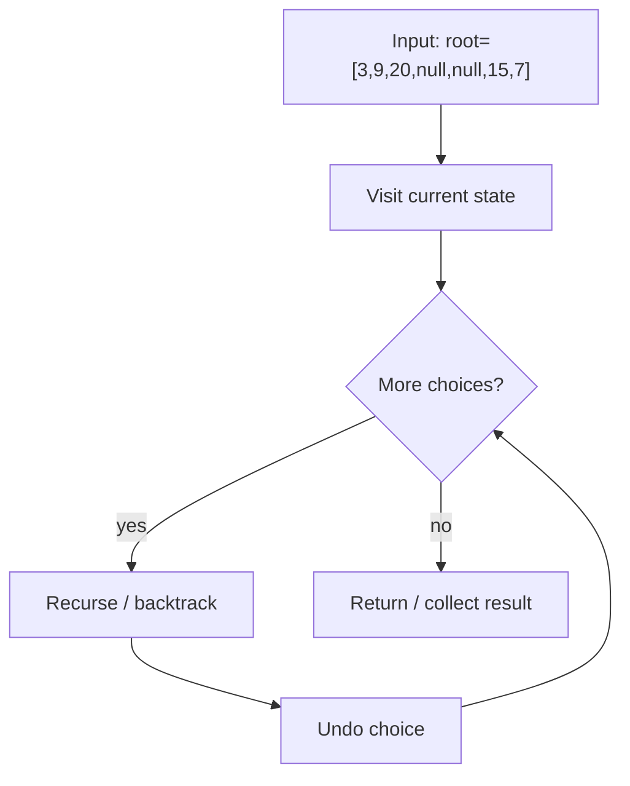
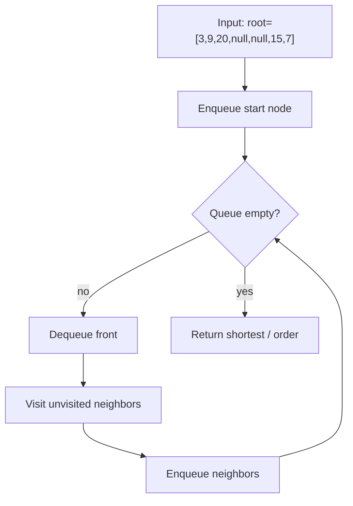

# Maximum Depth of Binary Tree

> **You are here**: DSA — see [ROADMAP](../../../ROADMAP.md) for level assignment
> **Roadmap**: [Developer Master Roadmap](../../../ROADMAP.md) | **Study path**: [StudyGuide](../../StudyGuide.md)
> **Pattern**: [Binary Tree](../../../03_CodingPatterns/02_AlgorithmicPatterns.md#pattern-8-dfs-depth-first-search) · [DFS](../../../03_CodingPatterns/02_AlgorithmicPatterns.md#pattern-8-dfs-depth-first-search) | **Catalog**: [Algorithmic Patterns](../../../03_CodingPatterns/02_AlgorithmicPatterns.md)

## Problem Statement
Given the root of a binary tree, return its maximum depth. The maximum depth is the number of nodes along the longest path from the root node down to the farthest leaf node.

## Example
```
Input: root = [3,9,20,null,null,15,7]
Output: 3

Tree structure:
    3
   / \
  9  20
    /  \
   15   7
```

## Approach 1: Recursive DFS (Optimal!)

### How it works:
1. **Base case:** Null node has depth 0
2. **Recursive case:** 1 + max depth of subtrees
3. **Bottom-up approach:** Build depth from leaves to root

### Key Logic:

#### Example Flow

**Step flow (mermaid):**



**Walkthrough (same example):**

```
Example: root=[3,9,20,null,null,15,7] → depth 3
Approach: Recursive DFS (Optimal!)

Visit current node/state
Recurse on valid next choices
Backtrack and try alternatives
```
```java
public int maxDepth(TreeNode root) {
    if (root == null) {
        return 0;
    }
    
    int leftDepth = maxDepth(root.left);
    int rightDepth = maxDepth(root.right);
    
    return 1 + Math.max(leftDepth, rightDepth);
}
```

### Time & Space Complexity:
- **Time:** O(n) - Visit each node once
- **Space:** O(h) where h is tree height (recursion stack)

## Approach 2: Iterative BFS

### How it works:
1. **Use queue** for level-by-level traversal
2. **Count levels** as we process them
3. **Number of levels** equals maximum depth

### Key Logic:

#### Example Flow

**Step flow (mermaid):**



**Walkthrough (same example):**

```
Example: root=[3,9,20,null,null,15,7] → depth 3
Approach: Iterative BFS

Enqueue start node/level
Process neighbors level by level
First reach target = shortest path
```
```java
public int maxDepth(TreeNode root) {
    if (root == null) return 0;
    
    Queue<TreeNode> queue = new LinkedList<>();
    queue.offer(root);
    int depth = 0;
    
    while (!queue.isEmpty()) {
        int levelSize = queue.size();
        depth++;
        
        // Process all nodes at current level
        for (int i = 0; i < levelSize; i++) {
            TreeNode node = queue.poll();
            
            if (node.left != null) queue.offer(node.left);
            if (node.right != null) queue.offer(node.right);
        }
    }
    
    return depth;
}
```

### Time & Space Complexity:
- **Time:** O(n) - Visit each node once
- **Space:** O(w) where w is maximum width of tree

## Approach 3: Iterative DFS with Stack

### How it works:
1. **Use stack** to simulate recursion
2. **Track depth** for each node
3. **Update maximum depth** as we go

### Key Logic:

#### Example Flow

**Step flow (mermaid):**


**Walkthrough (same example):**

```
Example: root=[3,9,20,null,null,15,7] → depth 3
Approach: Iterative DFS with Stack

Visit current node/state
Recurse on valid next choices
Backtrack and try alternatives
```
```java
public int maxDepth(TreeNode root) {
    if (root == null) return 0;
    
    Stack<Pair<TreeNode, Integer>> stack = new Stack<>();
    stack.push(new Pair<>(root, 1));
    int maxDepth = 0;
    
    while (!stack.isEmpty()) {
        Pair<TreeNode, Integer> current = stack.pop();
        TreeNode node = current.getKey();
        int depth = current.getValue();
        
        maxDepth = Math.max(maxDepth, depth);
        
        if (node.right != null) {
            stack.push(new Pair<>(node.right, depth + 1));
        }
        if (node.left != null) {
            stack.push(new Pair<>(node.left, depth + 1));
        }
    }
    
    return maxDepth;
}
```

## Comparison of Approaches:

### Recursive DFS:
- **Pros:** Clean, intuitive, least code
- **Cons:** Stack overflow for very deep trees

### Iterative BFS:
- **Pros:** No recursion, level-by-level processing
- **Cons:** More memory for wide trees

### Iterative DFS:
- **Pros:** No recursion, explicit control
- **Cons:** More complex code

## Related Problems:

### Minimum Depth:
- **Similar logic** but find minimum path to leaf
- **Handle single-child nodes** carefully

### Diameter of Tree:
- **Use max depth** at each node
- **Track maximum sum** of left + right depths

## Edge Cases:
1. **Empty tree** → Depth 0
2. **Single node** → Depth 1
3. **Skewed tree** → Depth equals number of nodes
4. **Balanced tree** → Depth is log(n)

## Tree Traversal Patterns:

### This problem demonstrates:
- **Post-order traversal** (process children first)
- **Bottom-up approach** (build result from leaves)
- **Height calculation** pattern

## LeetCode Similar Problems:
- [104. Maximum Depth of Binary Tree](https://leetcode.com/problems/maximum-depth-of-binary-tree/) (this problem)
- [111. Minimum Depth of Binary Tree](https://leetcode.com/problems/minimum-depth-of-binary-tree/)
- [543. Diameter of Binary Tree](https://leetcode.com/problems/diameter-of-binary-tree/)
- [110. Balanced Binary Tree](https://leetcode.com/problems/balanced-binary-tree/)
- [559. Maximum Depth of N-ary Tree](https://leetcode.com/problems/maximum-depth-of-n-ary-tree/)

## Interview Tips:
- Start with recursive solution (most natural)
- Explain the recursive thinking clearly
- Handle null base case first
- Consider iterative alternatives for follow-up
- This is a foundational tree problem pattern 