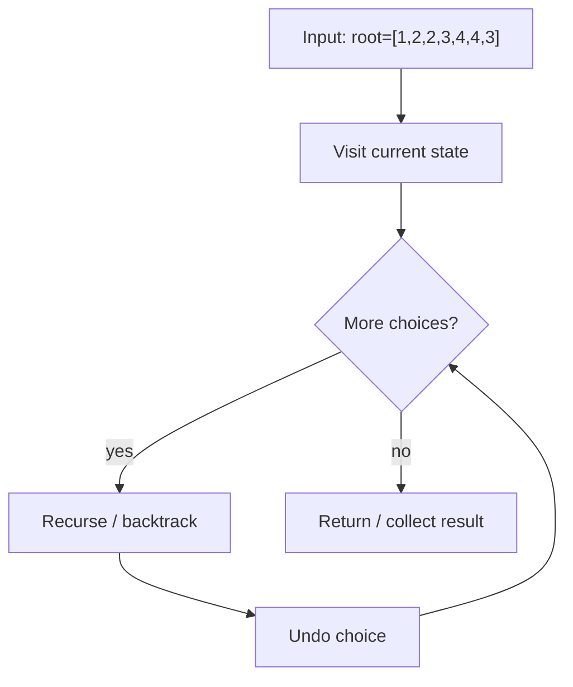
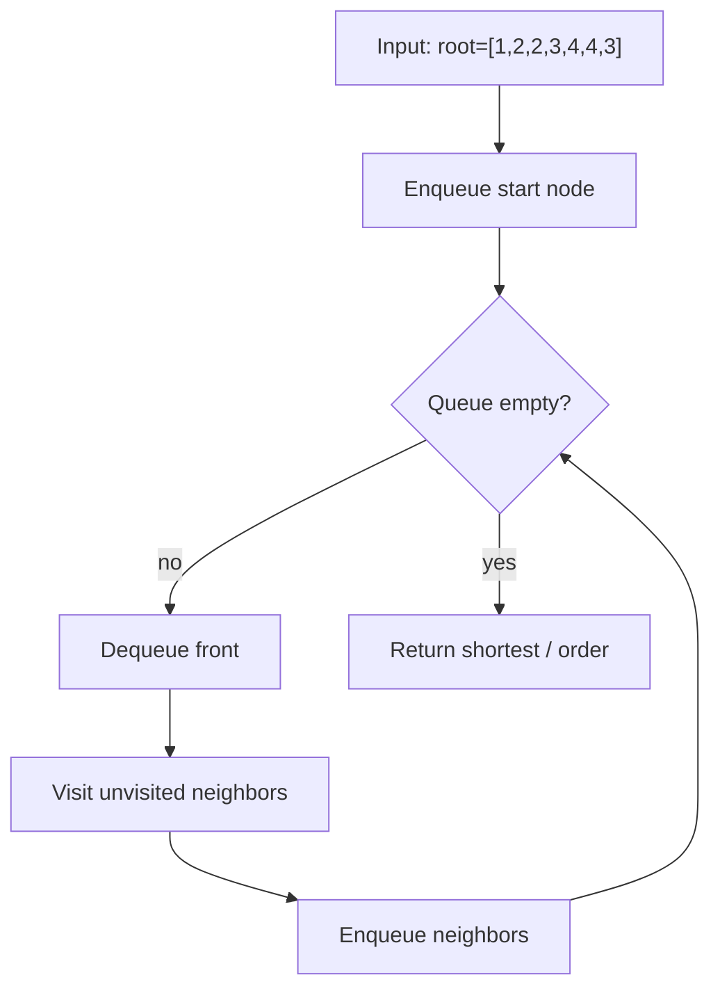
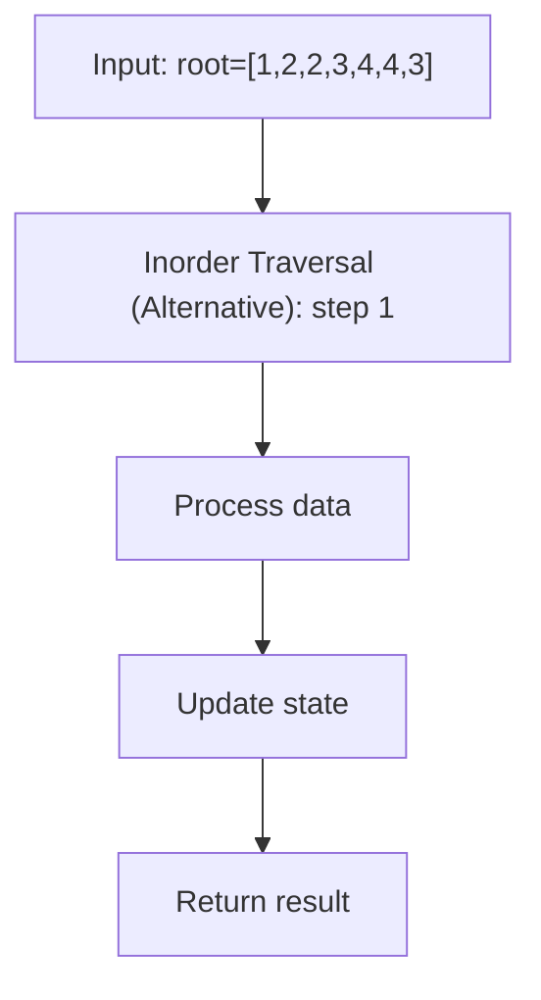

# Symmetric Tree

> **You are here**: DSA — see [ROADMAP](../../../ROADMAP.md) for level assignment
> **Roadmap**: [Developer Master Roadmap](../../../ROADMAP.md) | **Study path**: [StudyGuide](../../StudyGuide.md)
> **Pattern**: [Binary Tree](../../../03_CodingPatterns/02_AlgorithmicPatterns.md#pattern-8-dfs-depth-first-search) · [DFS](../../../03_CodingPatterns/02_AlgorithmicPatterns.md#pattern-8-dfs-depth-first-search) | **Catalog**: [Algorithmic Patterns](../../../03_CodingPatterns/02_AlgorithmicPatterns.md)

## Problem Statement
Given the root of a binary tree, check whether it is a mirror of itself (i.e., symmetric around its center).

## Example
```
Input: root = [1,2,2,3,4,4,3]
Output: true

Symmetric tree:
    1
   / \
  2   2
 / \ / \
3  4 4  3

Input: root = [1,2,2,null,3,null,3]
Output: false

Not symmetric:
    1
   / \
  2   2
   \   \
    3   3
```

## Approach 1: Recursive (Optimal!)

### How it works:
1. **Compare pairs of nodes** that should be mirrors
2. **Left subtree of left** should mirror **right subtree of right**
3. **Recursively check** all mirror pairs

### Key Logic:

#### Example Flow

**Step flow (mermaid):**



**Walkthrough (same example):**

```
Example: root=[1,2,2,3,4,4,3] → true
Approach: Recursive (Optimal!)

Visit current node/state
Recurse on valid next choices
Backtrack and try alternatives
```
```java
public boolean isSymmetric(TreeNode root) {
    if (root == null) return true;
    return isMirror(root.left, root.right);
}

private boolean isMirror(TreeNode left, TreeNode right) {
    // Both null - symmetric
    if (left == null && right == null) return true;
    
    // One null, one not - not symmetric
    if (left == null || right == null) return false;
    
    // Values must match and subtrees must be mirrors
    return (left.val == right.val) && 
           isMirror(left.left, right.right) &&
           isMirror(left.right, right.left);
}
```

### Time & Space Complexity:
- **Time:** O(n) - Visit each node once
- **Space:** O(h) where h is tree height (recursion stack)

## Approach 2: Iterative with Queue

### How it works:
1. **Use queue** to store pairs of nodes to compare
2. **Add mirror pairs** to queue
3. **Check each pair** iteratively

### Key Logic:

#### Example Flow

**Step flow (mermaid):**



**Walkthrough (same example):**

```
Example: root=[1,2,2,3,4,4,3] → true
Approach: Iterative with Queue

Enqueue start node/level
Process neighbors level by level
First reach target = shortest path
```
```java
public boolean isSymmetric(TreeNode root) {
    if (root == null) return true;
    
    Queue<TreeNode> queue = new LinkedList<>();
    queue.offer(root.left);
    queue.offer(root.right);
    
    while (!queue.isEmpty()) {
        TreeNode left = queue.poll();
        TreeNode right = queue.poll();
        
        // Both null - continue
        if (left == null && right == null) continue;
        
        // One null or values don't match - not symmetric
        if (left == null || right == null || left.val != right.val) {
            return false;
        }
        
        // Add next pairs to check
        queue.offer(left.left);
        queue.offer(right.right);
        queue.offer(left.right);
        queue.offer(right.left);
    }
    
    return true;
}
```

### Time & Space Complexity:
- **Time:** O(n) - Visit each node once
- **Space:** O(w) where w is maximum width of tree

## Approach 3: Inorder Traversal (Alternative)

### How it works:
1. **Two inorder traversals:** normal and mirrored
2. **Compare the sequences** - should be identical
3. **Handle null nodes** with special markers

### Key Logic:

#### Example Flow

**Step flow (mermaid):**



**Walkthrough (same example):**

```
Example: root=[1,2,2,3,4,4,3] → true
Approach: Inorder Traversal (Alternative)

Apply Inorder Traversal (Alternative) on the example input step by step
Final answer from example: see above
```
```java
public boolean isSymmetric(TreeNode root) {
    List<String> normal = new ArrayList<>();
    List<String> mirrored = new ArrayList<>();
    
    inorderNormal(root, normal);
    inorderMirrored(root, mirrored);
    
    return normal.equals(mirrored);
}

private void inorderNormal(TreeNode node, List<String> result) {
    if (node == null) {
        result.add("null");
        return;
    }
    inorderNormal(node.left, result);
    result.add(String.valueOf(node.val));
    inorderNormal(node.right, result);
}

private void inorderMirrored(TreeNode node, List<String> result) {
    if (node == null) {
        result.add("null");
        return;
    }
    inorderMirrored(node.right, result); // Right first
    result.add(String.valueOf(node.val));
    inorderMirrored(node.left, result);  // Left second
}
```

## Mirror Relationship Visualization:

### For symmetric tree:
```
    1
   / \
  2   2
 /|  |\ 
3 4  4 3

Pairs to check:
- (2, 2) ✓
- (3, 3) ✓ 
- (4, 4) ✓
- (null, null) ✓
```

### Key insight:
- **left.left** mirrors **right.right**
- **left.right** mirrors **right.left**

## Edge Cases:
1. **Empty tree** → Symmetric
2. **Single node** → Symmetric
3. **Two nodes** → Check if values match
4. **Unbalanced structure** → Compare carefully

## Common Mistakes:
1. **Forgetting null checks**
2. **Wrong mirror pairing** (left.left with right.left)
3. **Not handling single child nodes**
4. **Comparing node references** instead of values

## LeetCode Similar Problems:
- [101. Symmetric Tree](https://leetcode.com/problems/symmetric-tree/) (this problem)
- [100. Same Tree](https://leetcode.com/problems/same-tree/)
- [951. Flip Equivalent Binary Trees](https://leetcode.com/problems/flip-equivalent-binary-trees/)
- [226. Invert Binary Tree](https://leetcode.com/problems/invert-binary-tree/)

## Interview Tips:
- Start with recursive approach (most intuitive)
- Clearly explain the mirror relationship
- Handle all null cases carefully
- Draw examples to visualize the checking process
- Consider iterative approach as follow-up 