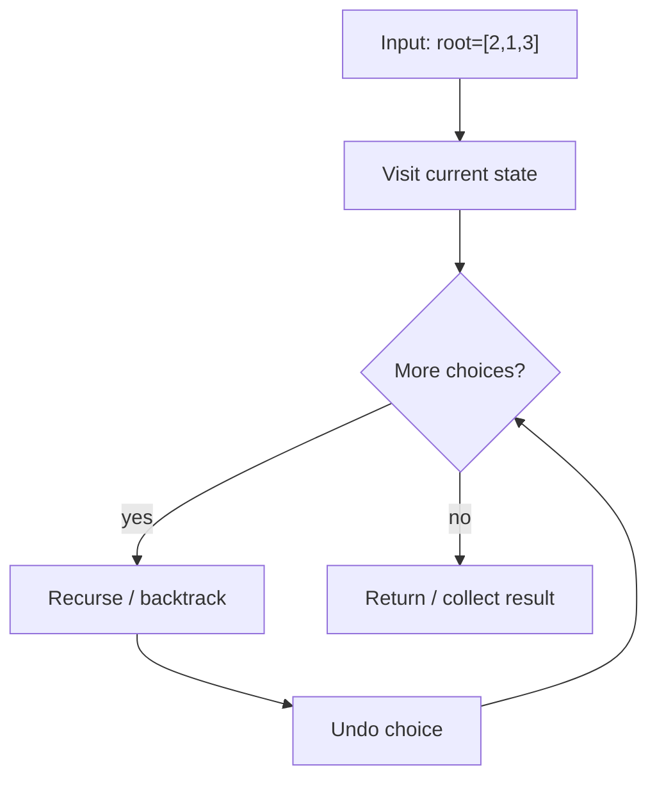
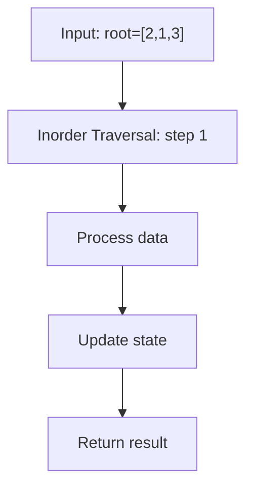
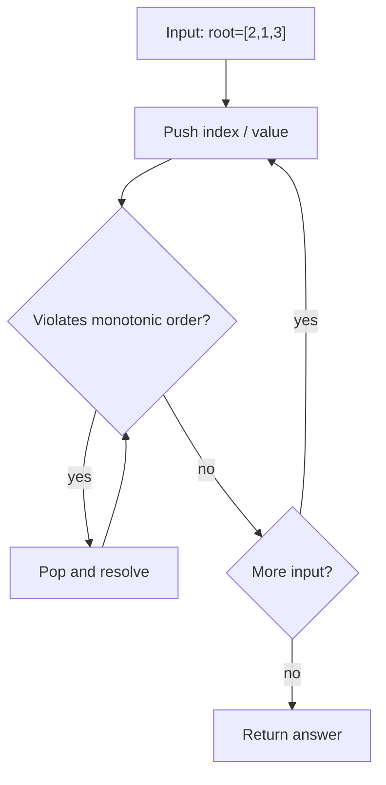

# Validate Binary Search Tree

> **You are here**: DSA — see [ROADMAP](../../../ROADMAP.md) for level assignment
> **Roadmap**: [Developer Master Roadmap](../../../ROADMAP.md) | **Study path**: [StudyGuide](../../StudyGuide.md)
> **Pattern**: [Binary Tree](../../../03_CodingPatterns/02_AlgorithmicPatterns.md#pattern-8-dfs-depth-first-search) · [DFS](../../../03_CodingPatterns/02_AlgorithmicPatterns.md#pattern-8-dfs-depth-first-search) | **Catalog**: [Algorithmic Patterns](../../../03_CodingPatterns/02_AlgorithmicPatterns.md)

## Problem Statement
Given the root of a binary tree, determine if it is a valid binary search tree (BST). A valid BST is defined as follows:
- The left subtree contains only nodes with keys less than the node's key
- The right subtree contains only nodes with keys greater than the node's key
- Both left and right subtrees must also be binary search trees

## Example
```
Input: root = [2,1,3]
Output: true

Valid BST:
  2
 / \
1   3

Input: root = [5,1,4,null,null,3,6]
Output: false
Explanation: The root node's value is 5 but its right child's value is 4.
```

## Approach 1: Recursive with Min/Max Bounds (Optimal!)

### How it works:
1. **Track valid range** for each node (min, max)
2. **Root can be any value** → range is (-∞, +∞)
3. **Left child range:** (min, current) **Right child range:** (current, max)
4. **Check if node value** is within its valid range

### Key Logic:

#### Example Flow

**Step flow (mermaid):**



**Walkthrough (same example):**

```
Example: root=[2,1,3] → true
Approach: Recursive with Min/Max Bounds (Optimal!)

Visit current node/state
Recurse on valid next choices
Backtrack and try alternatives
```
```java
public boolean isValidBST(TreeNode root) {
    return validate(root, Long.MIN_VALUE, Long.MAX_VALUE);
}

private boolean validate(TreeNode node, long min, long max) {
    // Empty tree is valid BST
    if (node == null) return true;
    
    // Check if current node violates BST property
    if (node.val <= min || node.val >= max) {
        return false;
    }
    
    // Recursively validate left and right subtrees
    return validate(node.left, min, node.val) &&
           validate(node.right, node.val, max);
}
```

### Time & Space Complexity:
- **Time:** O(n) - Visit each node once
- **Space:** O(h) where h is tree height (recursion stack)

## Approach 2: Inorder Traversal

### How it works:
1. **Inorder traversal of BST** gives sorted sequence
2. **Check if sequence** is strictly increasing
3. **Track previous value** during traversal

### Key Logic:

#### Example Flow

**Step flow (mermaid):**



**Walkthrough (same example):**

```
Example: root=[2,1,3] → true
Approach: Inorder Traversal

Apply Inorder Traversal on the example input step by step
Final answer from example: see above
```
```java
private Integer prev = null;

public boolean isValidBST(TreeNode root) {
    return inorder(root);
}

private boolean inorder(TreeNode node) {
    if (node == null) return true;
    
    // Check left subtree
    if (!inorder(node.left)) return false;
    
    // Check current node
    if (prev != null && node.val <= prev) {
        return false;
    }
    prev = node.val;
    
    // Check right subtree
    return inorder(node.right);
}
```

### Alternative with List:
```java
public boolean isValidBST(TreeNode root) {
    List<Integer> values = new ArrayList<>();
    inorder(root, values);
    
    // Check if list is strictly increasing
    for (int i = 1; i < values.size(); i++) {
        if (values.get(i) <= values.get(i-1)) {
            return false;
        }
    }
    return true;
}

private void inorder(TreeNode node, List<Integer> values) {
    if (node == null) return;
    inorder(node.left, values);
    values.add(node.val);
    inorder(node.right, values);
}
```

## Approach 3: Iterative with Stack

### How it works:
1. **Iterative inorder traversal** using stack
2. **Track previous value** without recursion
3. **Same logic** as recursive inorder

### Key Logic:

#### Example Flow

**Step flow (mermaid):**



**Walkthrough (same example):**

```
Example: root=[2,1,3] → true
Approach: Iterative with Stack

Push indices/values on stack
Pop when current resolves pending
Stack top gives next greater / valid match
```
```java
public boolean isValidBST(TreeNode root) {
    Stack<TreeNode> stack = new Stack<>();
    Integer prev = null;
    TreeNode current = root;
    
    while (current != null || !stack.isEmpty()) {
        // Go to leftmost node
        while (current != null) {
            stack.push(current);
            current = current.left;
        }
        
        // Process current node
        current = stack.pop();
        
        // Check BST property
        if (prev != null && current.val <= prev) {
            return false;
        }
        prev = current.val;
        
        // Move to right subtree
        current = current.right;
    }
    
    return true;
}
```

## Common Pitfalls:

### 1. Only checking immediate children:
```java
// WRONG - only checks direct parent-child relationship
if (node.left != null && node.left.val >= node.val) return false;
if (node.right != null && node.right.val <= node.val) return false;
```

### 2. Integer overflow:
```java
// Use Long.MIN_VALUE and Long.MAX_VALUE
// Or handle null bounds separately
```

### 3. Equal values:
```java
// BST requires strict inequality
if (node.val <= min || node.val >= max) return false;
```

## Edge Cases:
1. **Empty tree** → Valid BST
2. **Single node** → Valid BST
3. **Duplicate values** → Invalid BST
4. **Integer boundary values** → Handle overflow

## Comparison of Approaches:

### Min/Max Bounds:
- **Pros:** Direct validation, clear logic
- **Cons:** Need to handle integer overflow

### Inorder Traversal:
- **Pros:** Uses BST property directly
- **Cons:** Additional space or global variable

### Iterative:
- **Pros:** No recursion stack
- **Cons:** More complex code

## LeetCode Similar Problems:
- [98. Validate Binary Search Tree](https://leetcode.com/problems/validate-binary-search-tree/) (this problem)
- [700. Search in a Binary Search Tree](https://leetcode.com/problems/search-in-a-binary-search-tree/)
- [701. Insert into a Binary Search Tree](https://leetcode.com/problems/insert-into-a-binary-search-tree/)
- [450. Delete Node in a BST](https://leetcode.com/problems/delete-node-in-a-bst/)
- [96. Unique Binary Search Trees](https://leetcode.com/problems/unique-binary-search-trees/)

## Interview Tips:
- Start with min/max bounds approach (most common)
- Explain the BST property clearly
- Handle integer overflow with Long values
- Consider inorder traversal as alternative
- Test with edge cases: empty tree, single node, duplicates 