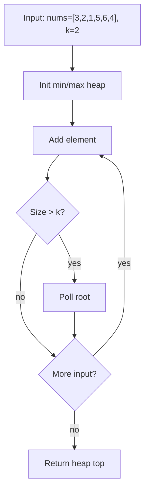
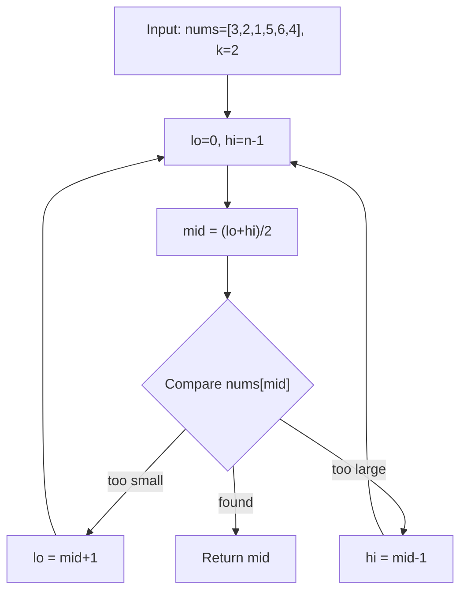
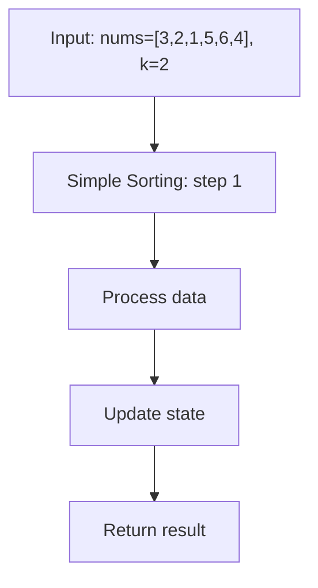

# Kth Largest Element in an Array

> **You are here**: DSA — see [ROADMAP](../../../ROADMAP.md) for level assignment
> **Roadmap**: [Developer Master Roadmap](../../../ROADMAP.md) | **Study path**: [StudyGuide](../../StudyGuide.md)
> **Pattern**: [Top K Elements](../../../03_CodingPatterns/02_AlgorithmicPatterns.md#pattern-12-top-k-elements) | **Catalog**: [Algorithmic Patterns](../../../03_CodingPatterns/02_AlgorithmicPatterns.md)

## Problem Statement
Given an integer array `nums` and an integer `k`, return the kth largest element in the array.

**Note**: It is the kth largest element in the sorted order, not the kth distinct element.

**Example:**
```
Input: nums = [3,2,1,5,6,4], k = 2
Output: 5
Explanation: Sorted array is [1,2,3,4,5,6], so 2nd largest is 5
```

## Approaches

### Approach 1: Min Heap of Size K ⭐ (Recommended)

#### Key Insight
Maintain a min heap of size k containing the k largest elements seen so far.

#### Algorithm
1. Iterate through array
2. Add each element to min heap
3. If heap size > k, remove the smallest element (heap root)
4. Return heap root (smallest among k largest = kth largest)


#### Example Flow

**Step flow (mermaid):**



**Walkthrough (same example):**

```
Example: nums=[3,2,1,5,6,4], k=2 → 5
Approach: Min Heap of Size K

Maintain heap of size k or candidates
Push each element, pop if over limit
Root is kth largest or min distance
```

#### Time Complexity
- **O(n log k)** - Each of n elements: O(log k) to add/remove from heap of size k

#### Space Complexity
- **O(k)** - Heap stores at most k elements

```java
public int findKthLargestMinHeap(int[] nums, int k) {
    PriorityQueue<Integer> minHeap = new PriorityQueue<>();
    
    for (int num : nums) {
        minHeap.offer(num);
        if (minHeap.size() > k) {
            minHeap.poll();
        }
    }
    
    return minHeap.peek();
}
```

### Approach 2: Max Heap

#### Algorithm
1. Add all elements to max heap
2. Extract k-1 largest elements
3. Return the next largest (kth largest)


#### Example Flow

**Step flow (mermaid):**


**Walkthrough (same example):**

```
Example: nums=[3,2,1,5,6,4], k=2 → 5
Approach: Max Heap

Maintain heap of size k or candidates
Push each element, pop if over limit
Root is kth largest or min distance
```

#### Time Complexity
- **O(n + k log n)** - Building heap: O(n), extracting k elements: O(k log n)

#### Space Complexity
- **O(n)** - Store all elements in heap

### Approach 3: QuickSelect ⭐⭐ (Optimal)

#### Key Insight
Use quicksort partitioning to find kth largest without fully sorting.

#### Algorithm
1. Convert problem: kth largest = (n-k)th smallest
2. Use partition to find position where all left elements are smaller
3. If partition index equals target, return element
4. Otherwise, recursively search left or right half


#### Example Flow

**Step flow (mermaid):**



**Walkthrough (same example):**

```
Example: nums=[3,2,1,5,6,4], k=2 → 5
Approach: QuickSelect

Set lo/hi bounds on answer or index
Compare mid element with target
Halve search space until found
```

#### Time Complexity
- **O(n)** average case, **O(n²)** worst case
- Average: Each recursion processes half the array

#### Space Complexity
- **O(1)** - In-place algorithm

```java
public int findKthLargestQuickSelect(int[] nums, int k) {
    return quickSelect(nums, 0, nums.length - 1, nums.length - k);
}

private int quickSelect(int[] nums, int left, int right, int kSmallest) {
    if (left == right) return nums[left];
    
    int pivotIndex = partition(nums, left, right, randomPivot);
    
    if (kSmallest == pivotIndex) {
        return nums[kSmallest];
    } else if (kSmallest < pivotIndex) {
        return quickSelect(nums, left, pivotIndex - 1, kSmallest);
    } else {
        return quickSelect(nums, pivotIndex + 1, right, kSmallest);
    }
}
```

### Approach 4: Simple Sorting

#### Algorithm
1. Sort the entire array
2. Return element at position `n-k`


#### Example Flow

**Step flow (mermaid):**



**Walkthrough (same example):**

```
Example: nums=[3,2,1,5,6,4], k=2 → 5
Approach: Simple Sorting

Apply Simple Sorting on the example input step by step
Final answer from example: see above
```

#### Time Complexity
- **O(n log n)** - Due to sorting

#### Space Complexity
- **O(1)** - If using in-place sort

## Comparison

| Approach | Time (Average) | Time (Worst) | Space | Best Use Case |
|----------|----------------|--------------|-------|---------------|
| Min Heap | O(n log k) | O(n log k) | O(k) | When k is small, consistent performance |
| Max Heap | O(n + k log n) | O(n + k log n) | O(n) | When k is close to n |
| QuickSelect | O(n) | O(n²) | O(1) | When space matters and average case is acceptable |
| Sorting | O(n log n) | O(n log n) | O(1) | Simple implementation, or when array needs to stay sorted |

## Example Trace (Min Heap, k=2)

Array: [3,2,1,5,6,4], k=2

1. **Process 3**: heap = [3]
2. **Process 2**: heap = [2,3]
3. **Process 1**: heap = [1,2,3] → size > k → remove 1 → heap = [2,3]
4. **Process 5**: heap = [2,3,5] → size > k → remove 2 → heap = [3,5]
5. **Process 6**: heap = [3,5,6] → size > k → remove 3 → heap = [5,6]
6. **Process 4**: heap = [4,5,6] → size > k → remove 4 → heap = [5,6]

**Result**: heap.peek() = 5

## When to Use Each Approach

- **Min Heap (k elements)**: Best general solution, especially when k << n
- **QuickSelect**: When space is critical and you can afford worst-case O(n²)
- **Max Heap**: When k is close to n
- **Sorting**: When you need the array sorted anyway, or for simple one-time queries

## Key Insights
- Min heap approach is usually preferred for its consistency
- QuickSelect is theoretically optimal but has worst-case issues
- The key insight for min heap: smallest element in k-largest-set is the kth largest overall 