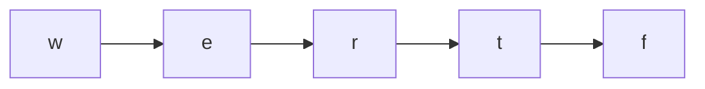

# Alien Dictionary — LeetCode 269

> **You are here**: Staff Engineer — DSA (graph)
> **Depth**: Standard (full graph construction + topological sort walkthrough)
> **Roadmap**: [Developer Master Roadmap](../../../ROADMAP.md) | **Prerequisites**: [Topological Sort](../TopologicalSort/TopologicalSort.md), [Course Schedule](../CourseSchedule/CourseSchedule.md) | **Next**: [Critical Connections](../CriticalConnections/CriticalConnections.md)
> **Pattern**: [Topological Sort](../../../03_CodingPatterns/02_AlgorithmicPatterns.md#pattern-15-topological-sort) | **Catalog**: [Algorithmic Patterns](../../../03_CodingPatterns/02_AlgorithmicPatterns.md)

---

## Problem Statement

Given a sorted list of words in an **alien language**, derive the character ordering. Words are sorted lexicographically by unknown rules.

Return a string of unique characters in order. If the order is **invalid** (contradiction / cycle), return `""`.

**Examples:**
```
Input:  words = ["wrt","wrf","er","ett","rftt"]
Output: "wertf"

Input:  words = ["z","x"]
Output: "zx"

Input:  words = ["z","x","z"]
Output: ""   // contradiction
```

---

## Intuition — what are we really solving?

Adjacent words in the sorted list give us **ordering constraints** between characters. Collect all constraints → build directed graph → topological sort.

```
"wrt" before "wrf"  →  at first differing char: t before f  →  edge t → f
"wrf" before "er"   →  w before e  →  edge w → e
... and so on
```

This is **topological sort on characters** — same template as [Course Schedule](../CourseSchedule/CourseSchedule.md) but nodes are chars, not courses.

---

## Step 1: Build graph from adjacent word pairs

For each pair `words[i]`, `words[i+1]`:

```java
for (int i = 0; i < words.length - 1; i++) {
    String w1 = words[i], w2 = words[i + 1];

    // INVALID: prefix rule — longer word cannot come before shorter prefix
    // e.g. "abc" before "ab" is impossible in sorted order
    if (w1.length() > w2.length() && w1.startsWith(w2)) {
        return "";
    }

    for (int j = 0; j < Math.min(w1.length(), w2.length()); j++) {
        char c1 = w1.charAt(j), c2 = w2.charAt(j);
        if (c1 != c2) {
            addEdge(c1, c2);  // c1 comes before c2
            break;  // only first differing char matters for this pair
        }
    }
}
```

### Prefix invalid case (critical edge case)

```
words = ["abc", "ab"]

"abc" is longer but "ab" is a prefix — in any valid alphabet,
"ab" must come BEFORE "abc" (shorter string is smaller in lex order).

So ["abc", "ab"] is INVALID → return ""
```

---

## Step 2: Topological sort (Kahn's BFS)

```java
// Initialize all chars seen in any word (even isolated chars)
for (String w : words)
    for (char c : w.toCharArray())
        graph.putIfAbsent(c, new HashSet<>());

// Kahn's algorithm
Queue<Character> q = new LinkedList<>();
for (char c : indegree.keySet())
    if (indegree.get(c) == 0) q.offer(c);

StringBuilder result = new StringBuilder();
while (!q.isEmpty()) {
    char c = q.poll();
    result.append(c);
    for (char next : graph.get(c)) {
        indegree.put(next, indegree.get(next) - 1);
        if (indegree.get(next) == 0) q.offer(next);
    }
}

return result.length() == indegree.size() ? result.toString() : "";
// If cycle exists, not all chars processed → return ""
```

---

## Full walkthrough: `["wrt","wrf","er","ett","rftt"]`

### Extract edges

| Pair | First diff | Edge |
|------|------------|------|
| wrt vs wrf | t vs f | t → f |
| wrf vs er | w vs e | w → e |
| er vs ett | r vs t | r → t |
| ett vs rftt | e vs r | e → r |

### Graph

```
w → e → r → t → f
```

### Topological order

One valid result: **wertf** (t before f from first edge; e,r,t chain from rest)



---

## Cycle example: `["z","x","z"]`

```
"z" vs "x"  →  z before x  →  edge z → x
"x" vs "z"  →  x before z  →  edge x → z

Cycle: z → x → z  →  topological sort fails  →  return ""
```

---

## Complexity

| Measure | Value | Why |
|---------|-------|-----|
| **Time** | O(C) | C = total characters across all words |
| **Space** | O(1) alphabet | Max 26 letters (or O(U) unique chars) |

---

## Comparison with related problems

| Problem | Nodes | Edges from | Cycle means |
|---------|-------|------------|-------------|
| [Course Schedule](../CourseSchedule/CourseSchedule.md) | Courses | Prerequisites | Cannot graduate |
| [Topological Sort](../TopologicalSort/TopologicalSort.md) | Generic | Given DAG | Invalid DAG |
| **Alien Dictionary** | Characters | Adjacent words | Invalid language order |

---

## Complete Java solution

```java
public String alienOrder(String[] words) {
    Map<Character, Set<Character>> graph = new HashMap<>();
    Map<Character, Integer> indegree = new HashMap<>();

    for (String w : words)
        for (char c : w.toCharArray()) {
            graph.putIfAbsent(c, new HashSet<>());
            indegree.putIfAbsent(c, 0);
        }

    for (int i = 0; i < words.length - 1; i++) {
        String w1 = words[i], w2 = words[i + 1];
        if (w1.length() > w2.length() && w1.startsWith(w2)) return "";

        for (int j = 0; j < Math.min(w1.length(), w2.length()); j++) {
            char c1 = w1.charAt(j), c2 = w2.charAt(j);
            if (c1 != c2) {
                if (!graph.get(c1).contains(c2)) {
                    graph.get(c1).add(c2);
                    indegree.put(c2, indegree.get(c2) + 1);
                }
                break;
            }
        }
    }

    Queue<Character> q = new LinkedList<>();
    for (char c : indegree.keySet())
        if (indegree.get(c) == 0) q.offer(c);

    StringBuilder sb = new StringBuilder();
    while (!q.isEmpty()) {
        char c = q.poll();
        sb.append(c);
        for (char next : graph.get(c)) {
            indegree.put(next, indegree.get(next) - 1);
            if (indegree.get(next) == 0) q.offer(next);
        }
    }
    return sb.length() == indegree.size() ? sb.toString() : "";
}
```

Full code: [AlienDictionary.java](AlienDictionary.java)

---

## Edge cases checklist

| Case | Expected |
|------|----------|
| Single word `"abc"` | Return any order containing a,b,c (often all chars) |
| Prefix invalid `"abc"` before `"ab"` | `""` |
| Cycle | `""` |
| Disconnected graph (no edges between groups) | Topo still includes all — order among components arbitrary |
| Duplicate edges | Don't double-increment indegree (use Set for neighbors) |
| Empty words array | `""` per problem constraints |

---

## Interview tips

1. **State approach first**: "Build graph from adjacent words, then Kahn's topo sort"
2. **Mention prefix case before coding** — interviewers often test this
3. **Duplicate edges**: Use `Set` adjacency — don't add same edge twice
4. **Follow-up**: Multiple valid orders? Return any one
5. **Follow-up**: Dictionary with  Unicode? Same algorithm, larger alphabet

---

## Common mistakes

| Mistake | Consequence |
|---------|-------------|
| Compare all char pairs in two words | Wrong edges — only first diff matters |
| Forget prefix invalid check | Accept impossible input |
| Double-count indegree | Wrong topo order |
| DFS without cycle detection | Infinite loop on cycle |

---

## Related

- [Word Ladder](../WordLadder/WordLadder.md) — BFS on word graph (different problem)
- [Critical Connections](../CriticalConnections/CriticalConnections.md) — graph connectivity
- [Tier3 Differentiators](../../Tier3_Differentiators.md)
