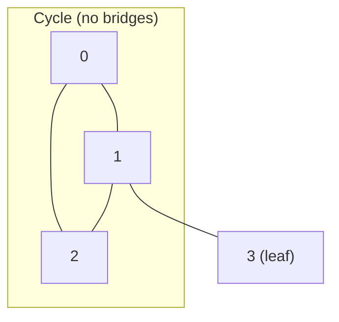

# Critical Connections — LeetCode 1192 (Network Bridges)

> **You are here**: Staff Engineer — DSA (graph)
> **Depth**: Standard (Tarjan's algorithm with visual walkthrough)
> **Roadmap**: [Developer Master Roadmap](../../../ROADMAP.md) | **Prerequisites**: [Union Find](../UnionFind/UnionFind.md), [Dijkstra](../DijkstraAlgorithm/DijkstraAlgorithm.md) | **Next**: [Alien Dictionary](../AlienDictionary/AlienDictionary.md)
> **Pattern**: [DFS / Tarjan](../../../03_CodingPatterns/02_AlgorithmicPatterns.md#pattern-8-dfs-depth-first-search) | **Catalog**: [Algorithmic Patterns](../../../03_CodingPatterns/02_AlgorithmicPatterns.md)

---

## Problem Statement

Given `n` servers labeled `0` to `n-1` and undirected connections, return all **critical connections** (bridges) — edges whose removal increases the number of connected components.

**Example:**
```
Input: n = 4, connections = [[0,1],[1,2],[2,0],[1,3]]
Output: [[1,3]]

Graph:
    0 --- 1 --- 3
     \   /
      \ /
       2

Removing edge [1,3] disconnects server 3. Edges on the triangle 0-1-2-0 are NOT bridges (cycle provides alternate path).
```

**Real-world**: Network reliability, microservice dependency analysis — [§29 Advanced Networking](../../../01_TechGuide/29_Advanced_Networking_Infrastructure.md).

---

## Intuition — what makes an edge a bridge?

An edge is a **bridge** if it is the **only path** between its two endpoints.

```
Chain:  A --- B --- C     Edge A-B and B-C are bridges (no alternate route)

Cycle:  A --- B
        |     |
        C --- D     NO edge is a bridge (removing any one edge, graph stays connected)
```

**Key question**: After removing edge `(u,v)`, can `v` still reach `u` without using that edge? If no → bridge.

---

## Approach: Tarjan's bridge-finding (DFS)

Tarjan's algorithm tracks two arrays during DFS:

| Array | Meaning |
|-------|---------|
| `disc[u]` | Discovery time — when DFS first visited node `u` |
| `low[u]` | Lowest `disc` reachable from `u` using tree edges + **one back edge** |

### Bridge condition

For tree edge `u → v` (where `v` is child of `u` in DFS tree):

```
If low[v] > disc[u]  →  edge (u,v) is a BRIDGE

Why? v's subtree cannot reach u or anything above u except through (u,v)
```

### Articulation point (follow-up)

Node `u` is articulation point if:
- Root with 2+ children in DFS tree, OR
- Non-root: exists child `v` with `low[v] >= disc[u]`

---

## Walkthrough: n=4, edges 0-1, 1-2, 2-0, 1-3

```
DFS from 0:

time=0: visit 0, disc[0]=low[0]=0
time=1: visit 1 (via 0-1), disc[1]=low[1]=1
time=2: visit 2 (via 1-2), disc[2]=low[2]=2
        back edge 2-0 → low[2] = min(low[2], disc[0]) = 0
time=3: back to 1, low[1] = min(low[1], low[2]) = 0
        Check edge 1-2: low[2]=0, disc[1]=1 → 0 < 1 → NOT bridge
time=4: back to 0, low[0] = min(low[0], low[1]) = 0
        Check edge 0-1: low[1]=0, disc[0]=0 → NOT bridge
time=5: visit 3 (via 1-3), disc[3]=low[3]=5
        Check edge 1-3: low[3]=5, disc[1]=1 → 5 > 1 → BRIDGE ✓
```

**Answer**: `[[1,3]]`



---

## Algorithm steps

```
1. Build adjacency list (undirected — add both directions)
2. Initialize disc[] = -1, low[], time = 0
3. For each unvisited node: DFS
4. In DFS(u, parent):
   a. disc[u] = low[u] = time++
   b. For each neighbor v of u:
      - Skip if v == parent
      - If v unvisited:
          DFS(v, u)
          low[u] = min(low[u], low[v])
          If low[v] > disc[u] → add edge (u,v) to bridges
      - Else (back edge):
          low[u] = min(low[u], disc[v])
```

---

## Java implementation

```java
public List<List<Integer>> criticalConnections(int n, List<List<Integer>> connections) {
    List<Integer>[] graph = new ArrayList[n];
    for (int i = 0; i < n; i++) graph[i] = new ArrayList<>();
    for (List<Integer> edge : connections) {
        graph[edge.get(0)].add(edge.get(1));
        graph[edge.get(1)].add(edge.get(0));
    }

    int[] disc = new int[n];
    int[] low = new int[n];
    Arrays.fill(disc, -1);
    List<List<Integer>> bridges = new ArrayList<>();
    int[] time = {0};

    for (int i = 0; i < n; i++) {
        if (disc[i] == -1) dfs(i, -1, graph, disc, low, time, bridges);
    }
    return bridges;
}

private void dfs(int u, int parent, List<Integer>[] graph,
                 int[] disc, int[] low, int[] time,
                 List<List<Integer>> bridges) {
    disc[u] = low[u] = time[0]++;

    for (int v : graph[u]) {
        if (v == parent) continue;
        if (disc[v] == -1) {
            dfs(v, u, graph, disc, low, time, bridges);
            low[u] = Math.min(low[u], low[v]);
            if (low[v] > disc[u]) {
                bridges.add(Arrays.asList(Math.min(u, v), Math.max(u, v)));
            }
        } else {
            low[u] = Math.min(low[u], disc[v]);
        }
    }
}
```

Full code: [CriticalConnections.java](CriticalConnections.java)

---

## Complexity

| Measure | Value |
|---------|-------|
| **Time** | O(V + E) — each node and edge visited once |
| **Space** | O(V + E) — adjacency list + recursion stack O(V) |

---

## Union-Find alternative?

| | Union-Find | Tarjan DFS |
|---|------------|------------|
| Connected components | Excellent | Yes |
| Find bridges | Must remove each edge and check — O(E × α(V)) | O(V + E) |
| Interview choice | Mention but don't use for bridges | **Standard answer** |

---

## Edge cases

| Case | Result |
|------|--------|
| Single edge 0-1 | That edge is a bridge |
| Triangle only (3 nodes, 3 edges) | No bridges |
| Disconnected graph | Run DFS from all unvisited nodes |
| Parallel edges between same pair | Rare in LeetCode; treat as separate edges |
| Large n (10^5) | O(V+E) required — no per-edge removal simulation |

---

## System design connection

| Concept | Application |
|---------|-------------|
| **Bridge edge** | Single network link whose failure partitions datacenter |
| **Articulation point** | Router whose failure disconnects subnet |
| **Redundancy** | Add edge to create cycle → remove bridge property |
| **Microservices** | Critical dependency chain — no fallback path |

**Interview bridge**: "This is why multi-AZ deployments add redundant network paths — eliminate bridges in infrastructure topology."

---

## Interview tips

1. Draw graph; mark tree edges vs back edges during DFS
2. Explain `low` with cycle example — back edge lowers `low`
3. State bridge condition: `low[v] > disc[u]`
4. Follow-up: articulation points — `low[v] >= disc[u]` for non-root
5. Don't confuse with [Critical Connections in distributed systems](../../../01_TechGuide/29_Advanced_Networking_Infrastructure.md) — same vocabulary, different context

---

## Common mistakes

| Mistake | Fix |
|---------|-----|
| Directed graph treatment | Edges are undirected — add both directions |
| Wrong bridge condition `low[v] >= disc[u]` | Use `>` for bridges; `>=` is articulation point |
| Forgetting to skip parent | Infinite loop on undirected edge |
| Not handling disconnected components | Outer loop over all nodes |

---

## Related

- [Number of Islands](../NumberOfIslands/NumberOfIslands.md) — connectivity via BFS/DFS
- [Union Find](../UnionFind/UnionFind.md) — when to use UF vs DFS
- [Min Cost to Connect Points](../MinCostToConnectPoints/MinCostToConnectPoints.md) — MST (different problem)
- [Tier3 Differentiators](../../Tier3_Differentiators.md)
