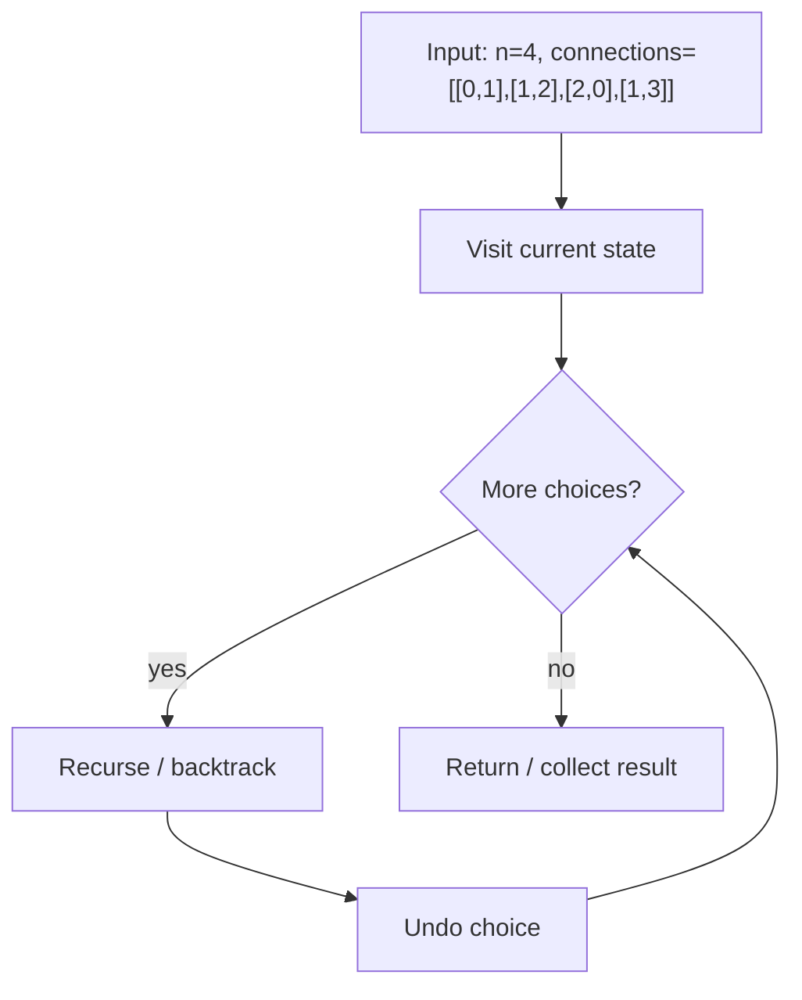

# Critical Connections — LeetCode 1192 (Network Bridges)

> **You are here**: Staff Engineer — DSA (graph)
> **Roadmap**: [Developer Master Roadmap](../../../ROADMAP.md) | **Prerequisites**: [Union Find](../UnionFind/UnionFind.md), [Dijkstra](../DijkstraAlgorithm/DijkstraAlgorithm.md) | **Next**: [Alien Dictionary](../AlienDictionary/AlienDictionary.md)
> **Pattern**: [DFS](../../../03_CodingPatterns/02_AlgorithmicPatterns.md#pattern-8-dfs-depth-first-search) | **Catalog**: [Algorithmic Patterns](../../../03_CodingPatterns/02_AlgorithmicPatterns.md)

## Problem Statement

Given `n` servers labeled `0` to `n-1` and undirected connections, return all **critical connections** (bridges) — edges whose removal increases the number of connected components.

**Example:**
```
Input: n = 4, connections = [[0,1],[1,2],[2,0],[1,3]]
Output: [[1,3]]
Explanation: Removing [1,3] disconnects server 3; other edges are on a cycle.
```

**Real-world**: Network reliability, [Advanced Networking §29](../../../01_TechGuide/29_Advanced_Networking_Infrastructure.md) — single points of failure in topology.

---

## Approach: Tarjan's bridge-finding (DFS)

### Key concepts

| Term | Meaning |
|------|---------|
| `disc[u]` | Discovery time when DFS first visits `u` |
| `low[u]` | Earliest `disc` reachable from `u` via tree edge + one back edge |
| **Bridge** | Tree edge `(u,v)` where `low[v] > disc[u]` — no back edge bypasses it |

### Algorithm

1. Build adjacency list from `connections`
2. DFS from each unvisited node (graph may be connected in problem constraints)
3. For edge `u → v`:
   - Set `disc[v]`, `low[v]`
   - Recurse; `low[u] = min(low[u], low[v])`
   - If `low[v] > disc[u]` → `(u,v)` is bridge (store with smaller index first)

### Complexity

- **Time**: O(V + E)
- **Space**: O(V + E)

---

## Union-Find alternative?

Union-Find finds **connected components** but not bridges efficiently. Tarjan DFS is the standard interview solution. Compare when to use [UnionFind](../UnionFind/UnionFind.md) vs DFS — [Course Schedule](../CourseSchedule/CourseSchedule.md) uses both paradigms.

---

## Java implementation

See [CriticalConnections.java](CriticalConnections.java).

---

## Edge Cases

1. **Parallel edges** — rare in problem; use adjacency as list; bridge logic still holds
2. **Single edge** — that edge is a bridge
3. **Fully cyclic graph** — no bridges (e.g. triangle only)
4. **Disconnected** — run DFS from all nodes; `time` counter global

---

## System design connection

| Concept | Application |
|---------|-------------|
| Bridges | Links whose failure partitions network — add redundant paths |
| Articulation points | Servers whose removal disconnects graph (Tarjan variant) |
| Microservices | Critical dependency edges in service mesh — [§29](../../../01_TechGuide/29_Advanced_Networking_Infrastructure.md) |

---

## Interview Tips

1. Draw small graph; mark tree vs back edges
2. Explain `low` with example cycle vs dangling node
3. Follow-up: **articulation points** — similar DFS, different condition (`low[v] >= disc[u]` for non-root)

## Related

- [Number of Islands](../NumberOfIslands/NumberOfIslands.md) — connectivity
- [Tier3 Differentiators](../../Tier3_Differentiators.md)
#### Example Flow

**Step flow (mermaid):**



**Walkthrough (same example):**

```
Example: n=4, connections=[[0,1],[1,2],[2,0],[1,3]] → [[1,3]]
Approach: : Tarjan's bridge-finding (DFS)

Visit current node/state
Recurse on valid next choices
Backtrack and try alternatives
```

