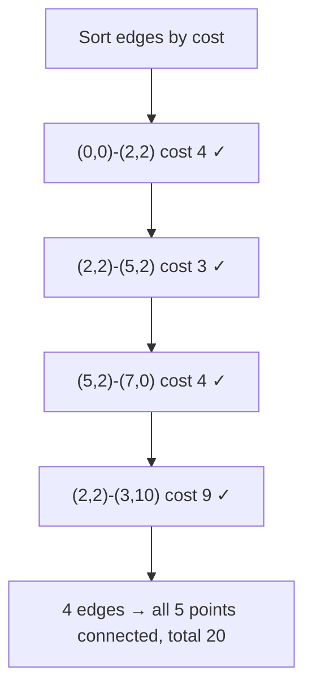
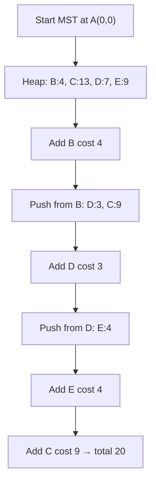

# Min Cost to Connect All Points

> **You are here**: Staff Engineer — DSA (MST)
> **Roadmap**: [Developer Master Roadmap](../../../ROADMAP.md#staff-engineer) | **Prerequisites**: [Union Find](../UnionFind/UnionFind.md) | **Next**: [Critical Connections](../CriticalConnections/CriticalConnections.md)
> **Pattern**: [Minimum Spanning Tree](../../../03_CodingPatterns/02_AlgorithmicPatterns.md#pattern-17-union-find) · [Union Find](../../../03_CodingPatterns/02_AlgorithmicPatterns.md#pattern-17-union-find) | **Catalog**: [Algorithmic Patterns](../../../03_CodingPatterns/02_AlgorithmicPatterns.md)

## Problem Statement

You are given an array `points` representing integer coordinates of a set of points on a 2D plane, where `points[i] = [xi, yi]`.

The **cost** of connecting two points `[xi, yi]` and `[xj, yj]` is the **Manhattan distance** between them: `|xi - xj| + |yi - yj|`, where `|val|` denotes the absolute value of `val`.

Return the minimum cost to connect all points such that there is **exactly one simple path** between any two points.

**Examples:**
```
Input: points = [[0,0],[2,2],[3,10],[5,2],[7,0]]
Output: 20
Explanation: One optimal spanning tree connects:
  (0,0)↔(2,2) cost 4, (2,2)↔(5,2) cost 3, (5,2)↔(7,0) cost 4,
  (2,2)↔(3,10) cost 9. Total = 4 + 3 + 4 + 9 = 20.

Input: points = [[3,12],[-2,5],[-4,1]]
Output: 18
Explanation: Connect all three points with Manhattan edges totaling 18.
```

## Problem Analysis

### Core Insight
This is a **Minimum Spanning Tree (MST)** problem on a **complete graph**:
- **Nodes**: Points on the 2D plane
- **Edges**: Every pair of points, weighted by Manhattan distance
- **Goal**: Connect all nodes with minimum total edge weight (no cycles)

### Why MST?
The constraint "exactly one simple path between any two points" means the result must be a **tree** spanning all nodes. Among all spanning trees, we want the one with minimum total cost — by definition, an MST.

### Key Characteristics
- **Complete graph**: Every pair of points has an edge → O(n²) edges
- **Implicit edges**: We don't need to store all edges upfront for Prim's; we can compute distances on the fly
- **Non-negative weights**: Both Kruskal and Prim apply directly

## Approaches

### Approach 1: Kruskal's Algorithm + Union Find ⭐ (Most Common)

#### Key Insight
Sort all edges by weight and greedily add the cheapest edge that doesn't form a cycle. Union Find efficiently tracks which components are connected.

#### Algorithm
1. Generate all O(n²) edges with Manhattan cost between every pair `(i, j)`
2. Sort edges by cost ascending
3. Initialize Union Find with each point as its own component
4. Iterate sorted edges: if `union(i, j)` succeeds (different components), add cost to total
5. Stop when `n - 1` edges are added (tree has exactly n-1 edges)


#### Example Flow

**Step flow (mermaid):**



**Walkthrough (same example):**

```
points: A(0,0) B(2,2) C(3,10) D(5,2) E(7,0)

Generate all pairs, sort by Manhattan cost:
  A-B:4, B-D:3, D-E:4, B-C:9, ...

Kruskal (cheapest first, skip cycles):
  take A-B (4)   components: {A,B}
  take B-D (3)   components: {A,B,D}
  take D-E (4)   components: {A,B,D,E}
  take B-C (9)   components: all 5 points

4 edges used (n-1) → minimum cost = 20
```

#### Time Complexity
- **O(n² log n)** — generating O(n²) edges + sorting dominates
- Union Find operations are nearly O(1) amortized (inverse Ackermann)

#### Space Complexity
- **O(n²)** for the edge list

```java
public int minCostConnectPointsKruskal(int[][] points) {
    int n = points.length;
    List<int[]> edges = new ArrayList<>();

    // Generate all pairwise edges: [cost, i, j]
    for (int i = 0; i < n; i++) {
        for (int j = i + 1; j < n; j++) {
            int cost = Math.abs(points[i][0] - points[j][0])
                     + Math.abs(points[i][1] - points[j][1]);
            edges.add(new int[]{cost, i, j});
        }
    }
    edges.sort(Comparator.comparingInt(e -> e[0]));

    int[] parent = new int[n];
    for (int i = 0; i < n; i++) parent[i] = i;

    int totalCost = 0, edgesUsed = 0;
    for (int[] edge : edges) {
        if (union(parent, edge[1], edge[2])) {
            totalCost += edge[0];
            if (++edgesUsed == n - 1) break;
        }
    }
    return totalCost;
}

private int find(int[] parent, int x) {
    if (parent[x] != x) parent[x] = find(parent, parent[x]);
    return parent[x];
}

private boolean union(int[] parent, int a, int b) {
    int rootA = find(parent, a), rootB = find(parent, b);
    if (rootA == rootB) return false;
    parent[rootA] = rootB;
    return true;
}
```

### Approach 2: Prim's Algorithm (Min-Heap) ⭐⭐ (Better for Dense Graphs)

#### Key Insight
Grow the MST from a starting node. Always add the cheapest edge connecting a node **inside** the tree to a node **outside** the tree. No need to pre-generate all edges.

#### Algorithm
1. Start from point 0; mark it in the MST
2. Push distances from point 0 to all other points onto a min-heap
3. While MST has fewer than n nodes:
   - Pop the cheapest edge `(cost, point)` from heap
   - If `point` is already in MST, skip
   - Add `point` to MST, accumulate `cost`
   - Push distances from `point` to all non-MST neighbors
4. Return accumulated cost


#### Example Flow

**Step flow (mermaid):**



**Walkthrough (same example):**

```
Prim grows tree from A(0,0):

MST = {A}, heap frontier distances from A:
  B:4, D:7, C:13, E:9

Pop B (4) → MST={A,B}, push B's edges:
  D:3 (better path), C:9

Pop D (3) → MST={A,B,D}, push E:4

Pop E (4) → MST={A,B,D,E}

Pop C (9) → all 5 points in MST

Total cost = 4+3+4+9 = 20
```

#### Time Complexity
- **O(n² log n)** — each of n nodes may push O(n) edges to the heap

#### Space Complexity
- **O(n)** for the heap and visited array (no edge list needed)

```java
public int minCostConnectPointsPrim(int[][] points) {
    int n = points.length;
    boolean[] inMST = new boolean[n];
    PriorityQueue<int[]> pq = new PriorityQueue<>(Comparator.comparingInt(a -> a[0]));

    pq.offer(new int[]{0, 0}); // {cost, pointIndex}
    int totalCost = 0, nodesAdded = 0;

    while (!pq.isEmpty() && nodesAdded < n) {
        int[] current = pq.poll();
        int cost = current[0], u = current[1];

        if (inMST[u]) continue;
        inMST[u] = true;
        totalCost += cost;
        nodesAdded++;

        for (int v = 0; v < n; v++) {
            if (!inMST[v]) {
                int dist = Math.abs(points[u][0] - points[v][0])
                         + Math.abs(points[u][1] - points[v][1]);
                pq.offer(new int[]{dist, v});
            }
        }
    }
    return totalCost;
}
```

## Comparison

| Approach | Time | Space | Pros | Cons |
|----------|------|-------|------|------|
| Kruskal + UF | O(n² log n) | O(n²) | Simple, works on sparse graphs | Must generate all edges |
| Prim (heap) | O(n² log n) | O(n) | No edge list, good for dense graphs | More heap operations |
| Prim (array) | O(n²) | O(n) | Best for dense graphs without heap | O(n²) scan each step |

## Example Traces

### Example 1: Three Points
```
points = [[3,12],[-2,5],[-4,1]]
Distances: (0,1)=12, (0,2)=18, (1,2)=6
```

**Kruskal Trace:**
1. Sorted edges: (1,2,6), (0,1,12), (0,2,18)
2. Add (1,2) cost 6 → components {1,2}, {0}
3. Add (0,1) cost 12 → single component {0,1,2}
4. 2 edges added (n-1=2) → total = **18**

### Example 2: Two Points
```
points = [[0,0],[1,1]]
Only one edge with cost 2 → answer = 2
```

**Kruskal Trace:**
1. One edge (0,1) cost 2
2. Add it → total = **2**

## Key Insights

### Manhattan Distance as Edge Weight
- No need for Euclidean distance or geometry libraries
- `|x1-x2| + |y1-y2|` is the cost of traveling along grid lines (L1 metric)

### Complete Graph Structure
- With n points, there are `n(n-1)/2` edges
- MST always has exactly `n - 1` edges
- For n ≤ 1000, O(n² log n) is acceptable

### Kruskal vs Prim Choice
- **Kruskal**: Natural when you have an explicit edge list; pairs well with Union Find
- **Prim**: Better space when edges are implicit (computed from coordinates)
- For this problem, both are O(n² log n) — either is fine in interviews

### Union Find Path Compression
- `find` with path compression makes operations nearly O(1)
- Critical for Kruskal's efficiency on larger inputs

## Edge Cases

1. **Single point** (`n = 1`): No edges needed; cost = 0
2. **Two points**: One edge, cost = Manhattan distance
3. **Collinear points**: MST is a path along the line; no special handling needed
4. **Duplicate coordinates**: Manhattan distance = 0; union still works (edge cost 0)
5. **Negative coordinates**: Absolute value handles correctly
6. **Large coordinates** (up to 10⁶): Distance fits in `int` (max ≈ 2×10⁶)

## Interview Tips

1. **Recognize MST**: "Connect all nodes with minimum cost, no cycles" → MST
2. **State both algorithms**: Kruskal + Union Find and Prim show depth
3. **Explain why n-1 edges**: A tree on n nodes has exactly n-1 edges
4. **Manhattan vs Euclidean**: Clarify which metric the problem uses
5. **Discuss when to stop**: Kruskal stops after n-1 edges; don't process all O(n²) edges unnecessarily
6. **Follow-up**: What if points are added dynamically? → Union Find shines

## Common Mistakes

1. **Using BFS/DFS shortest path**: This is MST, not shortest path
2. **Forgetting to sort edges** in Kruskal's algorithm
3. **Not stopping early** in Kruskal after n-1 edges
4. **Wrong distance formula**: Using Euclidean `sqrt(dx²+dy²)` instead of Manhattan
5. **Off-by-one in edge count**: Need exactly n-1 edges, not n
6. **Not using path compression** in Union Find (TLE on large inputs)

## Applications

- **Network design**: Minimum cable to connect all sites on a grid
- **Clustering**: MST-based single-linkage clustering
- **Circuit design**: Minimum wire length connecting components
- **Facility location**: Minimum infrastructure cost connecting facilities
- **Image segmentation**: MST for grouping pixels

## Related Problems

- [Union Find](../UnionFind/UnionFind.md) — core data structure for Kruskal
- [Network Delay Time](../NetworkDelayTime/NetworkDelayTime.md) — shortest path (not MST)
- [Critical Connections](../CriticalConnections/CriticalConnections.md) — bridges in a graph (related graph connectivity)
- [Union Find](../UnionFind/UnionFind.md) — same Kruskal + DSU pattern
- [Connecting Cities With Minimum Cost (LeetCode 1135)](https://leetcode.com/problems/connecting-cities-with-minimum-cost/) — similar MST on implicit graph
- [Tier3 Differentiators](../../Tier3_Differentiators.md)

**Code**: [MinCostToConnectPoints.java](MinCostToConnectPoints.java)
