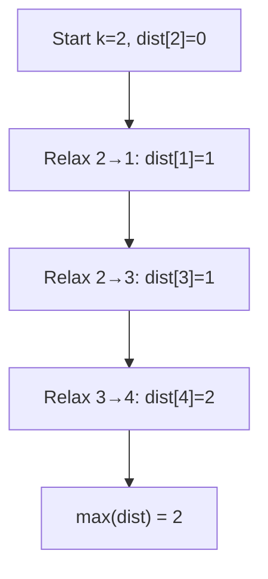
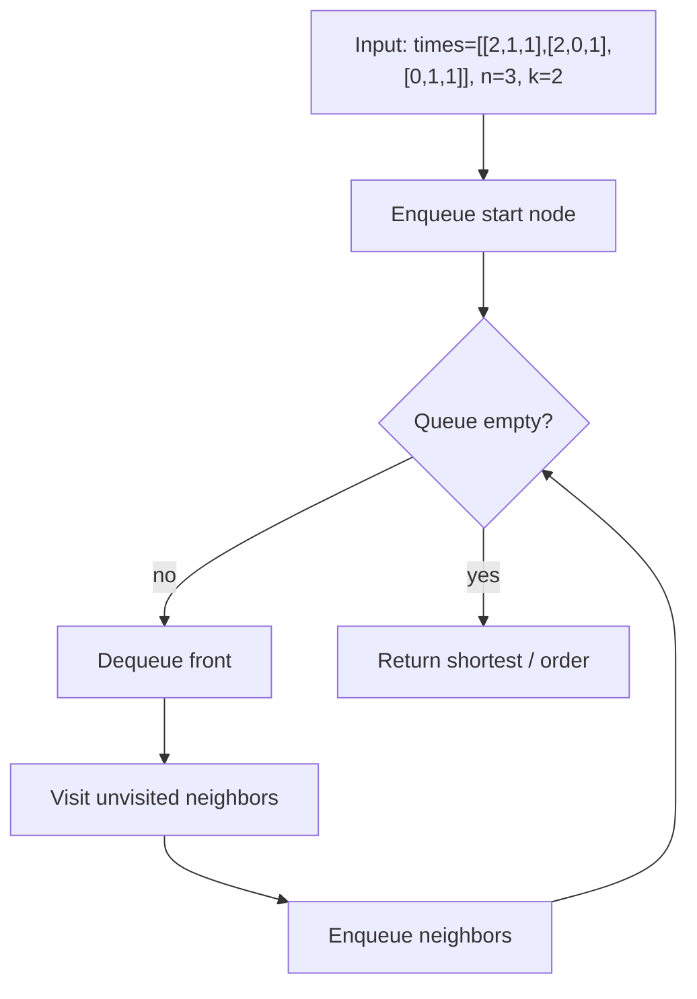

# Network Delay Time

> **You are here**: Senior SDE / Staff — DSA (weighted graph)
> **Roadmap**: [Developer Master Roadmap](../../../ROADMAP.md#staff-engineer) | **Prerequisites**: [Dijkstra's Algorithm](../DijkstraAlgorithm/DijkstraAlgorithm.md) | **Next**: [Min Cost to Connect Points](../MinCostToConnectPoints/MinCostToConnectPoints.md)
> **Pattern**: [Dijkstra / Weighted Graph](../../../03_CodingPatterns/02_AlgorithmicPatterns.md#pattern-8-dfs-depth-first-search) · [BFS](../../../03_CodingPatterns/02_AlgorithmicPatterns.md#pattern-7-bfs-breadth-first-search) | **Catalog**: [Algorithmic Patterns](../../../03_CodingPatterns/02_AlgorithmicPatterns.md)

## Problem Statement

You are given a network of `n` nodes, labeled from `1` to `n`. You are also given `times`, a list of travel times as directed edges `times[i] = [ui, vi, wi]`, where there is a directed edge from node `ui` to node `vi` that takes `wi` time to traverse.

You are starting at node `k`. Send a signal from `k` to all other nodes. How long will it take for all nodes to receive the signal? If it is impossible for all nodes to receive the signal, return `-1`.

**Examples:**
```
Input: times = [[2,1,1],[2,3,1],[3,4,1]], n = 4, k = 2
Output: 2
Explanation: Signal from node 2 reaches node 1 in 1 time unit, node 3 in 1, and node 4 in 2.
The last node to receive the signal is node 4 at time 2.

Input: times = [[1,2,1]], n = 2, k = 2
Output: -1
Explanation: Node 1 can never receive the signal because there is no path from node 2 to node 1.
```

## Problem Analysis

### Core Insight
This is a **single-source shortest path** problem on a **directed weighted graph**:
- **Nodes**: Network routers (1 to n)
- **Edges**: Directed links with non-negative travel times
- **Goal**: Find the shortest time from source `k` to every reachable node, then return the **maximum** of those times

### Why Maximum, Not Sum?
The signal propagates in parallel along all edges. The time for **all** nodes to receive the signal equals the time it takes for the **farthest** (slowest-reachable) node to be reached — i.e., `max(dist[v])` over all nodes `v`.

### Key Characteristics
- **Non-negative edge weights** → Dijkstra's algorithm is optimal
- **Directed graph** → edges are one-way; reachability matters
- **Disconnected nodes** → if any node has `dist = ∞`, return `-1`

## Approaches

### Approach 1: Dijkstra's Algorithm (Min-Heap) ⭐ (Interview Default)

#### Key Insight
Greedily expand the closest unvisited node. A min-heap always processes the node with the smallest tentative distance first, guaranteeing optimal shortest paths when all weights are non-negative.

#### Algorithm
1. Build an adjacency list: `graph[u] → [(v, w), ...]`
2. Initialize `dist[k] = 0`, all others to `∞`
3. Push `(k, 0)` onto a min-heap priority queue
4. While the heap is not empty:
   - Pop `(u, d)`; skip if `d > dist[u]` (stale entry)
   - For each neighbor `(v, w)`: if `dist[u] + w < dist[v]`, update `dist[v]` and push `(v, dist[v])`
5. Scan all nodes: if any `dist[i] == ∞` return `-1`; else return `max(dist[i])`


#### Example Flow

**Step flow (mermaid):**



**Walkthrough (same example):**

```
times=[[2,1,1],[2,3,1],[3,4,1]], n=4, k=2

Dijkstra from node 2:
  dist[2]=0
  edge 2→1: dist[1]=1
  edge 2→3: dist[3]=1
  edge 3→4: dist[4]=2

All nodes reachable → answer = max(1,1,2) = 2
```

#### Time Complexity
- **O(E log V)** where V = n nodes, E = number of edges in `times`
- Each edge relaxed at most once per final visit; heap operations are O(log V)

#### Space Complexity
- **O(V + E)** for adjacency list, distance array, and priority queue

```java
public int networkDelayTimeDijkstra(int[][] times, int n, int k) {
    // Build adjacency list (1-indexed nodes)
    List<int[]>[] graph = new List[n + 1];
    for (int i = 1; i <= n; i++) {
        graph[i] = new ArrayList<>();
    }
    for (int[] edge : times) {
        graph[edge[0]].add(new int[]{edge[1], edge[2]});
    }

    int[] dist = new int[n + 1];
    Arrays.fill(dist, Integer.MAX_VALUE);
    dist[k] = 0;

    // Min-heap ordered by distance
    PriorityQueue<int[]> pq = new PriorityQueue<>(Comparator.comparingInt(a -> a[1]));
    pq.offer(new int[]{k, 0});

    while (!pq.isEmpty()) {
        int[] current = pq.poll();
        int u = current[0], d = current[1];

        if (d > dist[u]) continue; // Stale entry — already found shorter path

        for (int[] edge : graph[u]) {
            int v = edge[0], w = edge[1];
            if (dist[u] + w < dist[v]) {
                dist[v] = dist[u] + w;
                pq.offer(new int[]{v, dist[v]});
            }
        }
    }

    int maxDist = 0;
    for (int i = 1; i <= n; i++) {
        if (dist[i] == Integer.MAX_VALUE) return -1;
        maxDist = Math.max(maxDist, dist[i]);
    }
    return maxDist;
}
```

### Approach 2: Bellman-Ford ⭐ (When Negative Weights Exist)

#### Key Insight
Relax all edges V-1 times. Detects negative cycles. Use when the problem allows negative edge weights (not needed for LeetCode 743, but good to mention in interviews).

#### Algorithm
1. Initialize `dist[k] = 0`, others to `∞`
2. Repeat V-1 times: for each edge `(u, v, w)`, if `dist[u] + w < dist[v]`, update `dist[v]`
3. Optional: one more pass to detect negative cycles
4. Return `max(dist)` or `-1` if any node unreachable


#### Example Flow

**Step flow (mermaid):**



**Walkthrough (same example):**

```
Example: times=[[2,1,1],[2,0,1],[0,1,1]], n=3, k=2 → 2
Approach: Bellman-Ford

Enqueue start node/level
Process neighbors level by level
First reach target = shortest path
```

#### Time Complexity
- **O(V × E)** — slower than Dijkstra but handles negative weights

#### Space Complexity
- **O(V)** for distance array

```java
public int networkDelayTimeBellmanFord(int[][] times, int n, int k) {
    int[] dist = new int[n + 1];
    Arrays.fill(dist, Integer.MAX_VALUE);
    dist[k] = 0;

    // Relax all edges V-1 times
    for (int i = 0; i < n - 1; i++) {
        for (int[] edge : times) {
            int u = edge[0], v = edge[1], w = edge[2];
            if (dist[u] != Integer.MAX_VALUE && dist[u] + w < dist[v]) {
                dist[v] = dist[u] + w;
            }
        }
    }

    int maxDist = 0;
    for (int i = 1; i <= n; i++) {
        if (dist[i] == Integer.MAX_VALUE) return -1;
        maxDist = Math.max(maxDist, dist[i]);
    }
    return maxDist;
}
```

## Comparison

| Approach | Time | Space | Pros | Cons |
|----------|------|-------|------|------|
| Dijkstra (heap) | O(E log V) | O(V + E) | Optimal for non-negative weights | Cannot handle negative edges |
| Bellman-Ford | O(V × E) | O(V) | Handles negative weights, detects cycles | Slower on sparse graphs |
| Floyd-Warshall | O(V³) | O(V²) | All-pairs shortest paths | Overkill for single-source |

## Example Traces

### Example 1: Star Topology
```
times = [[2,1,1],[2,3,1],[3,4,1]], n = 4, k = 2
Graph: 2 → 1 (1), 2 → 3 (1), 3 → 4 (1)
```

**Dijkstra Trace:**
1. PQ: [(2,0)] → pop (2,0), relax → dist[1]=1, dist[3]=1
2. PQ: [(1,1), (3,1)] → pop (1,1), no outgoing edges
3. PQ: [(3,1)] → pop (3,1), relax → dist[4]=2
4. PQ: [(4,2)] → pop (4,2), done
5. dist = [∞, 1, 0, 1, 2] → max = **2**

### Example 2: Unreachable Node
```
times = [[1,2,1]], n = 2, k = 2
Graph: 1 → 2 (only edge goes the wrong direction from k=2)
```

**Dijkstra Trace:**
1. PQ: [(2,0)] → pop (2,0), no outgoing edges
2. dist[1] = ∞ → return **-1**

### Example 3: Parallel Edges
```
times = [[1,2,5],[1,2,3]], n = 2, k = 1
Two edges from 1 to 2 with weights 5 and 3
```

**Dijkstra Trace:**
1. Relax edge (1→2, w=5): dist[2] = 5
2. Relax edge (1→2, w=3): dist[2] = 3 (improvement)
3. max(dist) = **3**

## Key Insights

### Why Dijkstra Works Here
- Non-negative weights guarantee that once a node is popped from the min-heap with distance `d`, no shorter path exists
- The "stale entry" check (`d > dist[u]`) handles duplicate heap entries efficiently

### The Max-Distance Twist
- Unlike typical SSSP problems that return distance to a single target, this problem asks: "when is **everyone** done?"
- Answer = bottleneck time = `max` over all shortest distances

### 1-Indexed Nodes
- LeetCode uses nodes labeled 1..n (not 0..n-1)
- Size arrays as `n + 1` and iterate from `1` to `n`

## Edge Cases

1. **Single node** (`n = 1`): No edges needed; answer is `0`
2. **Source unreachable to some node**: Return `-1`
3. **Self-loop** `(k, k, w)`: Harmless; dist[k] stays 0
4. **Parallel edges** between same pair: Relaxation keeps minimum weight
5. **Disconnected graph with multiple components**: Any unreachable node → `-1`
6. **Large weights**: Use `long` if weights can overflow `int` (not needed on LeetCode 743)

## Interview Tips

1. **Recognize the pattern**: "Shortest path from source to all nodes" → Dijkstra or BFS (if unweighted)
2. **Clarify the answer**: It's `max(dist)`, not the sum or the path to a specific node
3. **Explain stale PQ entries**: Shows you understand lazy deletion in heaps
4. **Mention Bellman-Ford**: Demonstrates breadth; note it's only needed for negative weights
5. **Discuss alternatives**: For unweighted graphs, BFS is O(V + E); for all-pairs, Floyd-Warshall
6. **Real-world analogy**: Network broadcast / routing convergence time

## Common Mistakes

1. **Returning sum of distances** instead of maximum
2. **0-indexed arrays** when nodes are 1-indexed
3. **Forgetting unreachable check**: Must return `-1` if any `dist[i] == ∞`
4. **Not skipping stale heap entries**: Leads to redundant work (still correct, but slower)
5. **Using BFS on weighted graph**: BFS only works for unweighted or uniform-weight edges

## Applications

- **Network routing**: OSPF link-state routing computes shortest paths, convergence time ≈ max distance
- **Distributed systems**: Propagation delay of a broadcast/gossip message
- **Logistics**: Time for supplies to reach all locations from a central depot
- **Social networks**: Time for information to spread through a weighted trust graph

## Floyd-Warshall Extension (All-Pairs)

If the interviewer asks for shortest paths between **all pairs** of nodes (not just from one source), Floyd-Warshall runs in O(V³):

```java
// After Floyd-Warshall, answer from k = max(dist[k][i]) for all i
for (int k = 1; k <= n; k++) {
    for (int i = 1; i <= n; i++) {
        for (int j = 1; j <= n; j++) {
            if (dist[i][k] != INF && dist[k][j] != INF) {
                dist[i][j] = Math.min(dist[i][j], dist[i][k] + dist[k][j]);
            }
        }
    }
}
```

For single-source problems like Network Delay Time, Dijkstra is strictly better.

## Related Problems

- [Dijkstra's Algorithm](../DijkstraAlgorithm/DijkstraAlgorithm.md) — foundational single-source shortest path
- [Min Cost to Connect Points](../MinCostToConnectPoints/MinCostToConnectPoints.md) — MST instead of shortest path
- [Dijkstra Algorithm](../DijkstraAlgorithm/DijkstraAlgorithm.md) — template + related weighted graph problems
- [Cheapest Flights Within K Stops (LeetCode 787)](https://leetcode.com/problems/cheapest-flights-within-k-stops/) — shortest path with hop limit
- [Path With Minimum Effort (LeetCode 1631)](https://leetcode.com/problems/path-with-minimum-effort/) — variant cost function
- [Tier3 Differentiators](../../Tier3_Differentiators.md)

**Code**: [NetworkDelayTime.java](NetworkDelayTime.java)
