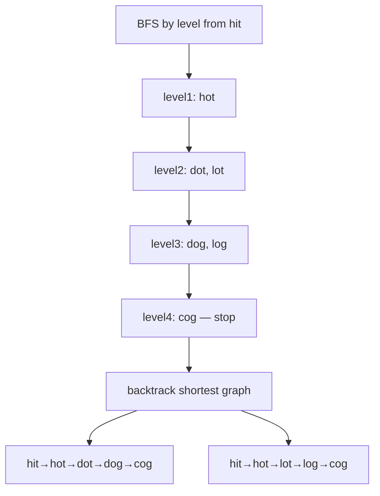
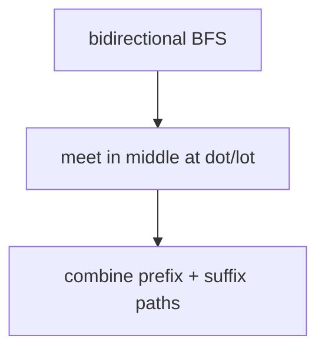

# Word Ladder II

> **You are here**: Staff Engineer — DSA (BFS + backtracking)
> **Roadmap**: [Developer Master Roadmap](../../../ROADMAP.md#staff-engineer) | **Prerequisites**: [Word Ladder](../WordLadder/WordLadder.md) | **Next**: [Network Delay Time](../NetworkDelayTime/NetworkDelayTime.md)
> **Pattern**: [BFS](../../../03_CodingPatterns/02_AlgorithmicPatterns.md#pattern-7-bfs-breadth-first-search) · [Subsets / Backtracking](../../../03_CodingPatterns/02_AlgorithmicPatterns.md#pattern-10-subsets-backtracking) | **Catalog**: [Algorithmic Patterns](../../../03_CodingPatterns/02_AlgorithmicPatterns.md)

## Problem Statement

A **transformation sequence** from word `beginWord` to word `endWord` using a dictionary `wordList` is a sequence of words `beginWord → s1 → s2 → ... → sk` such that:

- Every adjacent pair of words differs by exactly **one letter**
- Every `si` for `1 <= i <= k` is in `wordList` (note that `beginWord` does not need to be in `wordList`)
- `sk == endWord`

Given two words, `beginWord` and `endWord`, and a dictionary `wordList`, return **all the shortest transformation sequences** from `beginWord` to `endWord`, or an empty list if no such sequence exists. Each sequence should be represented as a list of the words `[beginWord, s1, s2, ..., sk]`.

**Examples:**
```
Input: beginWord = "hit", endWord = "cog", wordList = ["hot","dot","dog","lot","log","cog"]
Output: [["hit","hot","dot","dog","cog"],["hit","hot","lot","log","cog"]]
Explanation: There are 2 shortest paths, each with 5 words.

Input: beginWord = "hit", endWord = "cog", wordList = ["hot","dot","dog","lot","log"]
Output: []
Explanation: endWord "cog" is not in wordList, so no transformation is possible.
```

## Problem Analysis

### Core Insight
This is **Word Ladder I** (shortest path) extended to return **all shortest paths**:
- **Phase 1 — BFS by level**: Build a directed graph containing only edges on shortest paths
- **Phase 2 — Backtracking/DFS**: Enumerate all paths from `beginWord` to `endWord` through that graph

### Why Two Phases?
- A naive BFS that records all paths during search explodes in memory and time
- Level-by-level BFS first finds the shortest distance, then we only keep edges between consecutive levels
- Backtracking on this sparse graph efficiently enumerates all shortest paths

### Key Characteristics
- **Unweighted graph** → BFS finds shortest paths level by level
- **Multiple shortest paths** → need graph + backtracking, not just distance array
- **Stop BFS early** → once `endWord` is found at the current level, don't explore deeper

## Approaches

### Approach 1: BFS Layer Graph + Backtracking ⭐ (Standard Solution)

#### Key Insight
Process BFS level by level. Within each level, only add edges from current-level words to next-level words. Use a per-level visited set to avoid cross-level shortcuts that would create longer paths.

#### Algorithm — Phase 1 (BFS)
1. If `endWord` not in `wordList`, return empty
2. BFS from `beginWord`, processing one level at a time
3. For each word, try changing each character to `'a'..'z'`
4. If neighbor is in `wordList` and not yet visited this BFS: add edge `word → neighbor` to graph
5. Track per-level visited; after each level, merge into global visited
6. Stop BFS when `endWord` is found at the current level

#### Algorithm — Phase 2 (Backtracking)
1. DFS from `beginWord` following graph edges to `endWord`
2. At each step, add current word to path; on reaching `endWord`, save path copy
3. Backtrack by removing last word from path


#### Example Flow

**Step flow (mermaid):**



**Walkthrough (same example):**

```
BFS builds level graph only
Backtrack from cog:
  path1: hit,hot,dot,dog,cog
  path2: hit,hot,lot,log,cog
```

#### Time Complexity
- **O(N × L² × 26)** for BFS where N = wordList size, L = word length
- **O(P × L)** for backtracking where P = number of shortest paths
- Overall dominated by BFS neighbor generation

#### Space Complexity
- **O(N × L)** for graph, visited sets, and queue

```java
public List<List<String>> findLadders(String beginWord, String endWord, List<String> wordList) {
    Set<String> dict = new HashSet<>(wordList);
    List<List<String>> result = new ArrayList<>();
    if (!dict.contains(endWord)) return result;

    Map<String, List<String>> graph = new HashMap<>();
    Set<String> visited = new HashSet<>();
    Queue<String> queue = new LinkedList<>();
    queue.offer(beginWord);
    visited.add(beginWord);
    boolean found = false;

    while (!queue.isEmpty() && !found) {
        int size = queue.size();
        Set<String> levelVisited = new HashSet<>(); // Per-level visited

        for (int i = 0; i < size; i++) {
            String word = queue.poll();
            char[] chars = word.toCharArray();

            for (int j = 0; j < chars.length; j++) {
                char original = chars[j];
                for (char c = 'a'; c <= 'z'; c++) {
                    if (c == original) continue;
                    chars[j] = c;
                    String next = new String(chars);

                    if (!dict.contains(next)) continue;

                    // Only add edges to unvisited nodes (next BFS level)
                    if (!visited.contains(next)) {
                        graph.computeIfAbsent(word, k -> new ArrayList<>()).add(next);
                        levelVisited.add(next);
                        if (next.equals(endWord)) found = true;
                    }
                }
                chars[j] = original;
            }
        }
        visited.addAll(levelVisited);
        queue.addAll(levelVisited);
    }

    if (!graph.containsKey(beginWord)) return result;

    List<String> path = new ArrayList<>();
    path.add(beginWord);
    backtrack(graph, beginWord, endWord, path, result);
    return result;
}

private void backtrack(Map<String, List<String>> graph, String current,
                       String endWord, List<String> path, List<List<String>> result) {
    if (current.equals(endWord)) {
        result.add(new ArrayList<>(path));
        return;
    }
    if (!graph.containsKey(current)) return;
    for (String next : graph.get(current)) {
        path.add(next);
        backtrack(graph, next, endWord, path, result);
        path.remove(path.size() - 1);
    }
}
```

### Approach 2: Bidirectional BFS + Backtracking ⭐⭐ (Optimized)

#### Key Insight
Search simultaneously from `beginWord` (forward) and `endWord` (backward). When the two frontiers meet, combine paths. Typically reduces explored nodes from O(N) to O(√N) in practice.

#### Algorithm
1. Build forward graph from `beginWord` and backward graph from `endWord` level by level
2. Always expand the smaller frontier first
3. When a word appears in both frontiers, a shortest path layer is found — stop BFS
4. Combine forward and backward paths via meeting points
5. Backtrack on the combined graph


#### Example Flow

**Step flow (mermaid):**



**Walkthrough (same example):**

```
Forward: hit→hot→{dot,lot}
Backward: cog→log/lot→hot
Join at hot; enumerate 2 full paths
```

#### Time Complexity
- **O(N × L² × 26)** worst case, but much faster in practice
- Significantly fewer nodes explored when word graph is large

#### Space Complexity
- **O(N × L)** for two graphs and visited sets

```java
public List<List<String>> findLaddersBidirectional(String beginWord, String endWord,
                                                    List<String> wordList) {
    Set<String> dict = new HashSet<>(wordList);
    List<List<String>> result = new ArrayList<>();
    if (!dict.contains(endWord) || beginWord.equals(endWord)) return result;

    Map<String, List<String>> forward = new HashMap<>();
    Map<String, List<String>> backward = new HashMap<>();
    Set<String> visitedForward = new HashSet<>();
    Set<String> visitedBackward = new HashSet<>();
    visitedForward.add(beginWord);
    visitedBackward.add(endWord);

    Queue<String> qForward = new LinkedList<>();
    Queue<String> qBackward = new LinkedList<>();
    qForward.offer(beginWord);
    qBackward.offer(endWord);
    boolean found = false;

    while (!qForward.isEmpty() && !qBackward.isEmpty() && !found) {
        // Always expand the smaller frontier
        if (qForward.size() > qBackward.size()) {
            found = expandLevel(qBackward, backward, visitedBackward, visitedForward, dict, true);
            if (!found) found = expandLevel(qForward, forward, visitedForward, visitedBackward, dict, false);
        } else {
            found = expandLevel(qForward, forward, visitedForward, visitedBackward, dict, false);
            if (!found) found = expandLevel(qBackward, backward, visitedBackward, visitedForward, dict, true);
        }
    }

    if (!found) return result;
    // Merge graphs and backtrack (implementation detail varies)
    // ... backtrack from beginWord to endWord using merged graph
    return result;
}
```

## Comparison

| Approach | Time | Space | Pros | Cons |
|----------|------|-------|------|------|
| BFS + Backtrack | O(N·L²·26) | O(N·L) | Clear two-phase logic, easy to implement | Explores all nodes at shortest depth |
| Bidirectional BFS | O(N·L²·26)* | O(N·L) | Fewer nodes explored in practice | More complex to implement and merge |
| BFS record all paths | O(P·N·L) | O(P·N·L) | No separate backtrack phase | Memory explosion with many paths |

*Bidirectional is faster in practice but same worst-case complexity.

## Example Traces

### Example 1: Two Shortest Paths
```
beginWord = "hit", endWord = "cog"
wordList = ["hot","dot","dog","lot","log","cog"]
```

**BFS Level Trace:**
```
Level 0: {hit}
Level 1: {hot}           edges: hit→hot
Level 2: {dot, lot}      edges: hot→dot, hot→lot
Level 3: {dog, log}      edges: dot→dog, lot→log
Level 4: {cog}           edges: dog→cog, log→cog  ← found! stop BFS
```

**Backtrack Trace:**
```
hit → hot → dot → dog → cog  ✓
hit → hot → lot → log → cog  ✓
Result: 2 paths
```

### Example 2: No Path
```
beginWord = "hit", endWord = "cog"
wordList = ["hot","dot","dog","lot","log"]  (no "cog")
```
Return `[]` immediately — `endWord` not in dictionary.

### Example 3: beginWord Adjacent to endWord
```
beginWord = "a", endWord = "c", wordList = ["b","c"]
```
Level 1: {b, c} — edges a→b, a→c. Path: [a, c].

## Key Insights

### Per-Level Visited Set
- **Critical detail**: Use `levelVisited` separate from global `visited`
- Within a level, multiple parents can point to the same child (e.g., `dot` and `lot` both lead to paths)
- But don't revisit words from previous levels — that would create longer paths

### When to Stop BFS
- Stop as soon as `endWord` appears in the **current level**
- Do NOT process the next level — those would be longer paths
- Still finish processing the current level (other words at same level may be needed for alternate paths)

### Graph Direction
- BFS builds directed edges `parent → child` (forward in the transformation)
- Backtracking follows these edges from `beginWord` to `endWord`

### Word Ladder I vs II

| | Ladder I | Ladder II |
|---|----------|-----------|
| Output | Shortest path length | All shortest paths |
| Technique | BFS until end found | BFS layer graph + backtrack |
| Early exit | Return level count | Stop BFS, then enumerate |
| Complexity | O(N·L²) | O(N·L² + P·L) |

## Edge Cases

1. **endWord not in wordList**: Return `[]` immediately
2. **beginWord equals endWord**: Return `[[beginWord]]` (check problem constraints)
3. **No path exists**: BFS completes without finding endWord → return `[]`
4. **Single-step path**: beginWord differs by one letter from endWord
5. **Many shortest paths**: Backtracking handles all; watch for TLE on large path counts
6. **beginWord in wordList**: Allowed but BFS starts from beginWord regardless

## Interview Tips

1. **Start with Word Ladder I**: Show you understand BFS shortest path first
2. **Explain the two-phase approach**: BFS for structure, backtrack for enumeration
3. **Emphasize per-level visited**: This is the trickiest part — interviewers probe here
4. **Discuss bidirectional BFS**: Shows optimization awareness for large inputs
5. **Clarify output format**: List of lists, each path includes beginWord
6. **Mention alternative**: Build graph with all valid edges first, then BFS for distances + backtrack only on shortest edges

## Common Mistakes

1. **Global visited too early**: Marking a word visited when first discovered prevents finding all parents at the same level
2. **Not stopping BFS at the right level**: Processing level N+1 creates non-shortest paths in the graph
3. **Missing beginWord in path**: Output must start with `beginWord`
4. **Storing all paths during BFS**: Memory explosion; use graph + backtrack instead
5. **Forgetting to restore path in backtracking**: Leads to corrupted paths
6. **Not checking endWord in wordList**: Wastes time on impossible cases

## Applications

- **Gene sequencing**: Find all shortest mutation pathways between DNA sequences
- **Word games**: Boggle, Word Chain puzzles with multiple solutions
- **Network routing**: Enumerate all equal-cost routes
- **Spell checkers**: Find all single-edit corrections
- **Social networks**: All shortest connection chains between people

## Related Problems

- [Word Ladder](../WordLadder/WordLadder.md) — shortest path length only (Ladder I)
- [Course Schedule](../CourseSchedule/CourseSchedule.md) — layered graph traversal
- [Open the Lock (LeetCode 752)](https://leetcode.com/problems/open-the-lock/) — BFS state transformation
- [Minimum Genetic Mutation (LeetCode 433)](https://leetcode.com/problems/minimum-genetic-mutation/) — variant with gene bank
- [Tier3 Differentiators](../../Tier3_Differentiators.md)

**Code**: [WordLadderII.java](WordLadderII.java)
