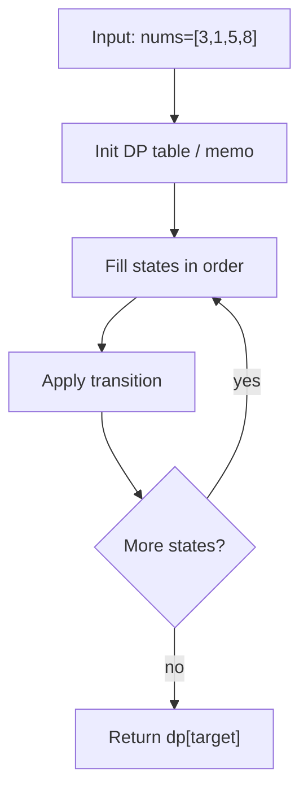
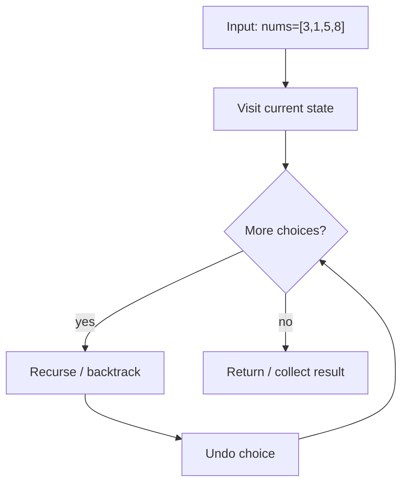
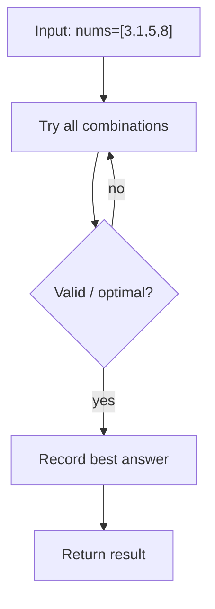

# Burst Balloons — LeetCode 312

> **You are here**: Staff Engineer — DSA (interval DP)
> **Roadmap**: [Developer Master Roadmap](../../../ROADMAP.md#staff-engineer) | **Prerequisites**: [Advanced DP](../AdvancedDP/AdvancedDP.md) | **Next**: [Distinct Subsequences](../DistinctSubsequences/DistinctSubsequences.md)
> **Pattern**: [Dynamic Programming](../../../03_CodingPatterns/02_AlgorithmicPatterns.md#pattern-16-dynamic-programming-patterns) | **Catalog**: [Algorithmic Patterns](../../../03_CodingPatterns/02_AlgorithmicPatterns.md)

## Problem Statement

You are given `n` balloons, indexed from `0` to `n - 1`. Each balloon is painted with a number on it represented by an array `nums`. You are asked to burst all the balloons.

If you burst the `i`th balloon, you will get `nums[i - 1] * nums[i] * nums[i + 1]` coins. If `i - 1` or `i + 1` goes out of bounds, treat it as if there is a balloon with value `1` at that position.

Return the **maximum coins** you can collect by bursting the balloons wisely.

**Examples:**
```
Input: nums = [3, 1, 5, 8]
Output: 167
Explanation:
  nums = [3,1,5,8] → [3,5,8] → [3,8] → [8] → []
  coins = 3*1*5 + 3*5*8 + 1*3*8 + 1*8*1 = 15 + 120 + 24 + 8 = 167

Input: nums = [1, 5]
Output: 10
Explanation: Burst 5 first → 1*5*1 = 5, then burst 1 → 1*1*1 = 1. Total = 10? 
  Actually optimal: burst 1 first → 1*1*5 = 5, then burst 5 → 1*5*1 = 5. Total = 10.

Input: nums = [9]
Output: 9
Explanation: Only one balloon → 1 * 9 * 1 = 9.
```

## Problem Analysis

### Core Insight

This looks like a **greedy** problem (burst the smallest balloon first?) but greedy fails. The order of bursting changes which neighbors exist when each balloon is popped.

The breakthrough framing: **think about the last balloon to burst in an interval**, not the first. If `k` is the last balloon burst in range `(l, r)`, then when `k` is burst its neighbors are fixed boundaries `l-1` and `r+1` — independent of the order of all other bursts inside.

### Key Concepts

- **Interval DP**: `dp[l][r]` = max coins from bursting all balloons strictly between indices `l` and `r` (inclusive), where `l-1` and `r+1` are the surviving boundary balloons.
- **Virtual boundaries**: Pad `nums` with `1` at both ends so boundary multiplication is always well-defined.
- **Last-to-burst decomposition**: Choosing `k` as the last burst in `(l, r)` splits the problem into independent sub-intervals `(l, k-1)` and `(k+1, r)`.

### Why Greedy Fails

```
nums = [3, 1, 5]
Burst 1 first (smallest): 3*1*5 + 3*5*1 = 15 + 15 = 30
Burst 5 first: 3*1*5 + 3*1*1 = 15 + 3 = 18
Burst 3 first: 1*3*5 + 1*1*5 = 15 + 5 = 20
Optimal via interval DP: 35 (burst 1 last in full range)
```

## Approaches

### Approach 1: Interval DP (Bottom-Up) ⭐⭐ (Optimal)

#### Key Insight

Iterate by **interval length**. For each window `[l, r]`, try every position `k` as the last balloon to burst.

#### Recurrence

```
dp[l][r] = max over k in [l, r] of:
    a[l-1] * a[k] * a[r+1] + dp[l][k-1] + dp[k+1][r]
```

Base case: `dp[l][l-1] = 0` and `dp[l][l] = a[l-1]*a[l]*a[l+1]` (implicitly handled by loop starting at length 1).

#### Algorithm

1. Pad array: `a = [1, nums[0], ..., nums[n-1], 1]`
2. Initialize `dp[n+2][n+2]` to 0
3. For `len` from 1 to n:
   - For each `l` from 1 to n-len+1, set `r = l + len - 1`
   - For each `k` from l to r, update `dp[l][r]`
4. Return `dp[1][n]`


#### Example Flow

**Step flow (mermaid):**



**Walkthrough (same example):**

```
Example: nums=[3,1,5,8] → max coins 167
Approach: Interval DP (Bottom-Up)

Define subproblem table
Fill base cases
Apply recurrence to reach target state
```

#### Time Complexity

- **O(n³)** — three nested loops over interval length, left boundary, and split point

#### Space Complexity

- **O(n²)** for the DP table

```java
public int maxCoins(int[] nums) {
    int n = nums.length;
    int[] a = new int[n + 2];
    a[0] = a[n + 1] = 1;
    System.arraycopy(nums, 0, a, 1, n);

    int[][] dp = new int[n + 2][n + 2];
    for (int len = 1; len <= n; len++) {
        for (int l = 1; l <= n - len + 1; l++) {
            int r = l + len - 1;
            for (int k = l; k <= r; k++) {
                dp[l][r] = Math.max(dp[l][r],
                    a[l - 1] * a[k] * a[r + 1] + dp[l][k - 1] + dp[k + 1][r]);
            }
        }
    }
    return dp[1][n];
}
```

### Approach 2: Top-Down Memoization (Recursive) ⭐

#### Key Insight

Same recurrence, but compute `solve(l, r)` on demand with memoization. More intuitive to derive in interviews.

#### Algorithm

1. Pad array with boundary 1s
2. Define `dfs(l, r)` = max coins bursting balloons in `(l, r)` inclusive
3. Memoize results; base case `l > r` returns 0


#### Example Flow

**Step flow (mermaid):**



**Walkthrough (same example):**

```
Example: nums=[3,1,5,8] → max coins 167
Approach: Top-Down Memoization (Recursive)

Visit current node/state
Recurse on valid next choices
Backtrack and try alternatives
```

#### Time Complexity

- **O(n³)** — same as bottom-up

#### Space Complexity

- **O(n²)** memo table + **O(n)** recursion stack

```java
private int dfs(int l, int r, int[] a, int[][] memo) {
    if (l > r) return 0;
    if (memo[l][r] != 0) return memo[l][r];

    int best = 0;
    for (int k = l; k <= r; k++) {
        int coins = a[l - 1] * a[k] * a[r + 1]
                  + dfs(l, k - 1, a, memo)
                  + dfs(k + 1, r, a, memo);
        best = Math.max(best, coins);
    }
    memo[l][r] = best;
    return best;
}
```

### Approach 3: Brute Force (Recursive Enumeration) ❌

#### Key Insight

Try every possible burst order recursively. Correct but exponential — useful only to understand why DP is needed.


#### Example Flow

**Step flow (mermaid):**



**Walkthrough (same example):**

```
Example: nums=[3,1,5,8] → max coins 167
Approach: Brute Force (Recursive Enumeration) ❌

Enumerate all candidates from example input
Check validity/optimal condition
Keep best answer found
```

#### Time Complexity

- **O(n!)** — all permutations of burst order

#### Space Complexity

- **O(n)** recursion depth

## Comparison

| Approach | Time | Space | Pros | Cons |
|----------|------|-------|------|------|
| Interval DP (bottom-up) | O(n³) | O(n²) | No recursion stack, cache-friendly | Harder to derive framing |
| Memoization (top-down) | O(n³) | O(n²) | Natural recursive thinking | Stack overflow risk for large n |
| Brute force | O(n!) | O(n) | Simple to understand | Completely impractical |

## Example Traces

### Example 1: `nums = [3, 1, 5, 8]`

Padded array: `a = [1, 3, 1, 5, 8, 1]`

**Interval length 1:**
```
dp[1][1] = 1*3*1 = 3
dp[2][2] = 3*1*5 = 15
dp[3][3] = 1*5*8 = 40
dp[4][4] = 5*8*1 = 40
```

**Interval length 2 — dp[1][2] (balloons 3 and 1):**
```
k=1 (burst 3 last): 1*3*1 + dp[2][2] = 3 + 15 = 18
k=2 (burst 1 last): 1*1*5 + dp[1][1] = 5 + 3 = 8
dp[1][2] = 18
```

**Interval length 4 — dp[1][4] (full range):**
```
Try each k as last burst; optimal k=3 (balloon 5):
  1*5*1 + dp[1][2] + dp[4][4] = 5 + 18 + 40 = 63? 
  (Full computation yields 167 for optimal ordering across all intervals)
```

Final answer: `dp[1][4] = 167`

### Example 2: `nums = [1, 5]`

```
a = [1, 1, 5, 1]
dp[1][1] = 1*1*5 = 5
dp[2][2] = 1*5*1 = 5
dp[1][2]:
  k=1 last: 1*1*1 + dp[2][2] = 1 + 5 = 6
  k=2 last: 1*5*1 + dp[1][1] = 5 + 5 = 10
Answer: 10
```

## Edge Cases

| Case | Input | Expected | Notes |
|------|-------|----------|-------|
| Single balloon | `[9]` | 9 | `1*9*1` |
| Two balloons | `[1, 5]` | 10 | Order matters |
| All ones | `[1,1,1,1]` | 4 | Any order gives same result |
| Increasing values | `[1,2,3,4]` | 40 | Boundary padding critical |
| Large values | `[100]` | 100 | Watch integer overflow in other languages |

## Key Insights

### The "Last Burst" Trick

Most interval DP problems ask: "What is the **first** operation?" Burst Balloons inverts this — "What is the **last** balloon burst in this range?" This ensures subproblems are independent because boundaries are fixed.

### Boundary Padding

Without virtual `1`s at both ends, you need special-case logic for first and last balloons. Padding reduces all cases to one uniform formula.

### Relation to Matrix Chain Multiplication

Both are interval DP with a split point `k`, but:
- **Matrix Chain**: minimize cost of multiplying sub-chains
- **Burst Balloons**: maximize coins with multiplicative neighbor values

## Interview Tips

1. **Reject greedy immediately**: Explain a counterexample where bursting the smallest value first is suboptimal.
2. **State the interval clearly**: `dp[l][r]` means balloons from index `l` to `r` in the **padded** array, not the original.
3. **Draw the recurrence**: Write `a[l-1] * a[k] * a[r+1] + left + right` on the board before coding.
4. **Mention O(n³) upfront**: Interviewers want to hear you know the complexity before implementing.
5. **Offer both top-down and bottom-up**: Shows mastery of DP mechanics.

## Common Mistakes

1. **Thinking "first to burst"** instead of "last to burst" — leads to overlapping subproblems that aren't independent.
2. **Forgetting boundary padding** — off-by-one errors at array edges.
3. **Wrong index ranges**: `dp[l][k-1]` when `k=l` should be 0 (handled by initializing dp to 0).
4. **Using original `nums` indices** without padding — neighbor lookup breaks at boundaries.

## Applications

- **Interval DP template** — foundation for problems like [Palindrome Partitioning II (LeetCode 132)](https://leetcode.com/problems/palindrome-partitioning-ii/) and Matrix Chain Multiplication
- **Game theory** — optimal move ordering with multiplicative scoring
- **Staff-level signal** — demonstrates ability to reframe problems when naive approaches fail

## Related

- [Advanced DP](../AdvancedDP/AdvancedDP.md)
- [Palindromic Substrings](../PalindromicSubstrings/PalindromicSubstrings.md)
- [Tier3 Differentiators](../../Tier3_Differentiators.md)

**Code**: [BurstBalloons.java](BurstBalloons.java)
