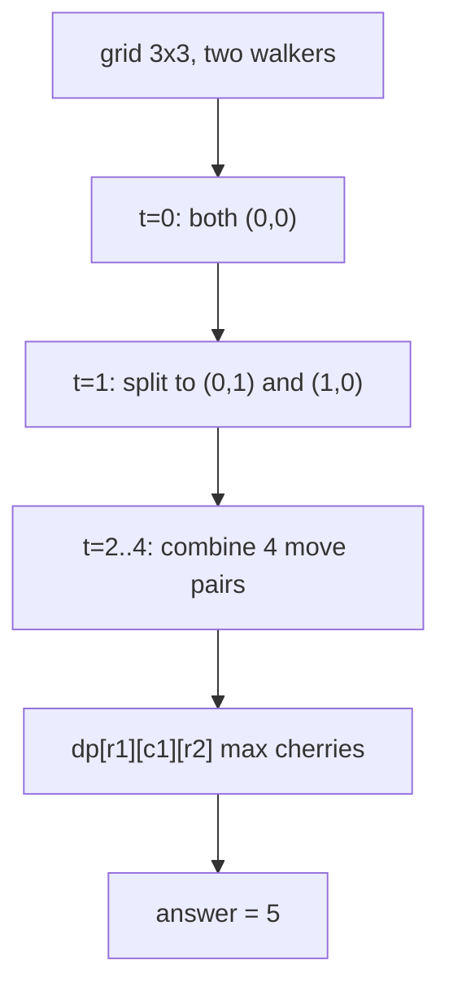
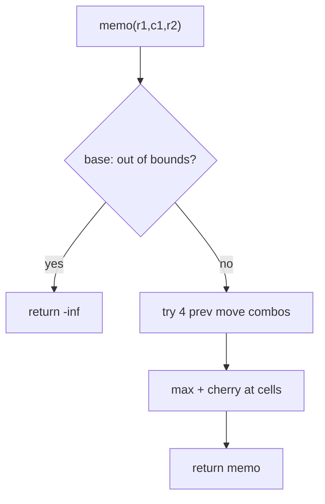
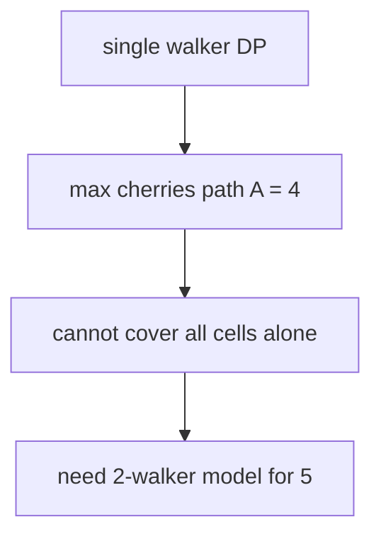

# Cherry Pickup — LeetCode 741

> **You are here**: Staff Engineer — DSA (multi-agent DP)
> **Roadmap**: [Developer Master Roadmap](../../../ROADMAP.md#staff-engineer) | **Prerequisites**: [Unique Paths](../UniquePaths/UniquePaths.md) | **Next**: [Constrained Subsequence Sum](../ConstrainedSubsequenceSum/ConstrainedSubsequenceSum.md)
> **Pattern**: [Dynamic Programming](../../../03_CodingPatterns/02_AlgorithmicPatterns.md#pattern-16-dynamic-programming-patterns) | **Catalog**: [Algorithmic Patterns](../../../03_CodingPatterns/02_AlgorithmicPatterns.md)

## Problem Statement

You are given an `n x n` `grid` representing a field of cherries. Each cell is one of three integers:

- `0` — no cherry
- `1` — cherry present
- `-1` — obstacle (impassable)

You start at position `(0, 0)` and must reach `(n-1, n-1)` by moving only **right** or **down**. When you pass through a cell with a cherry, you pick it up and the cherry disappears.

Return the **maximum number of cherries** you can collect by following the rules starting from `(0, 0)` and reaching `(n-1, n-1)`. If there is no path, return `0`.

**Follow-up (this problem's twist):** Two walkers traverse simultaneously from `(0,0)` to `(n-1,n-1)`. Each cell's cherry can be collected at most once (unless both walkers arrive at the same cell on the same step — then it's collected once).

**Examples:**
```
Input: grid = [[0,1,-1],[1,0,-1],[1,1,1]]
Output: 5
Explanation: One walker alone can collect at most 4 cherries. The trick is to send
  two walkers at once so they cover different cherries on the same number of steps:
  Walker A: (0,0)→(0,1)→(1,1)→(2,1)→(2,2) → cherries at (0,1), (2,1), (2,2) = 3
  Walker B: (0,0)→(1,0)→(2,0)→(2,1)→(2,2) → cherries at (1,0), (2,0), (2,2) = 3
  Cell (2,2) is counted once; total = 5.

Input: grid = [[1,1,-1],[1,-1,1],[-1,1,1]]
Output: 0
Explanation: No valid path to bottom-right.

Input: grid = [[1,1],[1,1]]
Output: 4
Explanation: Two walkers can each collect 2, visiting all 4 cherries.
```

## Problem Analysis

### Core Insight

The original "single walker" problem is standard grid DP (`O(n²)`). The **two-walker** variant is the Staff-level twist: track both positions simultaneously in one DP state.

Since both walkers take the same number of steps (`r1 + c1 = r2 + c2 = t`), we can eliminate one coordinate: `c2 = t - r2 = (r1 + c1) - r2`.

### Key Concepts

- **Multi-agent DP**: State tracks positions of multiple agents; transitions combine all valid move pairs.
- **Dimension reduction**: 4D state `(r1, c1, r2, c2)` → 3D `(r1, c1, r2)` because `c2` is determined.
- **Cherry deduplication**: If both walkers land on the same cell, count that cherry only once.
- **Obstacle handling**: Skip states where either cell is `-1`.

### State Definition

```
dp[r1][c1][r2] = max cherries collected when walker 1 is at (r1, c1)
                 and walker 2 is at (r2, c2) where c2 = r1 + c1 - r2
```

## Approaches

### Approach 1: 3D Bottom-Up DP ⭐⭐ (Optimal)

#### Key Insight

Iterate all reachable `(r1, c1, r2)` triples. For each state, try all 4 combinations of previous moves (each walker came from up or left).


#### Example Flow

**Step flow (mermaid):**



**Walkthrough (same example):**

```
grid=[[0,1,-1],[1,0,-1],[1,1,1]]
Walker1: (0,0)→(0,1)→(1,1)→(2,1)→(2,2) = 3
Walker2: (0,0)→(1,0)→(2,0)→(2,1)→(2,2) = 3
Shared (2,2) once → total 5
```

#### Transitions

From previous step, each walker moved right or down (4 combinations):
```
(r1-1, c1, r2-1)  — both came from above
(r1-1, c1, r2, c2-1) — walker1 up, walker2 left
(r1, c1-1, r2-1)  — walker1 left, walker2 up
(r1, c1-1, r2, c2-1) — both came from left
```

#### Cherry Count

```java
int cherries = grid[r1][c1];
if (r1 != r2 || c1 != c2) cherries += grid[r2][c2];
```

#### Time Complexity

- **O(n³)** — three nested loops over grid dimensions

#### Space Complexity

- **O(n³)** for the DP table

```java
public int cherryPickup(int[][] grid) {
    int n = grid.length;
    int[][][] dp = new int[n][n][n];
    // initialize to MIN_VALUE, dp[0][0][0] = grid[0][0]
    for (int r1 = 0; r1 < n; r1++) {
        for (int c1 = 0; c1 < n; c1++) {
            if (grid[r1][c1] == -1) continue;
            for (int r2 = 0; r2 < n; r2++) {
                int c2 = r1 + c1 - r2;
                if (c2 < 0 || c2 >= n || grid[r2][c2] == -1) continue;
                // try 4 predecessors, update dp[r1][c1][r2]
            }
        }
    }
    return Math.max(0, dp[n-1][n-1][n-1]);
}
```

### Approach 2: Top-Down Memoization ⭐

#### Key Insight

Recursive DFS with state `(r1, c1, r2, c2)`. More intuitive to explain in interviews.

#### Algorithm

1. Base case: if out of bounds or obstacle → return `-∞`
2. Compute cherries at current positions (deduplicate if same cell)
3. Return cherries + max of 4 recursive calls for previous positions


#### Example Flow

**Step flow (mermaid):**



**Walkthrough (same example):**

```
Top-down: dfs(0,0,0) explores both walkers
Memo avoids recomputing (1,0,0) etc.
Best path yields 5 cherries
```

#### Time Complexity

- **O(n³)** — same as bottom-up

#### Space Complexity

- **O(n³)** memo + **O(n)** recursion stack

```java
private int dfs(int r1, int c1, int r2, int c2, int[][] grid, int[][][][] memo) {
    int n = grid.length;
    int c2 = r1 + c1 - r2; // derived, or pass explicitly
    if (r1 >= n || c1 >= n || r2 >= n || c2 >= n) return Integer.MIN_VALUE;
    if (grid[r1][c1] == -1 || grid[r2][c2] == -1) return Integer.MIN_VALUE;
    if (memo[r1][c1][r2][c2] != Integer.MIN_VALUE) return memo[r1][c1][r2][c2];
    // ... recurse on 4 predecessors
}
```

### Approach 3: Single Walker DP (Baseline) ⭐

#### Key Insight

Without the two-walker twist, this reduces to standard unique-paths-with-weights DP.

#### Recurrence

```
dp[r][c] = grid[r][c] + max(dp[r-1][c], dp[r][c-1])
```


#### Example Flow

**Step flow (mermaid):**



**Walkthrough (same example):**

```
Single walker max = 4 cherries
Two walkers required to reach 5
Shows why multi-agent DP is needed
```

#### Time Complexity

- **O(n²)** time and space

This is the prerequisite problem — Cherry Pickup extends it to multi-agent coordination.

## Comparison

| Approach | Time | Space | Pros | Cons |
|----------|------|-------|------|------|
| 3D Bottom-Up DP | O(n³) | O(n³) | Efficient, no stack overflow | Hard to visualize state |
| Memoization DFS | O(n³) | O(n³) | Natural recursive explanation | 4D memo if not reduced |
| Single Walker | O(n²) | O(n²) | Simple baseline | Doesn't solve two-walker variant |

## Example Traces

### Example 1: `grid = [[1,1],[1,1]]`

```
n = 2, all cells have 1 cherry.

Step 0: dp[0][0][0] = 1 (both at origin, count once)

Step 1: 
  Walker1 at (0,1), Walker2 at (1,0): c2 = 0+1-1 = 0
  cherries = 1 + 1 = 2

Step 2:
  Both at (1,1): dp[1][1][1] 
  cherries = 1 (same cell, count once)
  predecessors from (0,1)+(1,0), (0,1)+(1,1), (1,0)+(1,1), (1,1)+(1,0)
  Best total: 4
```

### Example 2: Obstacle blocks path

```
grid = [[1, -1],
        [1,  1]]

Single walker: must go (0,0)→(1,0)→(1,1) = 3 cherries
With obstacle at (0,1), path still exists.

grid = [[1, 1],
        [-1, 1]]

No path: answer = 0
```

## Edge Cases

| Case | Scenario | Expected | Notes |
|------|----------|----------|-------|
| 1x1 grid | `[[1]]` | 1 | Both walkers start and end at same cell |
| All obstacles | `[[-1]]` | 0 | No valid path |
| No cherries | `[[0,0],[0,0]]` | 0 | Path exists but nothing to collect |
| Start is obstacle | `[[-1,1],[1,1]]` | 0 | Can't even begin |
| Large cherries | values up to 100 | — | Use int (sum ≤ 2*100*n²) |

## Key Insights

### Why Two Walkers?

The single-walker version is too easy (`O(n²)`). The two-walker variant forces you to think about **coordinated path optimization** — a common Staff interview pattern (also seen in "Cherry Pickup II" with k walkers).

### Dimension Reduction Trick

`r1 + c1 = r2 + c2` always holds because both walkers take the same number of steps. This reduces 4D → 3D, saving space and iteration time.

### Cherry Deduplication

Only add `grid[r2][c2]` separately when `(r1,c1) ≠ (r2,c2)`. When they meet, the cherry is counted once in `grid[r1][c1]`.

### Relation to LCS on Grid

Two paths from top-left to bottom-right maximizing collected values is analogous to finding two optimal paths — similar spirit to [Longest Common Subsequence](../LongestCommonSubsequence/LongestCommonSubsequence.md) but on a grid.

## Interview Tips

1. **Start with single walker**: Show you can solve the simpler version first, then extend.
2. **Explain state compression**: Derive `c2 = r1 + c1 - r2` on the board — interviewers love this.
3. **Handle obstacles early**: Return `-∞` or skip for any `-1` cell.
4. **Clarify the two-walker model**: Both start at `(0,0)`, both must reach `(n-1,n-1)`, same number of steps.
5. **Mention Cherry Pickup II**: Generalization to k walkers using k-tuples of positions.

## Common Mistakes

1. **Double-counting cherries** when walkers share a cell.
2. **Forgetting obstacle check** for the second walker's derived position `(r2, c2)`.
3. **Invalid c2**: Not checking `c2 < 0 || c2 >= n` after computing from `r1 + c1 - r2`.
4. **Initializing DP to 0** instead of `Integer.MIN_VALUE` — causes incorrect max from unreachable states.
5. **Solving single-walker version** when the problem asks for two walkers.

## Applications

- **Robot coordination** — multiple agents collecting resources on a grid
- **Traffic flow** — optimizing two routes to cover maximum area
- **Multi-agent pathfinding** — foundation for k-walker generalizations

**Code**: [CherryPickup.java](CherryPickup.java)
