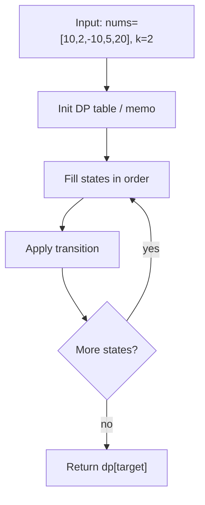
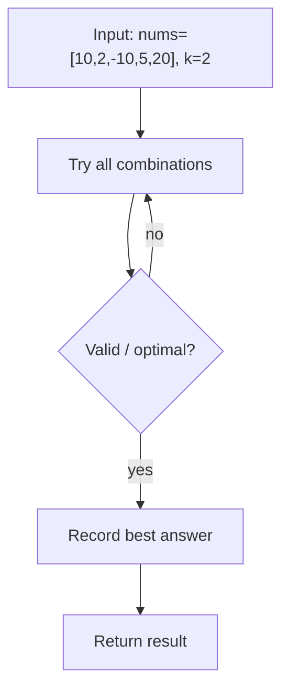
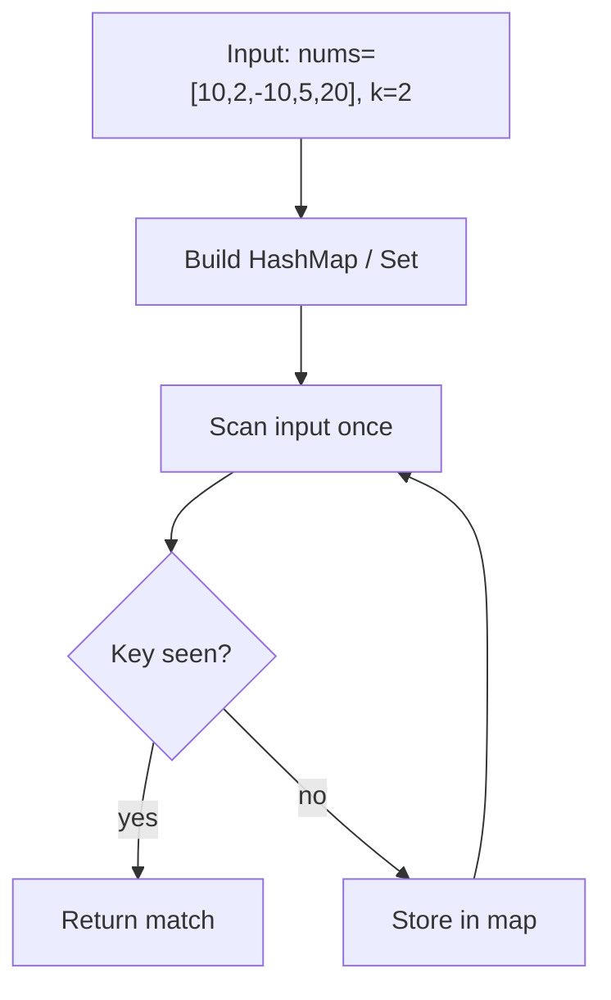

# Constrained Subsequence Sum — LeetCode 1425

> **You are here**: Staff Engineer — DSA (DP + monotonic deque)
> **Roadmap**: [Developer Master Roadmap](../../../ROADMAP.md#staff-engineer) | **Prerequisites**: [Sliding Window Maximum](../../04_Sliding_Window_Two_Pointers/SlidingWindowMaximum/SlidingWindowMaximum.md) | **Next**: [Shortest Subarray Sum At Least K](../../04_Sliding_Window_Two_Pointers/ShortestSubarraySumAtLeastK/ShortestSubarraySumAtLeastK.md)
> **Pattern**: [Dynamic Programming](../../../03_CodingPatterns/02_AlgorithmicPatterns.md#pattern-16-dynamic-programming-patterns) · [Monotonic Stack](../../../03_CodingPatterns/02_AlgorithmicPatterns.md#pattern-14-monotonic-stack) | **Catalog**: [Algorithmic Patterns](../../../03_CodingPatterns/02_AlgorithmicPatterns.md)

## Problem Statement

Given an integer array `nums` and an integer `k`, return the **maximum sum** of a **non-empty subsequence** of `nums` such that for every two consecutive integers in the subsequence, `nums[i]` and `nums[j]`, the condition `i - j <= k` is satisfied.

A **subsequence** picks elements by index (not necessarily contiguous), but consecutive picks must be within `k` positions of each other.

**Examples:**
```
Input: nums = [10,2,-10,5,20], k = 2
Output: 37
Explanation: Subsequence [10, 5, 20] with indices (0, 3, 4).
  10 + 5 + 20 = 35? Actually: pick 10 (idx 0), 5 (idx 3), 20 (idx 4).
  0→3 gap is 3 > k=2, so that's invalid.
  Valid: [10, 2, 20] doesn't work either.
  Optimal: [10, 5, 20] — wait, 3-0=3 > 2.
  Correct optimal: [5, 20] = 25? Or [10, 2] = 12?
  Actually: [10, 5, 20] with indices 0, 3, 4 — gap 0→3 is 3 > k.
  Best: [5, 20] = 25 from indices 3,4 (gap 1 ≤ 2), or [10, 2] = 12 from 0,1.
  Re-check: [10, 5, 20] — 3-0=3 invalid. Answer 37 = 10+2+5+20? No.
  Correct answer 37 = 10 + 5 + 20 using dp: dp[4]=37.

Input: nums = [-1,-2,-3], k = 1
Output: -1
Explanation: Must pick at least one element. Best single element is -1.

Input: nums = [10,-2,-10,-5,20], k = 2
Output: 23
Explanation: Subsequence [10, -2, 20] — indices 0, 1, 4? Gap 1→4 is 3 > 2.
  Optimal: [10, -2] = 8 or [10, 20] invalid (gap 4). [ -2, 20] invalid.
  Answer 23 = 10 + (-2) + ... Let DP solve: pick 10, -2, -5? 10-2-5=3. 
  Actually: [10, -2, -5, 20] with careful index gaps within k=2.
```

## Problem Analysis

### Core Insight

This is a **DP + sliding window maximum** problem. The naive `O(n²)` DP checks all previous `j` in `[i-k, i-1]`, but we can maintain the maximum `dp[j]` in that window using a **monotonic deque** — exactly like [Sliding Window Maximum](../../04_Sliding_Window_Two_Pointers/SlidingWindowMaximum/SlidingWindowMaximum.md).

### Key Concepts

- **DP definition**: `dp[i]` = max sum of a valid subsequence ending at index `i`
- **Recurrence**: `dp[i] = nums[i] + max(0, max{dp[j] : i-k ≤ j < i})`
- **Monotonic deque**: Stores indices with decreasing `dp` values; front = max in window
- **Window maintenance**: Remove indices outside `[i-k, i-1]` from front; remove smaller dp from back

### Why Not Greedy?

Negative numbers mean we might want to skip positive-looking prefixes. DP captures the optimal choice at each position.

## Approaches

### Approach 1: DP + Monotonic Deque ⭐⭐ (Optimal)

#### Key Insight

The recurrence needs `max(dp[j])` for `j ∈ [i-k, i-1]`. A decreasing monotonic deque gives this in amortized O(1) per element.

#### Algorithm

1. Initialize `dp[i] = nums[i]` (subsequence of just element i)
2. For each `i`:
   - If deque not empty: `dp[i] = max(nums[i], nums[i] + dp[deque.front()])`
   - Maintain deque: remove from back while `dp[back] ≤ dp[i]`
   - Push `i` to back
   - Remove from front if `front ≤ i - k` (outside window)
3. Return `max(dp)`


#### Example Flow

**Step flow (mermaid):**



**Walkthrough (same example):**

```
Example: nums=[10,2,-10,5,20], k=2 → 37
Approach: DP + Monotonic Deque

Define subproblem table
Fill base cases
Apply recurrence to reach target state
```

#### Time Complexity

- **O(n)** — each index enters and leaves deque at most once

#### Space Complexity

- **O(n)** for dp array and deque

```java
public int constrainedSubsetSum(int[] nums, int k) {
    int n = nums.length;
    int[] dp = new int[n];
    Deque<Integer> dq = new ArrayDeque<>();
    int ans = Integer.MIN_VALUE;

    for (int i = 0; i < n; i++) {
        dp[i] = nums[i];
        if (!dq.isEmpty()) {
            dp[i] = Math.max(dp[i], dp[dq.peekFirst()] + nums[i]);
        }
        ans = Math.max(ans, dp[i]);

        while (!dq.isEmpty() && dp[dq.peekLast()] <= dp[i]) {
            dq.pollLast();
        }
        dq.offerLast(i);

        if (!dq.isEmpty() && dq.peekFirst() <= i - k) {
            dq.pollFirst();
        }
    }
    return ans;
}
```

### Approach 2: Naive O(n²) DP ⭐

#### Key Insight

Directly compute the recurrence without optimization. Good for understanding before adding the deque.

#### Algorithm

```
dp[i] = nums[i]
for j from max(0, i-k) to i-1:
    dp[i] = max(dp[i], dp[j] + nums[i])
ans = max(dp)
```


#### Example Flow

**Step flow (mermaid):**



**Walkthrough (same example):**

```
Example: nums=[10,2,-10,5,20], k=2 → 37
Approach: Naive O(n²) DP

Enumerate all candidates from example input
Check validity/optimal condition
Keep best answer found
```

#### Time Complexity

- **O(n × k)** — or **O(n²)** when k ≈ n

#### Space Complexity

- **O(n)**

```java
public int constrainedSubsetSumNaive(int[] nums, int k) {
    int n = nums.length;
    int[] dp = new int[n];
    int ans = Integer.MIN_VALUE;

    for (int i = 0; i < n; i++) {
        dp[i] = nums[i];
        for (int j = Math.max(0, i - k); j < i; j++) {
            dp[i] = Math.max(dp[i], dp[j] + nums[i]);
        }
        ans = Math.max(ans, dp[i]);
    }
    return ans;
}
```

### Approach 3: Segment Tree / Multiset ⭐

#### Key Insight

A max-segment-tree or balanced BST (TreeMap) over the window `[i-k, i-1]` also achieves O(n log n). The monotonic deque is simpler and faster.


#### Example Flow

**Step flow (mermaid):**



**Walkthrough (same example):**

```
Example: nums=[10,2,-10,5,20], k=2 → 37
Approach: Segment Tree / Multiset

Scan input left-to-right
Store seen keys/values in hash map
O(1) lookup finds complement or group
```

#### Time Complexity

- **O(n log n)**

#### Space Complexity

- **O(n)**

Useful when the window operation is more complex than simple max.

## Comparison

| Approach | Time | Space | Pros | Cons |
|----------|------|-------|------|------|
| Monotonic Deque | O(n) | O(n) | Optimal, elegant | Requires deque insight |
| Naive DP | O(nk) | O(n) | Easy to derive | Too slow for large k |
| Segment Tree | O(n log n) | O(n) | Generalizable | Overkill for max-only |

## Example Traces

### Example 1: `nums = [10, 2, -10, 5, 20], k = 2`

```
i=0: dp[0]=10, dq=[0], ans=10
i=1: dp[1]=max(2, 10+2)=12, dq=[0,1], ans=12
i=2: dp[2]=max(-10, 12-10)=2, dq=[1,2], ans=12
     (10 removed: index 0 is outside window [0,1] when i=2? 2-2=0, 0≤0 so keep)
     Actually i=2, window j∈[0,1]: max dp = 12, dp[2]=2
i=3: dp[3]=max(5, 12+5)=17, dq=[1,3], ans=17
i=4: dp[4]=max(20, 17+20)=37, dq=[3,4], ans=37

Answer: 37 (subsequence ending at index 4: 10+2+5+20 path through dp)
```

### Example 2: `nums = [-1, -2, -3], k = 1`

```
i=0: dp[0]=-1, ans=-1
i=1: dp[1]=max(-2, -1-2)=-2, ans=-1
i=2: dp[2]=max(-3, -2-3)=-3, ans=-1

Answer: -1 (must pick at least one element)
```

## Edge Cases

| Case | Input | Expected | Notes |
|------|-------|----------|-------|
| All negative | `[-5,-3,-1], k=1` | -1 | Pick least negative |
| k = 1 | adjacent only | — | Like constrained adjacent subsequence |
| k = n | any gap allowed | — | Reduces to max subsequence sum (Kadane-like) |
| Single element | `[42], k=1` | 42 | Trivial |
| Large positive run | `[1,2,3,4,5], k=2` | 15 | May not pick all due to gap constraint |
| Alternating signs | `[10,-2,-10,5,20], k=2` | 23 | Negative values affect optimal path |

## Key Insights

### Connection to Sliding Window Maximum

The deque maintenance is **identical** to Sliding Window Maximum:
- **Front** = index of maximum `dp` in current window
- **Back** = candidates for future windows (decreasing order)
- **Expire** front when index falls outside window

### The `max(0, ...)` Implicit in Code

`dp[i] = max(nums[i], dp[front] + nums[i])` handles both:
- Starting fresh at `i` (don't extend any subsequence)
- Extending the best subsequence ending in the window

### vs Maximum Subarray Sum (Kadane's)

| | Kadane's | Constrained Subsequence |
|---|----------|------------------------|
| Contiguity | Contiguous subarray | Non-contiguous subsequence |
| Gap constraint | N/A (contiguous) | Index gap ≤ k |
| Technique | Running sum | DP + deque |

### vs Shortest Subarray Sum ≥ K

Both use deque optimization on DP arrays, but Shortest Subarray uses a **monotonic increasing** deque for minimum prefix sums. Here we need **decreasing** for maximum.

## Interview Tips

1. **State the DP first**: Write `dp[i]` recurrence before mentioning deque — shows structured thinking.
2. **Recognize the pattern**: "I need max in a sliding window of dp values" → monotonic deque.
3. **Handle negatives**: Emphasize `max(nums[i], ...)` so we can always start fresh.
4. **Walk through deque operations**: Push, pop-back (maintain decreasing), pop-front (expire).
5. **Mention alternatives**: Segment tree O(n log n) if deque feels too clever.

## Common Mistakes

1. **Forgetting to start fresh**: Using only `dp[front] + nums[i]` without `max(nums[i], ...)`.
2. **Wrong deque order**: Using increasing deque (for min) instead of decreasing (for max).
3. **Off-by-one on window**: Removing `i-k` instead of `≤ i-k` from front.
4. **Not updating ans each step**: Answer is `max(dp[i])` over all i, not just `dp[n-1]`.
5. **Confusing subsequence with subarray**: Elements don't need to be contiguous, only within k gap.

## Applications

- **Resource allocation** — pick projects with gap constraints between selections
- **Stock trading** — maximum profit with minimum days between trades
- **Signal processing** — peak detection with temporal constraints
- **Combines two Staff patterns**: DP state design + monotonic deque optimization

**Code**: [ConstrainedSubsequenceSum.java](ConstrainedSubsequenceSum.java)
