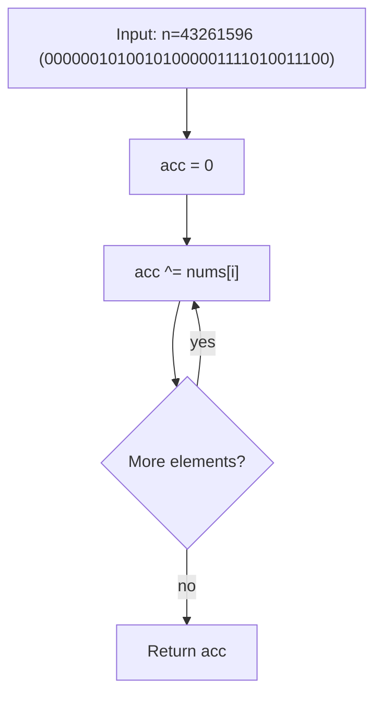
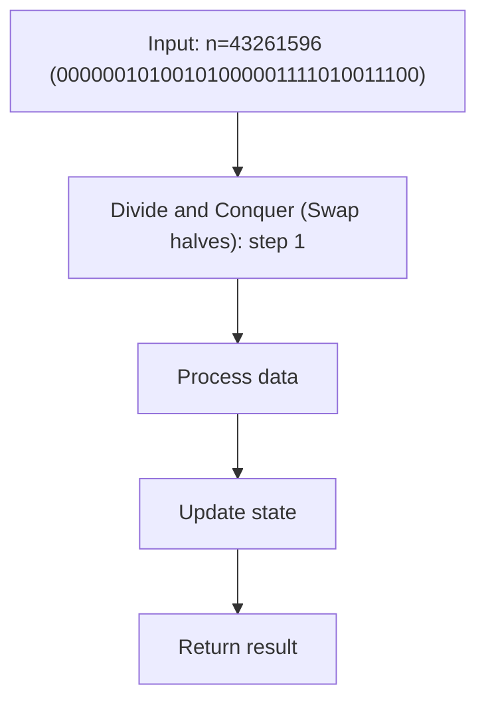
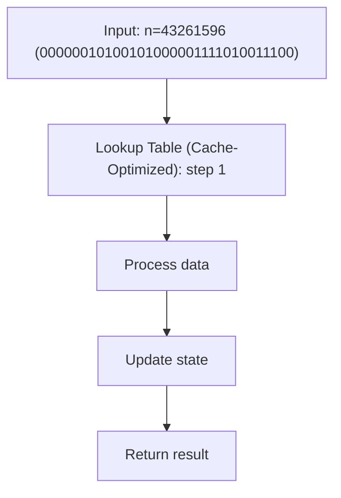

# Reverse Bits

> **You are here**: DSA — see [ROADMAP](../../../ROADMAP.md) for level assignment
> **Roadmap**: [Developer Master Roadmap](../../../ROADMAP.md) | **Study path**: [StudyGuide](../../StudyGuide.md)
> **Pattern**: [Bit Manipulation](../../../03_CodingPatterns/02_AlgorithmicPatterns.md#pattern-recognition-decision-tree) | **Catalog**: [Algorithmic Patterns](../../../03_CodingPatterns/02_AlgorithmicPatterns.md)

## Problem Statement

Reverse the bits of a given 32-bit unsigned integer.

**Constraints:**
- Input is a 32-bit unsigned integer.

## Example
```
Input:  n = 00000010100101000001111010011100  (43261596)
Output:   00111001011110000010100101000000  (964176192)

Input:  n = 11111111111111111111111111111101  (4294967293)
Output:   10111111111111111111111111111111  (3221225471)
```

## Approach 1: Bit-by-Bit Reversal

Extract each bit from the right side of `n` and place it at the corresponding position on the left side of the result.


#### Example Flow

**Step flow (mermaid):**



**Walkthrough (same example):**

```
Example: n=43261596 (00000010100101000001111010011100) → 964176192
Approach: Bit-by-Bit Reversal

XOR accumulates unmatched bits
Pairs cancel to 0
Remaining value is unique answer
```
```java
public int reverseBits(int n) {
    int result = 0;
    
    for (int i = 0; i < 32; i++) {
        // Extract the rightmost bit of n
        int bit = n & 1;
        
        // Place it at position (31 - i) in the result
        result = (result << 1) | bit;
        
        // Shift n right to process the next bit
        n >>= 1;
    }
    
    return result;
}
```

### Alternative: Direct Position Placement
```java
public int reverseBitsDirect(int n) {
    int result = 0;
    
    for (int i = 0; i < 32; i++) {
        // Get bit at position i
        int bit = (n >> i) & 1;
        
        // Place it at position (31 - i)
        result |= (bit << (31 - i));
    }
    
    return result;
}
```

**Time**: O(32) = O(1) — fixed number of bits.
**Space**: O(1)

## Approach 2: Divide and Conquer (Swap halves)

Swap groups of bits in progressively smaller chunks: swap 16-bit halves, then 8-bit quarters, then 4-bit nibbles, then 2-bit pairs, then individual bits.


#### Example Flow

**Step flow (mermaid):**



**Walkthrough (same example):**

```
Example: n=43261596 (00000010100101000001111010011100) → 964176192
Approach: Divide and Conquer (Swap halves)

Apply Divide and Conquer (Swap halves) on the example input step by step
Final answer from example: see above
```
```java
public int reverseBitsDnC(int n) {
    n = ((n & 0xFFFF0000) >>> 16) | ((n & 0x0000FFFF) << 16); // Swap 16-bit halves
    n = ((n & 0xFF00FF00) >>> 8)  | ((n & 0x00FF00FF) << 8);  // Swap 8-bit pairs
    n = ((n & 0xF0F0F0F0) >>> 4)  | ((n & 0x0F0F0F0F) << 4);  // Swap 4-bit nibbles
    n = ((n & 0xCCCCCCCC) >>> 2)  | ((n & 0x33333333) << 2);  // Swap 2-bit pairs
    n = ((n & 0xAAAAAAAA) >>> 1)  | ((n & 0x55555555) << 1);  // Swap individual bits
    return n;
}
```

### How It Works (Visualized for 8 bits: 10110100)
```
Original:  10110100

Step 1 - Swap 4-bit halves:
  1011 0100 → 0100 1011

Step 2 - Swap 2-bit pairs:
  01 00 10 11 → 00 01 11 10

Step 3 - Swap individual bits:
  0 0 0 1 1 1 1 0 → 00101110

Result:  00101110 ✓ (reverse of 10110100)
```

**Time**: O(1) — exactly 5 operations.
**Space**: O(1)

## Approach 3: Lookup Table (Cache-Optimized)

Pre-compute the reverse of every byte (0-255) and use it to reverse 4 bytes.


#### Example Flow

**Step flow (mermaid):**



**Walkthrough (same example):**

```
Example: n=43261596 (00000010100101000001111010011100) → 964176192
Approach: Lookup Table (Cache-Optimized)

Apply Lookup Table (Cache-Optimized) on the example input step by step
Final answer from example: see above
```
```java
private static final int[] REVERSE_BYTE = new int[256];

static {
    for (int i = 0; i < 256; i++) {
        REVERSE_BYTE[i] = reverseByte(i);
    }
}

private static int reverseByte(int b) {
    int result = 0;
    for (int i = 0; i < 8; i++) {
        result = (result << 1) | (b & 1);
        b >>= 1;
    }
    return result;
}

public int reverseBitsLookup(int n) {
    return (REVERSE_BYTE[n & 0xFF] << 24) |
           (REVERSE_BYTE[(n >>> 8) & 0xFF] << 16) |
           (REVERSE_BYTE[(n >>> 16) & 0xFF] << 8) |
           (REVERSE_BYTE[(n >>> 24) & 0xFF]);
}
```

**Time**: O(1) — 4 lookups.
**Space**: O(256) = O(1) — lookup table.

## Comparison

| Approach | Time | Space | Notes |
|----------|------|-------|-------|
| Bit-by-Bit | O(32) | O(1) | Simple, easy to explain |
| Divide & Conquer | O(5) | O(1) | Fastest, uses bit masks |
| Lookup Table | O(4) | O(256) | Best for repeated calls |

## Interview Tips

1. **Start with the simple approach** (bit-by-bit). It is clear and correct.
2. **Mention the D&C approach** as an optimization — it shows depth.
3. **Java gotcha**: Use `>>>` (unsigned right shift) instead of `>>` (signed right shift) because `>>` preserves the sign bit.
4. **Follow-up**: "If this function is called many times, how would you optimize?" → Use the lookup table approach (pre-compute byte reversal).

## Related Problems
- Number of 1 Bits (count set bits)
- Counting Bits (count bits for 0 to n)
- Power of Two (n & (n-1) == 0)
- Hamming Distance (XOR + count bits)

