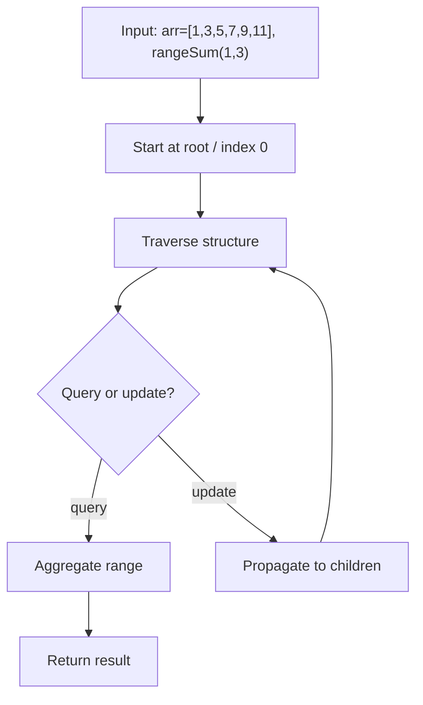
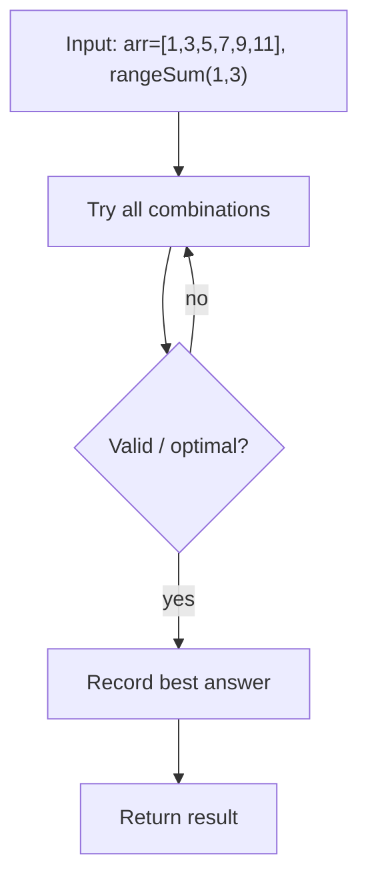

# Fenwick Tree (Binary Indexed Tree)

> **You are here**: Staff Engineer — DSA (range queries)
> **Roadmap**: [Developer Master Roadmap](../../../ROADMAP.md#staff-engineer) | **Prerequisites**: [Segment Tree](../SegmentTree/SegmentTree.md) | **Next**: [RandomizedSet](../RandomizedSet/RandomizedSet.md)
> **Pattern**: [Fenwick Tree](../../../03_CodingPatterns/02_AlgorithmicPatterns.md#pattern-recognition-decision-tree) | **Catalog**: [Algorithmic Patterns](../../../03_CodingPatterns/02_AlgorithmicPatterns.md)

## Problem Class

Support **point updates** and **prefix / range sum queries** on a mutable array in O(log n) time per operation — with less code than a segment tree when only sums are needed.

Typical interview framing: implement the data structure behind **LeetCode 307** (Range Sum Query — Mutable) or use Fenwick for inversion counting with coordinate compression.

**Example** (array `[1, 3, 5, 7, 9, 11]`, 1-indexed internally):

```
update(3, +2)   → array becomes [1, 3, 7, 7, 9, 11]
rangeSum(2, 4)  → 3 + 7 + 7 = 17
```

---

## Approach 1: Fenwick Tree / Binary Indexed Tree (Optimal for Sum)

A Fenwick tree stores partial sums in a 1-indexed array `tree[]`. Each index `i` is responsible for a range whose length is the lowest set bit of `i` (`i & -i`).

| Operation | Idea |
|-----------|------|
| `update(i, delta)` | Add `delta` at `i`, then propagate to parent indices: `i += i & -i` |
| `prefixSum(i)` | Accumulate `tree[i]`, then move to parent: `i -= i & -i` |
| `rangeSum(l, r)` | `prefixSum(r) - prefixSum(l - 1)` |

### Key Logic


#### Example Flow

**Step flow (mermaid):**



**Walkthrough (same example):**

```
Example: arr=[1,3,5,7,9,11], rangeSum(1,3)→15
Approach: Fenwick Tree / Binary Indexed Tree (Optimal for Sum)

Traverse from root/index 0
Query aggregates or update nodes
Return range sum / structure result
```
```java
public void update(int i, int delta) {
    for (; i <= n; i += i & -i)
        tree[i] += delta;
}

public int prefixSum(int i) {
    int sum = 0;
    for (; i > 0; i -= i & -i)
        sum += tree[i];
    return sum;
}

public int rangeSum(int l, int r) {
    return prefixSum(r) - prefixSum(l - 1);
}
```

### Complexity

- **Time**: O(log n) per update and query
- **Space**: O(n)

---

## Approach 2: Prefix Sum Array with Rebuild (Baseline)

Maintain a standard prefix sum array. Point update at index `i` requires rebuilding suffix sums from `i` onward — O(n) per update.


#### Example Flow

**Step flow (mermaid):**



**Walkthrough (same example):**

```
Example: arr=[1,3,5,7,9,11], rangeSum(1,3)→15
Approach: Prefix Sum Array with Rebuild (Baseline)

Enumerate all candidates from example input
Check validity/optimal condition
Keep best answer found
```
```java
public void update(int i, int delta) {
    int old = arr[i];
    arr[i] += delta;
    for (int j = i + 1; j <= n; j++)
        prefix[j] += delta;
}
```

Works when updates are rare or array is small; does not scale for competitive / interview "many updates" constraints.

### Complexity

- **Time**: O(1) range query, O(n) point update
- **Space**: O(n)

---

## Fenwick vs Segment Tree

| | Fenwick Tree | Segment Tree |
|---|--------------|--------------|
| Code size | ~10 lines | ~40+ lines |
| Range operations | Prefix-based (sum, some extensions) | Min, max, GCD, custom merges |
| Build from array | O(n log n) point updates, or O(n) build trick | O(n) build |
| Use when | Sum/inversion count, speed matters | Non-invertible range aggregates |

---

## Pattern Recognition

| Signal | Pattern |
|--------|---------|
| Dynamic range sum with point updates | Fenwick or segment tree |
| Count smaller elements to the right | Fenwick on **compressed** sorted values |
| 2D range sum | 2D Fenwick (O(log² n)) |

**LeetCode links**: Range Sum Query — Mutable (307), Count of Smaller Numbers After Self (315), Reverse Pairs (493).

---

## Interview Tips

1. Fenwick trees are **1-indexed** — convert 0-indexed problem input with `i + 1`.
2. The magic `i & -i` isolates the lowest set bit — know *what* it does even if you skip the proof.
3. To **build** from an initial array: call `update(i, arr[i])` for each index, or use the O(n) construction trick.
4. If interviewer asks for range **min**, pivot to segment tree — Fenwick does not handle non-invertible operations cleanly.
5. For 315-style problems, **coordinate compress** values before indexing into Fenwick.

**Code**: [FenwickTree.java](FenwickTree.java)
