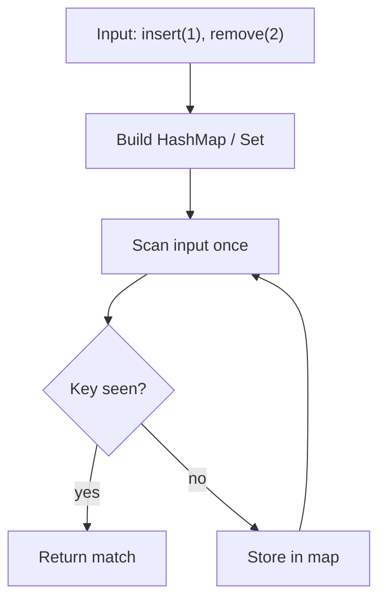
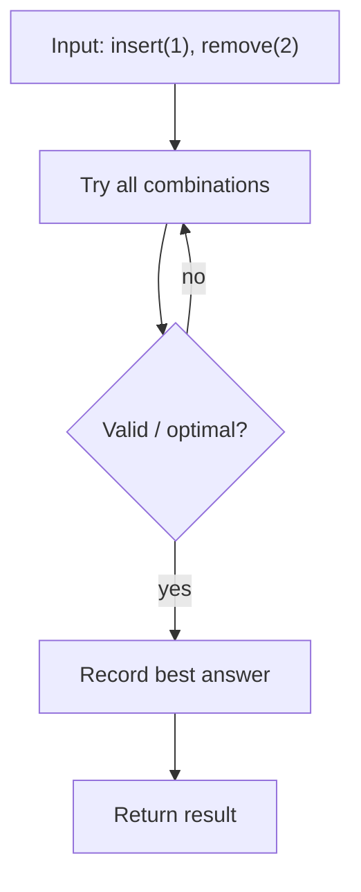

# Insert Delete GetRandom O(1) — LeetCode 380

> **You are here**: Staff Engineer — DSA (data structure design)
> **Roadmap**: [Developer Master Roadmap](../../../ROADMAP.md#staff-engineer) | **Prerequisites**: [LRU Cache](../../05_Linked_Lists/LRUCache/LRUCache.md) | **Next**: [Fenwick Tree](../FenwickTree/FenwickTree.md)
> **Pattern**: [Data Structure Design](../../../03_CodingPatterns/02_AlgorithmicPatterns.md#pattern-recognition-decision-tree) | **Catalog**: [Algorithmic Patterns](../../../03_CodingPatterns/02_AlgorithmicPatterns.md)

## Problem Statement

Implement the `RandomizedSet` class:

- `RandomizedSet()` — initialize an empty set.
- `bool insert(int val)` — insert `val`. Return `false` if already present, `true` otherwise.
- `bool remove(int val)` — remove `val`. Return `false` if not present, `true` otherwise.
- `int getRandom()` — return a **uniformly random** element from the set. Each element must have equal probability.

All operations must run in **average O(1)** time.

**Example:**
```
Input: ["RandomizedSet","insert","remove","insert","getRandom","remove","insert","getRandom"]
       [[],[1],[2],[2],[],[1],[2],[]]
Output: [null,true,false,true,2,true,false,2]
```

---

## Approach 1: ArrayList + HashMap (Optimal for Unique Values)

Combine two structures to get O(1) for every operation:

| Component | Role |
|-----------|------|
| `ArrayList<Integer>` | O(1) random access by index for `getRandom` |
| `HashMap<Integer, Integer>` | Maps value → current index in the list for O(1) lookup |

**Insert**: append to list, store index in map.

**getRandom**: `list.get(rand.nextInt(list.size()))`.

**Remove trick** (the key insight): deleting from the middle of an `ArrayList` is O(n). Instead:

1. Swap the target element with the **last** element in the list.
2. Update the map entry for the swapped-in value.
3. `remove` the last element (O(1)).
4. Remove the target from the map.

### Key Logic


#### Example Flow

**Step flow (mermaid):**



**Walkthrough (same example):**

```
Example: insert(1), remove(2)→false, insert(2), getRandom()→1 or 2
Approach: ArrayList + HashMap (Optimal for Unique Values)

Scan input left-to-right
Store seen keys/values in hash map
O(1) lookup finds complement or group
```
```java
public boolean remove(int val) {
    if (!indexMap.containsKey(val)) return false;
    int idx = indexMap.get(val);
    int lastVal = list.get(list.size() - 1);
    list.set(idx, lastVal);           // move last into deleted slot
    indexMap.put(lastVal, idx);       // update moved element's index
    list.remove(list.size() - 1);     // O(1) pop from end
    indexMap.remove(val);
    return true;
}
```

### Complexity

- **Time**: O(1) average per operation
- **Space**: O(n)

---

## Approach 2: HashSet + ArrayList Snapshot (Baseline)

`HashSet` gives O(1) insert/remove/contains, but `getRandom` requires copying values into an array or iterating — O(n) per call. Not acceptable for the problem constraints, but shows why the hybrid design is necessary.


#### Example Flow

**Step flow (mermaid):**



**Walkthrough (same example):**

```
Example: insert(1), remove(2)→false, insert(2), getRandom()→1 or 2
Approach: HashSet + ArrayList Snapshot (Baseline)

Enumerate all candidates from example input
Check validity/optimal condition
Keep best answer found
```
```java
// getRandom on HashSet alone:
Integer[] arr = set.toArray(new Integer[0]);
return arr[random.nextInt(arr.length)];  // O(n) per call
```

### Complexity

- **Time**: O(1) insert/remove, O(n) getRandom
- **Space**: O(n)

---

## Follow-ups

| Variant | Change |
|---------|--------|
| **LeetCode 381** — duplicates allowed | `Map<Integer, Set<Integer>>` mapping value → set of indices; swap-remove updates one index in the set |
| **Thread-safe** | `Collections.synchronizedList` + synchronized map, or `ConcurrentHashMap` with careful locking on swap-remove |
| **Weighted random** | Prefix sum + binary search, or alias method |

---

## Pattern Recognition

| Signal | Pattern |
|--------|---------|
| O(1) random + O(1) delete by value | Array + HashMap with swap-and-pop |
| "Design a set/map with fast random" | Hybrid structure — no single built-in type suffices |
| LRU/LFU eviction | Linked structure + map (different trade-off) |

**Related problems**: [LRU Cache](../../05_Linked_Lists/LRUCache/LRUCache.md), [LFU Cache](../../05_Linked_Lists/LFUCache/LFUCache.md), Insert Delete GetRandom O(1) — Duplicates allowed (381).

---

## Interview Tips

1. Draw the swap-and-pop on `[1, 2, 3]` removing `2` → `[1, 3]` before coding.
2. Handle edge case: removing the **last** element — swap with itself, still correct.
3. `getRandom` on an **empty** set is undefined — clarify with interviewer (LeetCode guarantees calls only when non-empty).
4. Mention 381 follow-up proactively — `Set<Integer>` of indices per value.

**Code**: [RandomizedSet.java](RandomizedSet.java)
