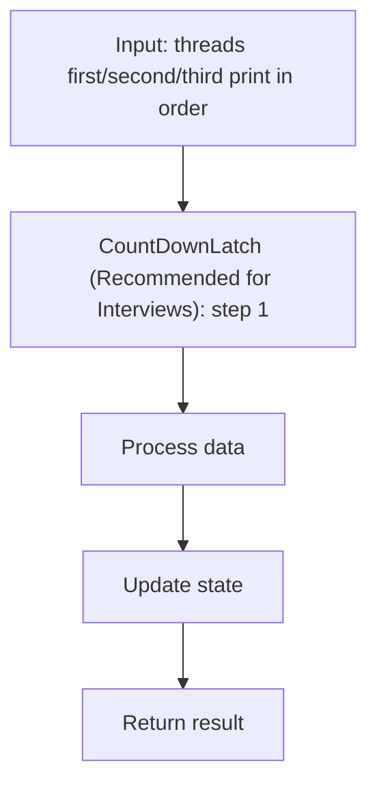
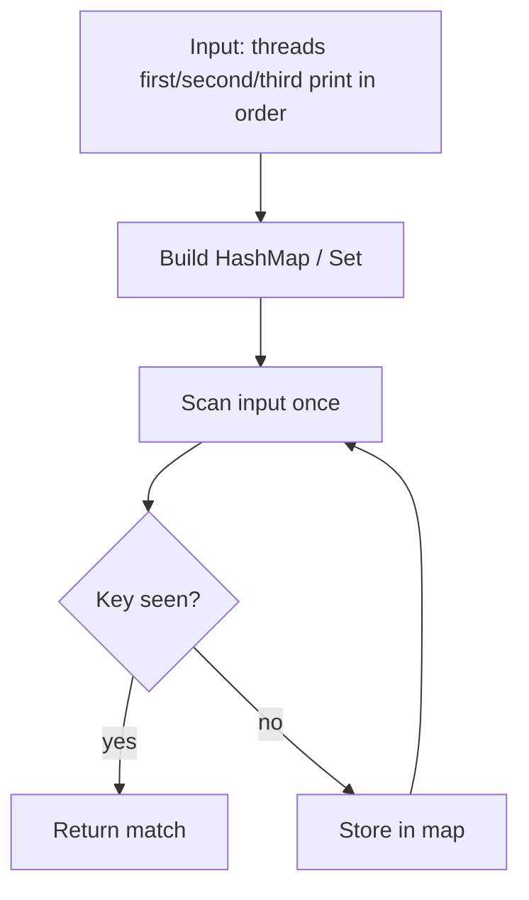
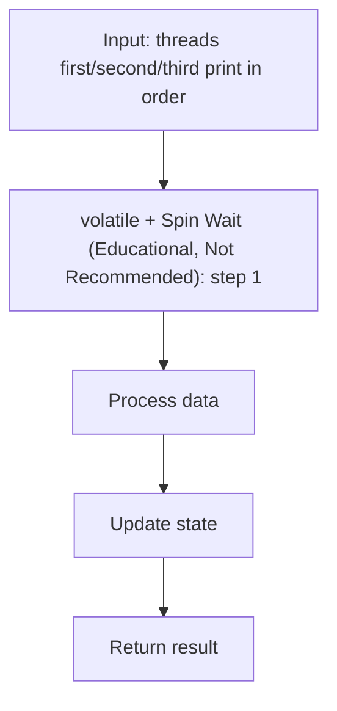
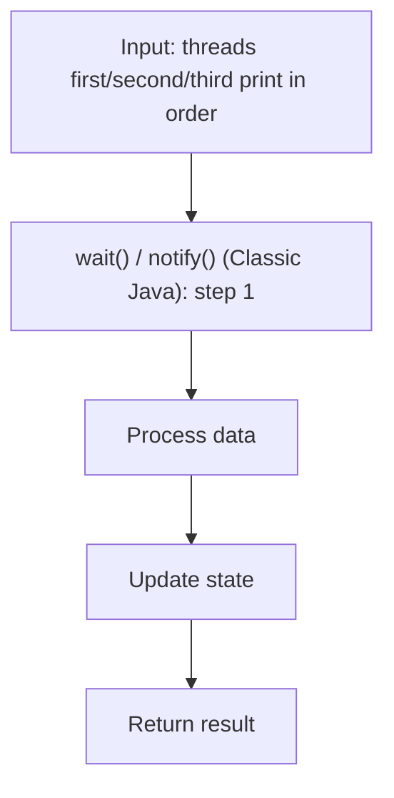

# Print In Order (LeetCode 1114)

> **You are here**: DSA — see [ROADMAP](../../../ROADMAP.md) for level assignment
> **Roadmap**: [Developer Master Roadmap](../../../ROADMAP.md) | **Study path**: [StudyGuide](../../StudyGuide.md)
> **Pattern**: [Concurrency](../../../03_CodingPatterns/02_AlgorithmicPatterns.md#pattern-recognition-decision-tree) | **Catalog**: [Algorithmic Patterns](../../../03_CodingPatterns/02_AlgorithmicPatterns.md)

## Problem Statement

Suppose we have a class with three methods: `first()`, `second()`, and `third()`. Three different threads will call these methods concurrently. Design a mechanism to ensure they always execute in the order `first()` → `second()` → `third()`, regardless of which thread starts first.

**Example**:
- Input: `[1, 2, 3]` (thread execution order)
- Output: `"firstsecondthird"` (always, regardless of input order)

---

## Why This Problem Matters

This is a classic **thread synchronization** problem. It tests your understanding of:
- Thread ordering and coordination
- Synchronization primitives (CountDownLatch, Semaphore, volatile, wait/notify)
- Java concurrency fundamentals

---

## Approach 1: CountDownLatch (Recommended for Interviews)

**Time:** O(1) per method call
**Space:** O(1) — two latches

### How it works:
A `CountDownLatch` is a one-shot synchronization barrier. A thread calling `await()` blocks until the latch's count reaches zero via `countDown()`.

- `latch1` ensures `second()` waits until `first()` is done.
- `latch2` ensures `third()` waits until `second()` is done.

### Java Implementation:


#### Example Flow

**Step flow (mermaid):**



**Walkthrough (same example):**

```
Example: threads first/second/third print in order → 'firstsecondthird'
Approach: CountDownLatch (Recommended for Interviews)

Apply CountDownLatch (Recommended for Interviews) on the example input step by step
Final answer from example: see above
```
```java
import java.util.concurrent.CountDownLatch;

class Foo {
    private final CountDownLatch latch1 = new CountDownLatch(1);
    private final CountDownLatch latch2 = new CountDownLatch(1);

    public Foo() {}

    public void first(Runnable printFirst) throws InterruptedException {
        printFirst.run();       // Execute first
        latch1.countDown();     // Signal that first is done
    }

    public void second(Runnable printSecond) throws InterruptedException {
        latch1.await();         // Wait for first to complete
        printSecond.run();      // Execute second
        latch2.countDown();     // Signal that second is done
    }

    public void third(Runnable printThird) throws InterruptedException {
        latch2.await();         // Wait for second to complete
        printThird.run();       // Execute third
    }
}
```

### Why CountDownLatch is Ideal Here:
- One-shot signaling (once counted down, all waiting threads proceed)
- Cannot be reset (perfect for one-time ordering)
- Thread-safe and efficient
- Clearly communicates intent

---

## Approach 2: Semaphore


#### Example Flow

**Step flow (mermaid):**



**Walkthrough (same example):**

```
Example: threads first/second/third print in order → 'firstsecondthird'
Approach: Semaphore

Scan input left-to-right
Store seen keys/values in hash map
O(1) lookup finds complement or group
```
```java
import java.util.concurrent.Semaphore;

class Foo {
    private final Semaphore sem1 = new Semaphore(0); // Blocks until first() releases
    private final Semaphore sem2 = new Semaphore(0); // Blocks until second() releases

    public void first(Runnable printFirst) throws InterruptedException {
        printFirst.run();
        sem1.release();      // Allow second() to proceed
    }

    public void second(Runnable printSecond) throws InterruptedException {
        sem1.acquire();      // Wait for first()
        printSecond.run();
        sem2.release();      // Allow third() to proceed
    }

    public void third(Runnable printThird) throws InterruptedException {
        sem2.acquire();      // Wait for second()
        printThird.run();
    }
}
```

---

## Approach 3: volatile + Spin Wait (Educational, Not Recommended)


#### Example Flow

**Step flow (mermaid):**



**Walkthrough (same example):**

```
Example: threads first/second/third print in order → 'firstsecondthird'
Approach: volatile + Spin Wait (Educational, Not Recommended)

Apply volatile + Spin Wait (Educational, Not Recommended) on the example input step by step
Final answer from example: see above
```
```java
class Foo {
    private volatile int step = 1;

    public void first(Runnable printFirst) throws InterruptedException {
        printFirst.run();
        step = 2;  // Signal that first is done
    }

    public void second(Runnable printSecond) throws InterruptedException {
        while (step != 2) {
            Thread.yield(); // Busy wait (CPU-wasteful)
        }
        printSecond.run();
        step = 3;
    }

    public void third(Runnable printThird) throws InterruptedException {
        while (step != 3) {
            Thread.yield();
        }
        printThird.run();
    }
}
```

**Warning**: Spin-waiting wastes CPU cycles. Use this only to demonstrate understanding of `volatile` visibility guarantees, not in production.

---

## Approach 4: wait() / notify() (Classic Java)


#### Example Flow

**Step flow (mermaid):**



**Walkthrough (same example):**

```
Example: threads first/second/third print in order → 'firstsecondthird'
Approach: wait() / notify() (Classic Java)

Apply wait() / notify() (Classic Java) on the example input step by step
Final answer from example: see above
```
```java
class Foo {
    private int step = 1;
    private final Object lock = new Object();

    public void first(Runnable printFirst) throws InterruptedException {
        synchronized (lock) {
            printFirst.run();
            step = 2;
            lock.notifyAll();
        }
    }

    public void second(Runnable printSecond) throws InterruptedException {
        synchronized (lock) {
            while (step != 2) {
                lock.wait();
            }
            printSecond.run();
            step = 3;
            lock.notifyAll();
        }
    }

    public void third(Runnable printThird) throws InterruptedException {
        synchronized (lock) {
            while (step != 3) {
                lock.wait();
            }
            printThird.run();
        }
    }
}
```

---

## Interview Tips

- **Start with CountDownLatch** — it is the most idiomatic and clean solution
- **Explain the happens-before guarantee**: `countDown()` happens-before `await()` returns, ensuring visibility of all writes made before `countDown()`
- **Discuss trade-offs**: CountDownLatch vs Semaphore vs volatile spin-wait
- **Know when each primitive is appropriate**: CountDownLatch for one-shot events, Semaphore for permits, CyclicBarrier for repeated synchronization points

## LeetCode Similar Problems:
- [1114. Print in Order](https://leetcode.com/problems/print-in-order/) (this problem)
- [1115. Print FooBar Alternately](https://leetcode.com/problems/print-foobar-alternately/)
- [1116. Print Zero Even Odd](https://leetcode.com/problems/print-zero-even-odd/)
- [1117. Building H2O](https://leetcode.com/problems/building-h2o/)
- [1195. Fizz Buzz Multithreaded](https://leetcode.com/problems/fizz-buzz-multithreaded/)

## Note
**For Lead-Level:** This tests your knowledge of Java's `java.util.concurrent` package. A lead should explain which synchronization primitive is most appropriate and why, discuss the happens-before memory model implications, and consider what happens if an exception is thrown in `first()`.

