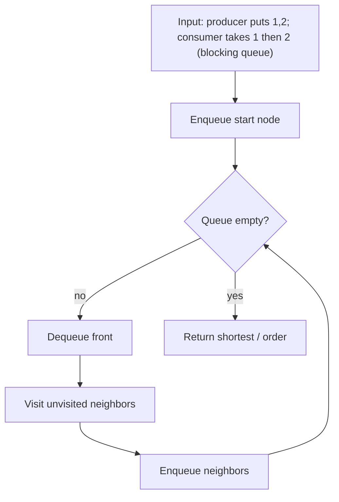
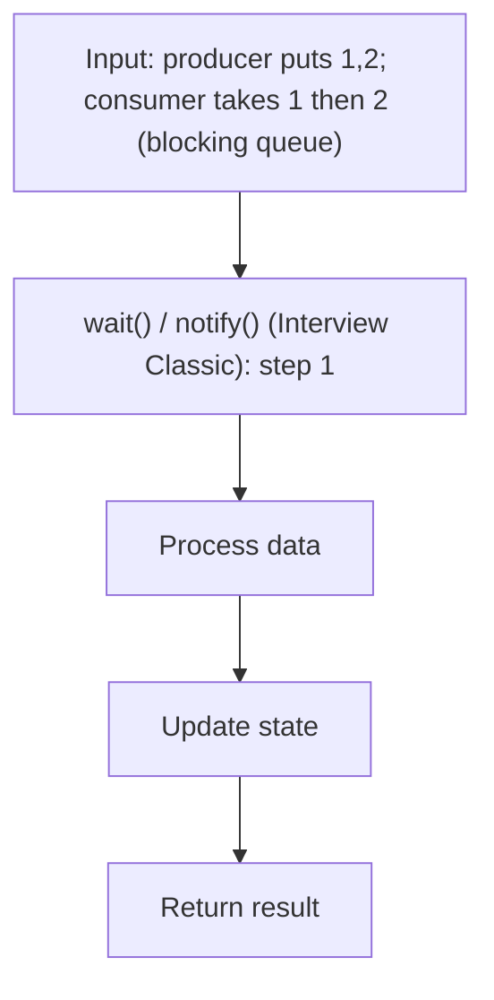
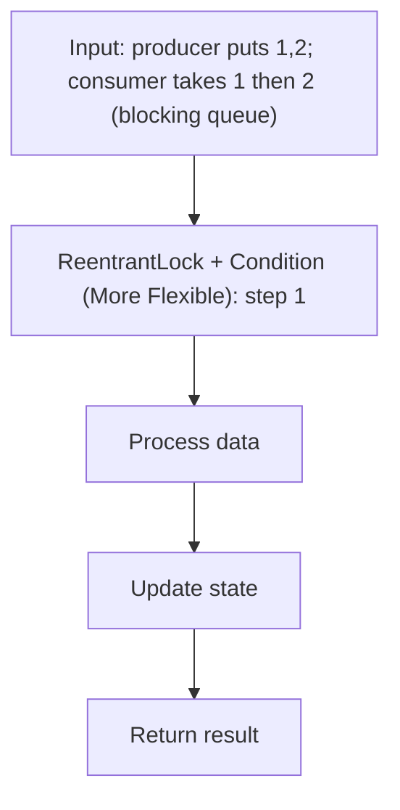

# Producer-Consumer Problem

> **You are here**: DSA — see [ROADMAP](../../../ROADMAP.md) for level assignment
> **Roadmap**: [Developer Master Roadmap](../../../ROADMAP.md) | **Study path**: [StudyGuide](../../StudyGuide.md)
> **Pattern**: [Concurrency](../../../03_CodingPatterns/02_AlgorithmicPatterns.md#pattern-recognition-decision-tree) | **Catalog**: [Algorithmic Patterns](../../../03_CodingPatterns/02_AlgorithmicPatterns.md)

## Problem Statement

Implement a thread-safe bounded buffer (blocking queue) where:
- **Producer threads** add items to the buffer
- **Consumer threads** remove items from the buffer
- If the buffer is full, producers must block (wait) until space is available
- If the buffer is empty, consumers must block (wait) until an item is available
- No busy-waiting; threads should sleep efficiently

This is one of the most fundamental concurrency problems and is directly applicable to real-world systems like Kafka consumers, thread pool task queues, and event-driven architectures.

---

## Approach 1: BlockingQueue (Production-Grade)

**The simplest and best approach for production code.**


#### Example Flow

**Step flow (mermaid):**



**Walkthrough (same example):**

```
Example: producer puts 1,2; consumer takes 1 then 2 (blocking queue)
Approach: BlockingQueue (Production-Grade)

Enqueue start node/level
Process neighbors level by level
First reach target = shortest path
```
```java
import java.util.concurrent.ArrayBlockingQueue;
import java.util.concurrent.BlockingQueue;

public class ProducerConsumerDemo {

    public static void main(String[] args) {
        BlockingQueue<Integer> queue = new ArrayBlockingQueue<>(10); // Bounded buffer of size 10

        // Producer thread
        Thread producer = new Thread(() -> {
            try {
                for (int i = 0; i < 100; i++) {
                    queue.put(i);  // Blocks if queue is full
                    System.out.println("Produced: " + i);
                }
            } catch (InterruptedException e) {
                Thread.currentThread().interrupt();
            }
        });

        // Consumer thread
        Thread consumer = new Thread(() -> {
            try {
                for (int i = 0; i < 100; i++) {
                    int item = queue.take();  // Blocks if queue is empty
                    System.out.println("Consumed: " + item);
                }
            } catch (InterruptedException e) {
                Thread.currentThread().interrupt();
            }
        });

        producer.start();
        consumer.start();
    }
}
```

### BlockingQueue Implementations:

| Implementation | Bounded? | Data Structure | Use Case |
|---------------|----------|---------------|----------|
| `ArrayBlockingQueue` | Yes (fixed) | Array | Known max capacity, fair ordering option |
| `LinkedBlockingQueue` | Optional | Linked list | Potentially unbounded, higher throughput |
| `PriorityBlockingQueue` | No | Heap | Priority-based consumption |
| `SynchronousQueue` | Zero capacity | None | Direct handoff (no buffering) |
| `DelayQueue` | No | Heap | Elements available after a delay |

---

## Approach 2: wait() / notify() (Interview Classic)

This is what interviewers expect you to implement from scratch.


#### Example Flow

**Step flow (mermaid):**



**Walkthrough (same example):**

```
Example: producer puts 1,2; consumer takes 1 then 2 (blocking queue)
Approach: wait() / notify() (Interview Classic)

Apply wait() / notify() (Interview Classic) on the example input step by step
Final answer from example: see above
```
```java
import java.util.LinkedList;
import java.util.Queue;

public class BoundedBuffer<T> {
    private final Queue<T> buffer;
    private final int capacity;
    private final Object lock = new Object();

    public BoundedBuffer(int capacity) {
        this.capacity = capacity;
        this.buffer = new LinkedList<>();
    }

    /**
     * Adds an item to the buffer. Blocks if the buffer is full.
     */
    public void produce(T item) throws InterruptedException {
        synchronized (lock) {
            // MUST use while loop (not if) — spurious wakeups!
            while (buffer.size() == capacity) {
                lock.wait(); // Release lock and wait until space is available
            }

            buffer.add(item);
            System.out.println(Thread.currentThread().getName() + " produced: " + item
                + " | Buffer size: " + buffer.size());

            lock.notifyAll(); // Wake up consumers waiting for items
        }
    }

    /**
     * Removes and returns an item from the buffer. Blocks if the buffer is empty.
     */
    public T consume() throws InterruptedException {
        synchronized (lock) {
            // MUST use while loop (not if) — spurious wakeups!
            while (buffer.isEmpty()) {
                lock.wait(); // Release lock and wait until items are available
            }

            T item = buffer.poll();
            System.out.println(Thread.currentThread().getName() + " consumed: " + item
                + " | Buffer size: " + buffer.size());

            lock.notifyAll(); // Wake up producers waiting for space
            return item;
        }
    }

    public int size() {
        synchronized (lock) {
            return buffer.size();
        }
    }
}
```

### Critical Detail: Why `while` and not `if`?

```java
// WRONG — can lead to bugs
if (buffer.isEmpty()) {
    lock.wait();
}
// After waking up, buffer might be empty again if another consumer took the item!

// CORRECT — always re-check the condition after waking up
while (buffer.isEmpty()) {
    lock.wait();
}
```

**Reasons**:
1. **Spurious wakeups**: The JVM specification allows threads to wake up without being notified. The `while` loop handles this by re-checking the condition.
2. **Lost signals**: With multiple consumers, one consumer might consume the item before another consumer that was also woken up gets to run. The `while` loop prevents this race condition.

### Why `notifyAll()` and not `notify()`?

`notify()` wakes one random waiting thread. If you have both producers and consumers waiting, `notify()` might wake a producer when only a consumer could make progress (or vice versa). `notifyAll()` wakes all waiting threads, and each one re-checks its condition.

---

## Approach 3: ReentrantLock + Condition (More Flexible)

Separates the "buffer full" and "buffer empty" conditions into distinct Condition objects for more precise signaling.


#### Example Flow

**Step flow (mermaid):**



**Walkthrough (same example):**

```
Example: producer puts 1,2; consumer takes 1 then 2 (blocking queue)
Approach: ReentrantLock + Condition (More Flexible)

Apply ReentrantLock + Condition (More Flexible) on the example input step by step
Final answer from example: see above
```
```java
import java.util.LinkedList;
import java.util.Queue;
import java.util.concurrent.locks.Condition;
import java.util.concurrent.locks.ReentrantLock;

public class BoundedBufferWithLock<T> {
    private final Queue<T> buffer;
    private final int capacity;
    private final ReentrantLock lock = new ReentrantLock();
    private final Condition notFull = lock.newCondition();  // Producers wait here
    private final Condition notEmpty = lock.newCondition(); // Consumers wait here

    public BoundedBufferWithLock(int capacity) {
        this.capacity = capacity;
        this.buffer = new LinkedList<>();
    }

    public void produce(T item) throws InterruptedException {
        lock.lock();
        try {
            while (buffer.size() == capacity) {
                notFull.await(); // Wait until buffer is not full
            }

            buffer.add(item);

            notEmpty.signal(); // Signal one consumer that an item is available
        } finally {
            lock.unlock(); // Always unlock in finally block
        }
    }

    public T consume() throws InterruptedException {
        lock.lock();
        try {
            while (buffer.isEmpty()) {
                notEmpty.await(); // Wait until buffer is not empty
            }

            T item = buffer.poll();

            notFull.signal(); // Signal one producer that space is available
            return item;
        } finally {
            lock.unlock();
        }
    }
}
```

### Advantages of ReentrantLock + Condition over synchronized + wait/notify:
1. **Separate conditions**: Producers and consumers wait on different conditions, so `signal()` only wakes the right type of thread.
2. **Fairness**: `new ReentrantLock(true)` provides fair ordering (longest-waiting thread gets the lock first).
3. **Interruptible locking**: `lock.lockInterruptibly()` allows cancellation.
4. **Try-lock**: `lock.tryLock(timeout, unit)` allows non-blocking attempts.

---

## Comparison of Approaches

| Feature | synchronized + wait/notify | ReentrantLock + Condition | BlockingQueue |
|---------|--------------------------|--------------------------|---------------|
| Complexity | Medium | Medium-High | Low |
| Separate conditions | No (single wait set) | Yes (multiple Conditions) | Internal |
| Fairness option | No | Yes | Yes (ArrayBlockingQueue) |
| Try-lock / timeout | No | Yes | Yes (offer/poll with timeout) |
| Interview expectation | Yes (must know) | Yes (shows depth) | Yes (shows pragmatism) |
| Production recommendation | Rarely | Sometimes | Almost always |

---

## Real-World Applications

1. **Thread Pool Task Queue**: `ThreadPoolExecutor` uses a `BlockingQueue` internally to hold submitted tasks.
2. **Kafka Consumer Buffer**: Messages are fetched and placed in a buffer for processing.
3. **Connection Pool**: Database connections are produced (opened) and consumed (borrowed) from a pool.
4. **Event-Driven Systems**: Events are produced by publishers and consumed by handlers.
5. **Rate Limiting**: Tokens are produced at a fixed rate and consumed by requests.

---

## Interview Tips

- **Start with the `BlockingQueue` solution** to show you know the standard library, then say "Let me implement it from scratch to show the underlying mechanism."
- **Always use `while` for wait conditions, never `if`**. Explain why (spurious wakeups + lost signals).
- **Use `notifyAll()` over `notify()`** when multiple types of threads share the same lock.
- **Discuss the ReentrantLock approach** if asked for improvements — it shows you understand the limitations of `synchronized`.
- **Mention happens-before**: `lock.unlock()` happens-before the next `lock.lock()`, ensuring all writes are visible.

## LeetCode Similar Problems:
- [1188. Design Bounded Blocking Queue](https://leetcode.com/problems/design-bounded-blocking-queue/)
- [1114. Print in Order](https://leetcode.com/problems/print-in-order/)
- [1115. Print FooBar Alternately](https://leetcode.com/problems/print-foobar-alternately/)

## Note
**For Lead-Level:** A lead engineer should be able to implement this from scratch with `wait/notify`, explain spurious wakeups, discuss the advantages of `ReentrantLock + Condition`, and then state that in production they would use `BlockingQueue`. They should also relate this to real systems like thread pools and message queues.

